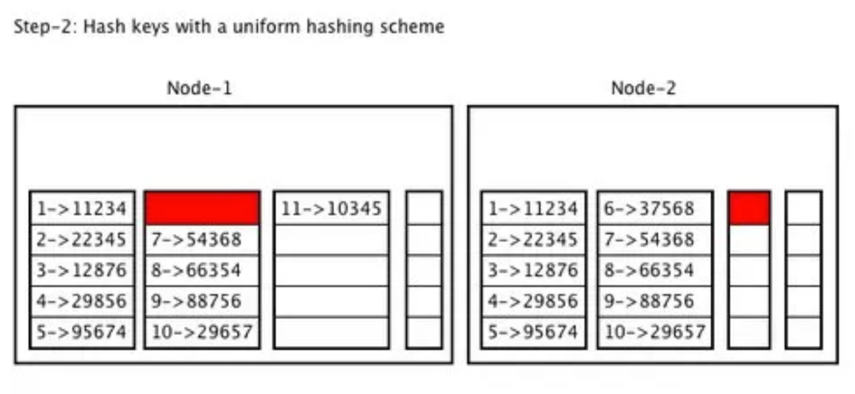

# Anti-Entropy

## What is Anti-Entropy

According to the internet and my science-minded friends, entropy is defined by the second law of thermodynamics.
Basically, ordered systems tend toward a higher state of entropy over time; therefore, the higher the entropy, the
greater the disorder. We are against disorder in our time series data, hence anti-entropy.

Anti-entropy is simply a service we can run to check for inconsistencies and attempt to repair the data discrepancies.

## What is merkle tree

In order to detect inconsistency, we need to compare data on two nodes and it is an expensive operation if you want to
compare each key. Most of the time, there will be few differences between nodes.

Quote from Wiki: `A Hash Tree or Merkle Tree is a tree in which every non-leaf node is labelled with the hash of the
labels of its children nodes. Hash trees are useful because they allow efficient and secure verification of the contents
of larger data structures. Hash trees can be used to verify any kind of data stored, handled and transferred in and
between computers.`

## How does it work

* Node 1 and Node 2 have different data at a given time.

* Create segments for key sets.

* Create Hash at Segments level, Group of segments level.

* Comparing hash value of each non-leaf node, you can tell if they have the same data or not.

## References

* <https://www.influxdata.com/blog/eventual-consistency-anti-entropy/>
* <https://pawan-bhadauria.medium.com/distributed-systems-part-2-consistency-versus-availability-a-pragmatic-example-2a5d6aa36156>