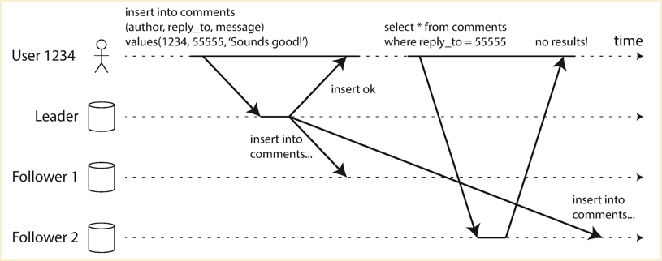
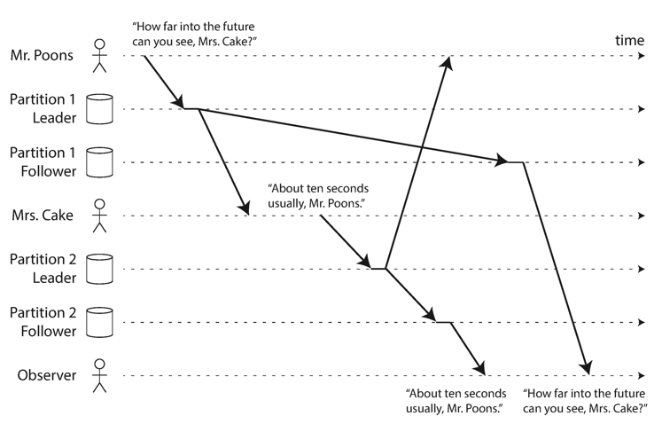
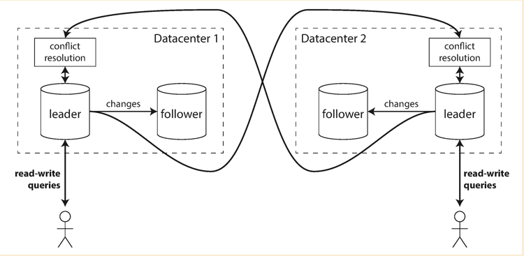
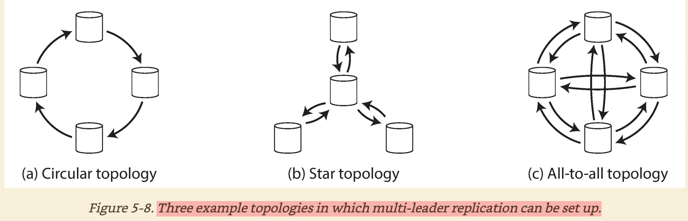
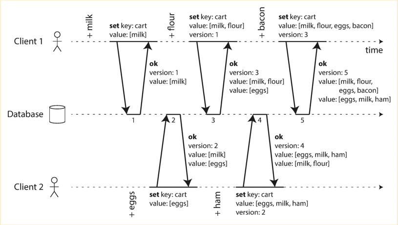
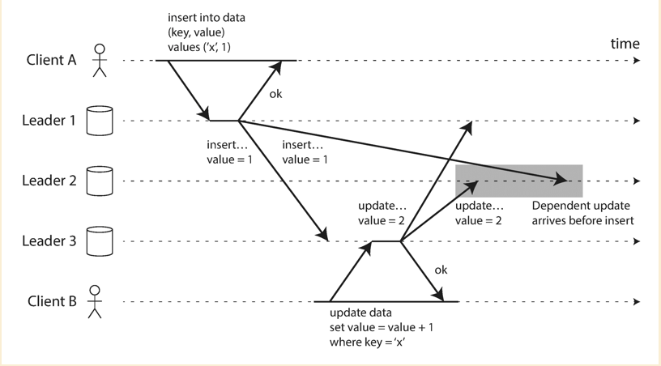

# Replication

The reasons to replicate data:

- keep data geographically close to users
- fault tolerance
- scale out the number of machines for serving read request

## Leader and followers replication

- Only one leader is designated at the same time and handles the write requests from clients.
- Whenever leader writes to its local storage, it replicates the data to all followers
- Client could sent read request to followers or leader. (In ETCD, both read and write request is redirected to leader in order to make sure the data consistency in K8S cluster)

### Synchronous replication or Asynchronous replication

**Fully synchronous**:

- Pros:
  - followers are gauranteed to have the up-to-date copy which is consistent with leader
  - if leader fails, there will be no data lose after switch over to new leader
- Cons:
  - low performance, leader has to wait. If there are slowness from multiple followers, the performance is extremely bad

**Semi synchronous**: One of the follower is synchronous, others are asynchronous.

- Pros:
  - slightly better than fully synchronous in terms of the performance
  - at least two nodes have the up-to-date data
- Cons:
  - if the follower is slow, performance is still problem

**Fully asynchronous**:

- Pros:
  - good performance, since leader is not blocked by the data replication
- Cons:
  - there could be data lose if leader fails in the middle of replicating data to followers

### Adding new followers

If a new follower is added, it starts with empty data. Leader needs to replicate data to that follower. There are two potential issues: 1) If we add multiple followers at the same time, leader will under a pressure to replicate its data to all followers. 2) leader is keep accepting write requests, so data is flux. File copy does not make sense.

For #1, we could let some of the followers to off the load from leader, they could replicate their data to the new members first, once the new member catch up with them, leader takes over the job to continue the data replication.

For #2, we could take consistent snapshot on leader's database, copy the snapshot to the new member, the new member request the backlog of data changes since the snapshot. ETCD uses a different way. It replicate the data in chunks, e.g. first round 10KB to replicate current data, second round 8KB to replicate current data, and so on until the chunk size reaches a predefined threshold, ETCD treats the follower "up-to-date".

### Handling node outages

**Follower failure**: The data changes are persistent on local disk, so if follower fails it could still recover by loading the data changes from local disk.

**Leader failure**: If leader fails, a new leader will be promoted and followers know who is the new leader and rediret all write requests to the new leader. Leader failure might cause the data lost when new leader does not have replicated all the data from old leader.

### Implementations of log replication

- Statement based replication: leader logs every statement (INSERT, UPDATE, DELETE) and send to followers.
  - If the statement calls a nondetermistic function, so each node will return different result.
- Write-ahead log shipping: process the log could help build a copy of exact same data structure as leader has. So leader could send this kind of log to followers.
  - But this log describes data on a very low level and coupled with storage engine.
  - Logical log replication is used to decouple from storage engine. The log is usually a sequence of records describing the database tables at granularity of row: for inserted row, it contains the new values of all columes.
- Trigger based replication: Allow the database changes trigger application layer to make the data replication. It increases the flexibility, like replicate data to different kind of database.

### Problems with replication lag

Data could be inconsistent between leader and followers due to the replication lag. Unless we do synchronous log replication. This is a trade off between availability and consisitency.

#### Read your own write issue

**If we DO NOT have cache solution. When writing Facebook comments, the user might not see the comment right after his write. When user update his Facebook profile, the user might not see the update right after his write.**

We could somehow redirect such read requests to leader:

- If the data is only editable by the owner, read from leader. E.g. user profile, the user who modified it and then read from leader. Other users could read from followers. We could tell this from request header and do a L7 loadbalancing.
- If the latest record from follower is too old, redirect the request to leader. E.g. if we found the latest record from follower is 10mins behind leader.
- Client could remember the timestamp of its recent write, it sends the read request with that timestamp, server redirect the request to the replica who has the data up to that timestamp.

**If user enter something from one device and read from a different device, we should see the info just entered. E.g. Upload a video from one device, we should be able to see it from another device.**

#### Monotonic read issue

The user sends several read requests, like refresh page, the requests could be sent to different replicas. This will cause the data user sees is inconsistent. To avoid this, we should redirect the requests from same users to the same replica.

#### Consistent prefix reads

There could be a big problem to solve in chatting service, e.g. iMessager, Snapchat. In a group chat, the observer might see the messages in an unexpected order.

One possible solution is to make sure that any related writes are written to the same partition.

// TODO: Add more detailed solution

## Multiple leaders replication

There is a big downside of leader based replication that is all writes must go through leader. Some database like etcd serves read through leader as well. So that leader must be able to handle the pressure and could easily be failed.

One extension is to allow more nodes to accept writes. This is called multi-leaders replication. Usually this happens across multiple datacenters.

Pros with multi-leader replication:

- Better performance, no need to redirect write requests from one datacenter to another.
- No need to failover if the datacenter fails, the other datacenter has a different leader could accepts the write requests as well.
- A network partition between two datacenters will not prevent the write requests.

Cons with multi-leader replication:

- Concurrent write could happen to both leaders. Need to have a way solving the concurrent writes.

### Handle write conflicts

- Redirect the write requests to the same leader. Dealing with the concurrent writes on single leader is much easier. The single leader could reject the second write request to let user retry or resolve the conflicts on server side.
- Each write has revision, and make the last write wins.
  - This would have data loss, since it aborts the failed writes.
- Server resolves conflicts and calculate the final value.
- Record conflicts and let user merge. (Git conflicts)

### How leaders communicate

MySQL only supports `circular topology` for now, and the most general one is `all-to-all`.

- If one node fails in `circular` and `star` topology, it will cause the single point failure
- If network delay happens in `all-to-all` topology, it could cause the ordered data gets delivered in different order.
  - We could use `revision` to solve the problem.

## Leaderless replication

The leader based replication is based on the concept that all write requests are sent to one node(leader), which requries the leader node has the capability to handle the peak traffic. Another model comes out to reduce the burden is leader-less replication. **Amazon's Dynamo DB** uses this model.

### How does it work

Client sends write reqeusts to several replicas(could be all replicas). Or the coordinator node will redirect write requests to all replicas. Read requests are also sent to several nodes in parallel.

### Handle stale data

If is possible nodes are offline, when those nodes come back online they could have stale data. When client reads from replicas, the stale data could be also read. There are several solutions to make sure the client gets latest data:

- Quorums write and read to make sure there must have the latest value within the quorum.
  - Usually N / 2 + 1 as the quorum
- Use version to determine which value is newer. Client accept the latest version.
- Repir the stale nodes
  - Read repair: client sees the stale value and write the latest value back to that replica.
  - Background process looks for diffs and fixes the stale data asynchronously

### Handle network partition

There are `m` nodes within the cluster, `n` out of `m` nodes are for data replications(`m` >> `n`). And we have the `w` as the write quorums which is usually `n/2 + 1`. If there is a network partition between client and the `w` nodes, we could not reach the quorum for write operations. We have two solutions:

- return error back to client and reject any write operations until the network partition is fixed
- still accept the writes to the nodes client could reach among `n`, and some nodes among `m - n` to reach the `w` quorum. (`This is called sloppy quorum`). When network issue is fixed, the writes are applied back to the nodes among `n` from the nodes among `m - n`. (`This is called hinted handoff`)

### Handle overwrites and concurrent write

- (concurrent write) Different clients are modifying the shopping cart at the same time.
- (overwrites) Two clients are updating the `likes` one after another, but they do not know each other. (it has dependencies on previous value)

Those requests might arrive different nodes in different order. We could not simply overwrite previous value with the current value, this will cause the data permanently inconsistent.

#### How to tell if requests are concurrent or happens-before

- When client sends a write to server, client attaches a version number with the request (The version number is either 0(init request) or given by server from previous write request)
- Server maintains the track of incremental version number
  - Once write is accepted, `version number++` and server responses the latest version number to client
- If server sees a version number which is less than current version number, it means there are concurrent writes happen
- If server sees a version number which is larger than current version number, which means there are previous write requests have not arrived.

**Concurrent Shopping Cart**

**Happens Before Writes**

#### Last write wins solution

Cassandra uses this solution.

- Each write reqeust is attached with a timestamp, the biggest timestamp is the most "recent"
- If the value has been set with earlier timestamp, we could safely update it
- If the value has been set with more recent timestamp, simply drop the request

Pros:

- Eventually consistent

Cons:

- data loss: If there are several concurrent writes, only one will be accepted and others will be dropped.

#### Shopping cart solution

- Client 1 adds milk to the cart. This is the first write to that key, so the server successfully stores it and assigns it version 1. The server also echoes the value back to the client, along with the version number.
- Client 2 adds eggs to the cart, not knowing that client 1 concurrently added milk (client 2 thought that its eggs were the only item in the cart). The server assigns version 2 to this write, and stores eggs and milk as two separate values. It then returns both values to the client, along with the version number of 2.
- Client 1, oblivious to client 2’s write, wants to add flour to the cart, so it thinks the
current cart contents should be [milk, flour] . It sends this value to the server, along with the version number 1 that the server gave client 1 previously. The server can tell from the version number that the write of [milk, flour] supersedes the prior value of [milk] but that it is concurrent with [eggs] . Thus, the server assigns version 3 to [milk, flour] , overwrites the version 1 value [milk] , but keeps the version 2 value [eggs] and returns both remaining values to the client.
- Meanwhile, client 2 wants to add ham to the cart, unaware that client 1 just added flour .
Client 2 received the two values [milk] and [eggs] from the server in the last response, so
the client now merges those values and adds ham to form a new value, [eggs, milk, ham] . It
sends that value to the server, along with the previous version number 2. The server detects that version 2 overwrites [eggs] but is concurrent with [milk, flour] , so the two remaining values are [milk, flour] with version 3, and [eggs, milk, ham] with version 4.
- Finally, client 1 wants to add bacon . It previously received [milk, flour] and [eggs] from the server at version 3, so it merges those, adds bacon , and sends the final value
[milk, flour, eggs, bacon] to the server, along with the version number 3. This overwrites
[milk, flour] (note that [eggs] was already overwritten in the last step) but is concurrent
with [eggs, milk, ham] , so the server keeps those two concurrent values.

In the end, we might want to return the values back to user and let user to converge the values in the shopping cart. Or simply return the union of values and return back to user.

##### Algorithm

- The server maintains a version number for every key, increments the version number every time that key is written, and stores the new version number along with the value written.
- When a client reads a key, the server returns all values that have not been overwritten, as well as the latest version number. A client must read a key before writing.
- When a client writes a key, it must include the version number from the prior read, and it must merge together all values that it received in the prior read. (The response from a write request can be like a read, returning all current values, which allows us to chain several writes like in the shopping cart example.)
- When the server receives a write with a particular version number, it can overwrite all values with that version number or below (since it knows that they have been merged into the new value), but it must keep all values with a higher version number (because those values are concurrent with
the incoming write).
