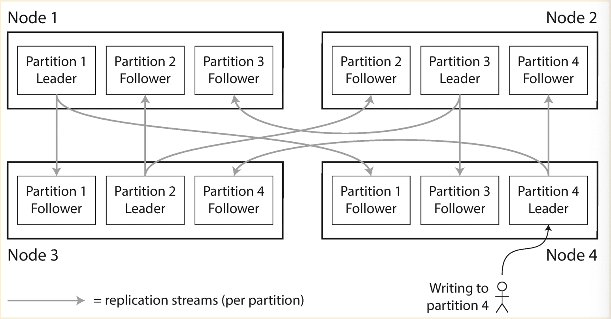
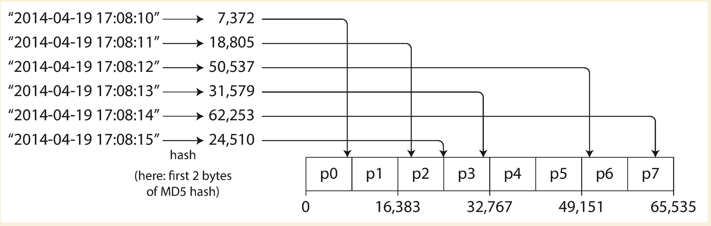
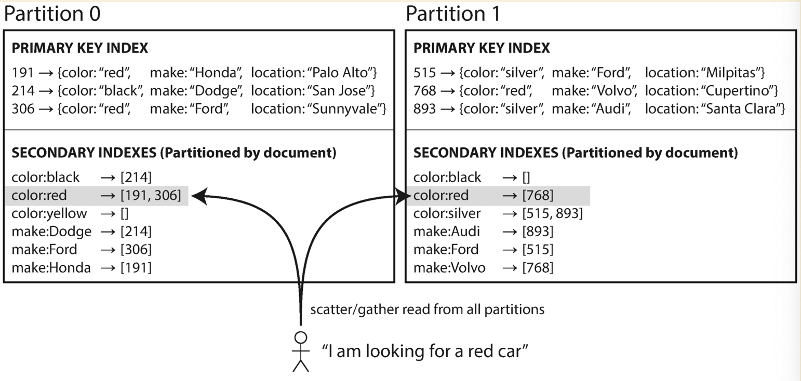
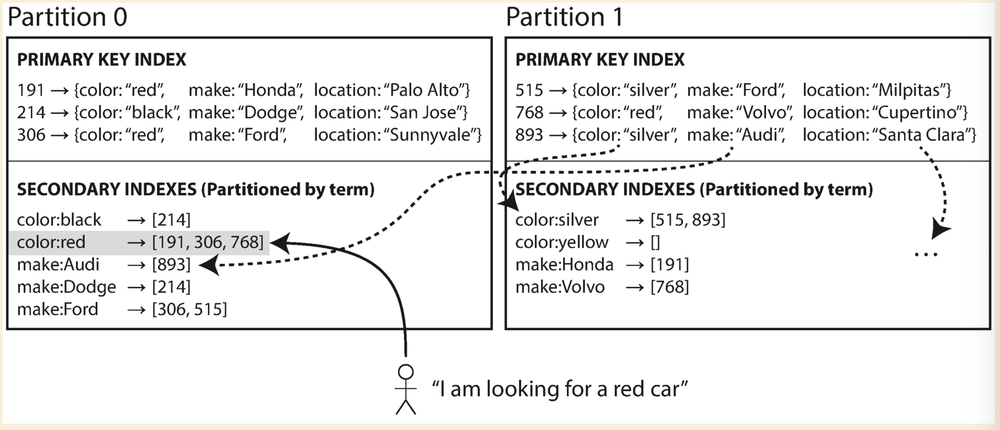
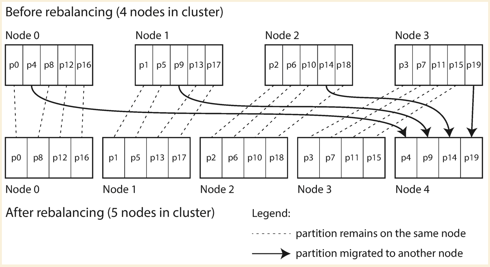
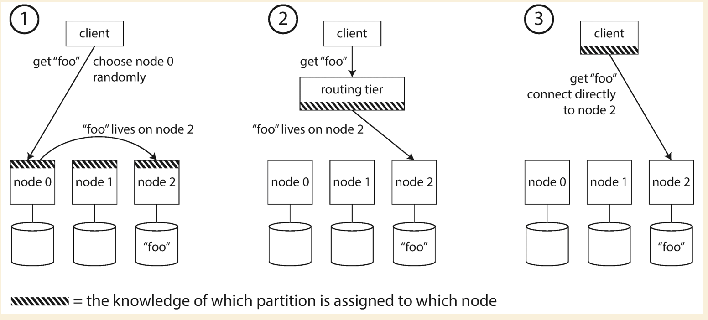
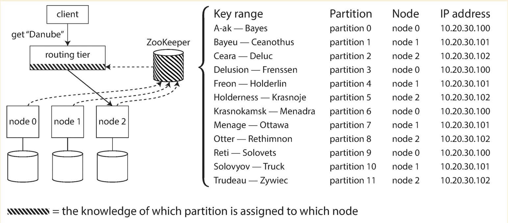

# Partitioning

If no partitioning, there are several issues:

- The increasing dataset could not fit in one node unless we do vertical scaling.
- In leader based replication, one node(leader) could be the hotspot with large amount of writes.
- In leader-less replication, clients close to one data center might send all requests to one node which causes the hotspot.

The main reason for wanting to partition data is **scalability**. And partition is always along with replication to make sure the availability of data.



## Partitioning of Key-Value Data

### Partitioning by Key Range

Assign a continuous range of keys as one partition. E.g. userID from 0-10000 to one node.

Pros:

- Keys within a partition is sorted, so range query is easy.

Cons:

- The range boundaries could not be easily determined (usually not evenly spaced).
- Even we have the boundaries well defined, it does not scale for long term.
- A particular access pattern could also lead to hot spots. E.g. clients are more interested in a particular range of data than the other.

### Partitioning by Hash Key

Using hash function to have a relatively evenly distributed hash value, store a range of hash value on a particular node.



- MongoDB uses MD5
- Cassandra uses Murmur3
- Voldemort uses Fowler-Noll-Vo function

**Important**: Some programming language's built-in hash function is not suitable for partitioning. Java's `Object.hashCode()` could have different hash values in different processes.

Pros:

- Keys are relatively well distributed. In theory, the reqeusts would be spread out to all partitions(nodes) evenly.

Cons:

- For range query, we need to send requests to all partitions. Because the adjacent keys are all distributed to different partitions.
- Choosing the boundaries for the range of hash keys is not easy.
- If there is a hot key, e.g. celebrities on twitter. We could not avoid the hot spot completely.

#### Solutions for range query

Using multiple columns as a compound primary key, only the first part of that key is hashed to determine the partition, the rest of columns are sorted to provide a better range query performance. E.g. `(userID, updateTimestamp)`, we use `userID` as the hash key to find the partition, and `updateTimestamp` is sorted. So that we could easily query the entries within an interval of a particular user.

The only problem is that all the data of a particualr user is stored within one partition which could cause the `celebrity problem`.

#### Solution for celebrity problem

A hot topic or a celebrity could cause the requests for that topic or celebrity to be directed to the same partition. A simple solution could be adding a random decimal number at the beginning or end of the key, e.g. two-digit decimal number could generate 100 unique keys, and allow those keys to be distributed across different partitions. Now reading needs to read from all 100 keys and combine it.

## Partitioning of Secondary Indexes

Sometimes people would add secondary index for a better performance on filtering, e.g. query on the cars which has red color. But how the secondary indexes are partitioned ?

### Document based partitioning or Local index



Each partition maintains its own secondary indexes which cover only the data in that partition. On write, only add/update/delete the secondary indexes on the partition where data is located. On read, need to read from all partitions and combine the result.

Pros:

- Write is efficient
  
Cons:

- Read is expensive

### Term based partitioning or Global index



Instead of letting each partition has its own secondary indexes, we construct a global one and store it on one of the patition. Which partition should store the secondary indexes ? We could partition by the term or a hash of the term.

Pros:

- Read is efficient, can just read from one partition

Cons:

- Write is slower and complicated, because multiple partitions are involved in a single write. Since the complication of write across multiple partitions, there would have some slowness in terms of data consistency(the global indexes might not be ready on immediately read).

## Rebalancing Partitions

### DO NOT USE HASH MOD N(number of nodes or number of partitions)

Need to say three times that **DO NOT USE HASH MOD N !** **DO NOT USE HASH MOD N !** **DO NOT USE HASH MOD N !** The reason is that when `N` changes, most of the keys will need to be moved from one node to another. One important rule is to move as less as possible. We use consistent hashing !

### Fixed number of patitions



We have `10` nodes, and fix the total number of partitions to be `1000`, so we have `100` partitions per node.

- **Add new node**: the new node copy a few patitions from every existing node until all the partitions are fairly distributed again, then the new node starts serving and old partitions could be removed. During the copying, the old partitions are still serving the read and write requests.
- **Drain an existing node**: we copy the partitions from current node evenly to other nodes. Current node still serves the requests until the data move is completed.

This approach is used by Elasticsearch, Couchbase and Voldemort.

Pros:

- No need to split partitions, and reduces the complexity of implementation.

Cons:

- Hard to pick the right number of partitions.

### Dynamic partitioning

Set a max and min ahead. When the data within one partition grows over the max, it is split into two partitions. One of the two halves can be transferred to another node in order to balance the load. When the data shrinks below the min, it can be merged into an adjacent partition. DBs like MongoDB and HBase usually set a `pre-spliting` to make sure an empty database can also have a pre-defined number of partitions. This is to mitigate the issue when empty database with multiple nodes, there is a period of time that all reqests are sent to that single partition until the partition split happens.

- **Add new node**: the new node copy a few patitions from every existing node until all the partitions are fairly distributed again, then the new node starts serving and old partitions could be removed. During the copying, the old partitions are still serving the read and write requests.
- **Drain an existing node**: we copy the partitions from current node evenly to other nodes. Current node still serves the requests until the data move is completed.
- **Data increase over the max**: Partition splits and one of the two halves will be assigned to another node.
- **Data delete below the min**: Partition merges with an adjacent partition on the same node.

### Have fixed number of partitions per node

E.g. `100` partitions per node.

- **Add new node**: It randomly choose existing partitions on all nodes to split.
- **Drain a node**: It copies the partitions randomly to other partitions.

## Request Routing

Client knows the key to query, and send the request to backend service. How does the backend service know which partition and which node the data stays on ?

Using the hash function, we could calculate the hash value of a key. Once we have the hash value, we could know which partition holds the key (This could be easitly done by consistent hashing, which is next clockwise partition greater than current hash value position). The system needs to maintain a mapping between partition and node IP(`Zookeeper`), so we could easily know which node we need redirect the requests to.

Usually there are three approaches:



If using `ZooKeeper`, it will track the cluster metadata. When a partition changes ownership, a node is added/removed, `ZooKeeper` notifies the routing tier so that it can keep its routing info up to date.



For redis, above three ways are equivalent to the following: 

- Client side partitioning means that the clients directly select the right node where to write or read a given key. Many Redis clients implement client side partitioning.

- Proxy assisted partitioning means that our clients send requests to a proxy that is able to speak the Redis protocol, instead of sending requests directly to the right Redis instance. The proxy will make sure to forward our request to the right Redis instance according to the configured partitioning schema, and will send the replies back to the client. The Redis and Memcached proxy [Twemproxy](https://github.com/twitter/twemproxy) implements proxy assisted partitioning.

- Query routing means that you can send your query to a random instance, and the instance will make sure to forward your query to the right node. Redis Cluster implements an hybrid form of query routing, with the help of the client (the request is not directly forwarded from a Redis instance to another, but the client gets redirected to the right node).

## Disadvantages of partitioning

- The operations include multiple keys need to deal with multiple partitions. If that is atomic operation, it would increase the complex from implementation perspective. For redis, operations involving multiple keys are usually not supported. For instance you can't perform the intersection between two sets if they are stored in keys that are mapped to different Redis instances (actually there are ways to do this, but not directly). And Redis transactions involving multiple keys can not be used.

## How consistent hash work

- <https://www.toptal.com/big-data/consistent-hashing>
- <https://medium.com/@dgryski/consistent-hashing-algorithmic-tradeoffs-ef6b8e2fcae8>

To add the list of nodes to the ring hash, each one is hashed m.replicas times with slightly different names ( 0 node1, 1 node1, 2 node1, …). The hash values are added to the m.nodes slice and the mapping from hash value back to node is stored in m.hashMap. Finally the m.nodes slice is sorted so we can use a binary search during lookup.

``` golang
func (m *Map) Add(nodes ...string) {
    for _, n := range nodes {
        for i := 0; i < m.replicas; i++ {
            hash := int(m.hash([]byte(strconv.Itoa(i) + " " + n)))
            m.nodes = append(m.nodes, hash)
            m.hashMap[hash] = n
        }
    }
    sort.Ints(m.nodes)
}
```

To see which node a given key is stored on, it’s hashed into an integer. The sorted nodes slice is searched to see find the smallest node hash value larger than the key hash (with a special case if we need to wrap around to the start of the circle). That node hash is then looked up in the map to determine the node it came from.

``` golang
func (m *Map) Get(key string) string {
    hash := int(m.hash([]byte(key)))
    idx := sort.Search(len(m.keys),
        func(i int) bool { return m.keys[i] >= hash }
    )
    if idx == len(m.keys) {
        idx = 0
    }
    return m.hashMap[m.keys[idx]]
}
```

### Downside of consistent hasing

First, the load distribution across the nodes can still be uneven. With 100 replicas (“vnodes”) per server, the standard deviation of load is about 10%. The 99% confidence interval for bucket sizes is 0.76 to 1.28 of the average load (i.e., total keys / number of servers). This sort of variability makes capacity planning tricky. Increasing the number of replicas to 1000 points per server reduces the standard deviation to ~3.2%, and a much smaller 99% confidence interval of 0.92 to 1.09.
This comes with significant memory cost. For 1000 nodes, this is 4MB of data, with O(log n) searches (for n=1e6) all of which are processor cache misses even with nothing else competing for the cache.

### Improve on consistent hashing

- [Jump Hash](https://arxiv.org/pdf/1406.2294.pdf)

Jump Hash addresses the two disadvantages of ring hashes: it has no memory overhead and virtually perfect key distribution. (The standard deviation of buckets is 0.000000764%, giving a 99% confidence interval of 0.99999998 to1.00000002).
Jump Hash is also fast. The loop executes O(ln n) times, faster by a constant amount than the O(log n) binary search for Ring Hash, and made faster even still by the fact that the computation is done entirely in a few registers and doesn’t pay the overhead of cache misses.

- [Multi-probe consistent hashing](https://arxiv.org/pdf/1505.00062.pdf)

The basic idea is that instead of hashing the nodes multiple times and bloating the memory usage, the nodes are hashed only once but the key is hashed k times on lookup and the closest node over all queries is returned. The value of k is determined by the desired variance. For a peak-to-mean-ratio of 1.05 (meaning that the most heavily loaded node is at most 5% higher than the average), k is 21. With a tricky data structure you can get the total lookup cost from O(k log n) down to just O(k). My implementation uses the tricky data structure.

- [Rendezvous Hashing](https://www.eecs.umich.edu/techreports/cse/96/CSE-TR-316-96.pdf)

The idea is that you hash the node and the key together and use the node that provides the highest hash value. The downside is that it’s hard to avoid the O(n) lookup cost of iterating over all the nodes.

- [Maglev Hashing](https://research.google/pubs/pub44824/) and [alt link](https://blog.acolyer.org/2016/03/21/maglev-a-fast-and-reliable-software-network-load-balancer/)

One of the primary goals was lookup speed and low memory usage as compared with ring hashing or rendezvous hashing. The algorithm effectively produces a lookup table that allows finding a node in constant time. The two downsides is that generating a new table on node failure is slow (the paper assumes backend failure is rare), and this also effectively limits the maximum number of backend nodes. Maglev hashing also aims for “minimal disruption” when nodes are added and removed, rather than optimal. For maglev’s use case as a software load balancer, this is sufficient.
The table is effectively a random permutation of the nodes. A lookup hashes the key and checks the entry at that location. This is O(1) with a small constant (just the time to hash the key).

## How to partition a tree or graph dataset

### How to partition a graph dataset

[How to partition billion nodes graph(pdf)](./resources/how-to-partition-billion-node-graph.pdf)

There are two ways mentioned in the paper above:

- Graph coarsening (vertical partition)
  - Coarsen, group multiple nodes
  - The nodes within the same group go to one partition
- Label propagation (horizontal partition)
  - Update the label of current node to be the same as majority of adjacent nodes. And repeat until the label of nodes won't change
  - The nodes with same label belong to the same partition
- Combined of above two (MULTI-LEVEL LABEL PROPAGATION)
  - Given a graph G, the algorithm divides G into k balanced
partitions stored in k machines. Initially, each vertex is assigned a
unique label, which indicates the partition it belongs to. In the end,
the entire graph will have k labels, and each label has the same
number of vertices. The algorithm has three steps. The first step is iterative coarsening. In each iteration, we find densely connected substructures
through label propagation (LP). We collapse each connected structure into a single vertex to produce a “coarsened” graph. Then we
repeat the process until the graph is small enough. The rationale for
iterative coarsening is that a single round is not enough to reduce
the number of labels to an acceptable level. The coarsening step is
controlled by 3 user specified parameters: We keep coarsening the
graph until there are no more than α labels (partitions); The label
propagation takes at most β iterations to avoid wasteful iterations;
The size of each label (partition) is controlled by γ ≥ 1 – each
label (partition) has an upper-limit size of |V |
kγ . In the second step,
we partition the coarsened graph using an off-the-shelf algorithm,
such as KL or METIS. In the last step we project the partitioning
on the coarsened graph to the original graph.

## How industry handles data sharding

### Redis cluster

<https://redis.io/topics/cluster-tutorial#redis-cluster-data-sharding>

<https://redis.io/topics/cluster-spec#keys-distribution-model>

<https://developpaper.com/complete-steps-for-adding-and-deleting-redis-cluster/>

- Fixed hash slots in entire cluster: 16384
- Slot = CRC16(key) % 16384
- Keys are automatically sharded across multiple nodes
  - If we have three master nodes in a cluster:
    - Node A contains hash slots from 0 to 5500
    - Node B contains hash slots from 5501 to 11000
    - Node C contains hash slots from 11001 to 16383
- Redis does not provide auto rebalancing if an new node is added or an existing node is deleted
- Redis does not provide auto rebalancing an existing node is deleted. Slots must be moved prior to node deletion, otherwise redis will reject the node deletion

## References

- <https://redis.io/topics/partitioning>
- <https://redis.io/topics/cluster-tutorial#redis-cluster-data-sharding>
- <https://docs.microsoft.com/en-us/azure/cosmos-db/graph-partitioning>
- <https://docs.microsoft.com/en-us/azure/cosmos-db/partition-data>
