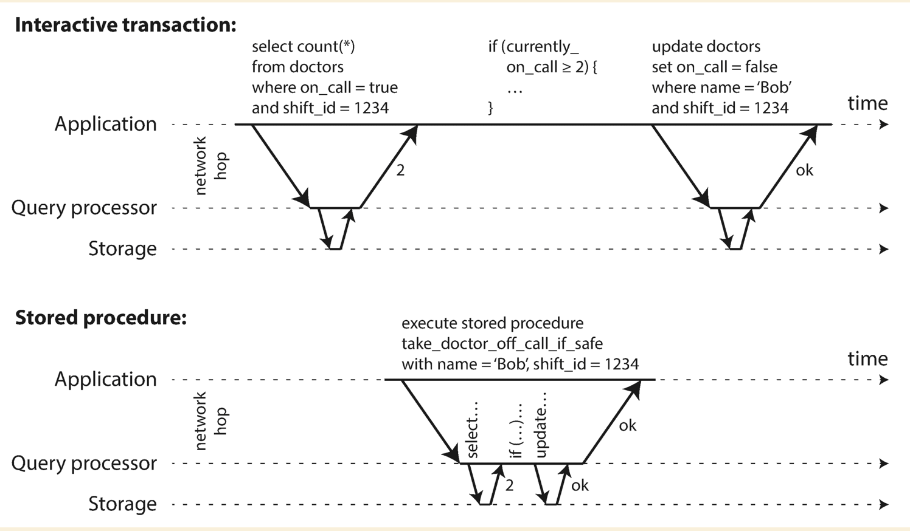
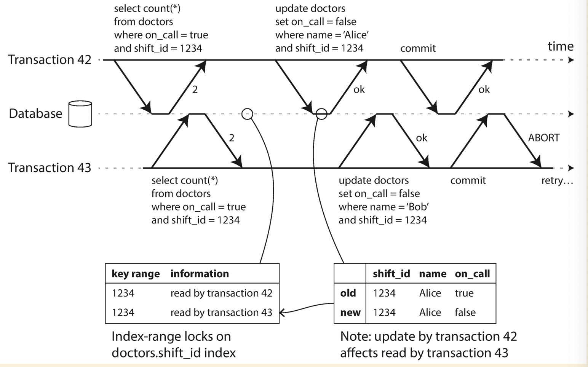

# Trasactions

## Why transactions and what it is

As mentioned in the book, there are so many types of failure:

- The database software or hardware may fail at any time (including in the middle of a write operation).
- The application may crash at any time (including halfway through a series of operations).
- Interruptions in the network can unexpectedly cut off the application from the database, or one database node from another.
- Several clients may write to the database at the same time, overwriting each other’s changes.
- A client may read data that doesn’t make sense because it has only partially been updated.
- Race conditions between clients can cause surprising bugs.

Transaction is a mechanism to simplify these issues. Transaction is a group of several read and writes as a logical unit.

## Meaning of ACID

### Atomicity

Operations are grouped into one unit, they either succeed(commit) or fail(abort) entirely and no halfway failure.

### Consisitency

A certain statement about the data is always true. E.g. You credit and debit of your bank acount is always balanced.

### Isolation

Concurrently executing transactions are isolated from each other.

### Durability

Any data has been committed successfully will not be lost.

## Single object operation and Multiple objects operation

Sometimes we just need to update a single object in database, like updating a cell of a table. But sometimes we need to
update multiple objects with a single transaction, like multiple tables need to be updated, multiple documents need to
be updated and multiple indexes need to be updated.

## Weak isolation level (Nonserializability)

### Read committed

- When read, only see data has been committed (no dirty reads)
- When write, only overwrite data has been committed (no dirty writes)

No dirty reads


With dirty writes


#### Implementing read committed

- For preventing dirty writes, we could use `row-level-lock`
- For preventing dirty reads, the database remembers both the old committed value and the new value set by the
  transaction that currently holds the write lock. While the transaction is ongoing, any other transactions that read
  the object are simply given the old value. Only when the new value is committed do transactions switch over to reading
  the new value.

### Snapshot isolation

[Read committed](#read-committed) could not solve the `read skew` issue as below:


So, we need a stronger isolation level to prevent this from happening, which snapshot isolution is commonly used.

Each transaction reads from a consistent of the snapshot, so that it sees all data that was committed at the start of
current transaction. Even the data is updated during the transaction, it alwasys sees the old data from a PIT.

Writes never block reads, and reads never block writes. So snapshot isolation has a good performance.

#### Implementing snapshot isolation

- For preventing dirty writes, we could use `row-level-lock`
- For preventing dirty reads, the database must potentially keep several different committed versions of an object,
  because various in-progress transactions may need to see the state of the database at different points in time.
  This is called `multi-version concurrency control`


Visibility rules:

- At the time when the reader’s transaction started, the transaction that created the object had already committed.
- The object is not marked for deletion, or if it is, the transaction that requested deletion had not yet committed at
  the time when the reader’s transaction started.

#### Implementation comparision between read committed and snapshot isolation

- `read committed` only needs to maintain two versions, however `snapshot isolation` needs to maintain multiple versions
- `read committed` usually reads from different snapshot in different operation, however `snapshot isolation` reads from
  one snapshot for entire transaction

#### How indexes work in multi-version database

There are two options:

- Have index point to all versions of an object, index query to filter out which version to fetch
- Have different indexes point to different version of an object. For B-tree DB, does not overwrite pages of the tree
  when they are updated, but instead creates a new copy of each modified page. Parent pages, up to the root of the tree,
  are copied and updated to point to the new versions of their child pages.

### Problems with writes

#### Dirty writes

The race condition could result in dirty writes if one operation writes to a data which has not been committed by
another operation. `row-level-lock` could solve this problem.

#### Data lost

Both `read committed` and `snapshot isolation` does not prevent data loss when two writes meet the non-dirty write
condition, but one overwrites the result from another one. E.g. two users edit the wiki page at the same time
(`read-modify-write` cycle).


- Atomic operation: Remove the implementation of read-modify-write cycle from application and provide it as an atomic operation.
  - Could be implemented using exclusive lock on object. Mutex lock on read, so that only one thread could read.
  - Or simply force all atomic opeartions to be executed on a single thread.
- Explicit locking: Application code lock the code block which performs the `read-modify-update` cycle.
- Auto detect on lost updates: database detect the lost updates and force application to retry. (It worths to explore
  if vector version/clock idea could help in this case)
- Compare and set: Allow an update to happen only if the value has not changed since you last read it.

  ``` SQL
  UPDATE wiki_pages SET content = 'new content'
  WHERE id = 1234 AND content = 'old content' ;
  ```

**Important**: The lock and compare-and-set assumes the situation on single node, but when it comes to leaderless
replication case or multi-leader replication case, those two won't work unless using distributed lock.

#### Write skew

From following diagram, it demostrate the write skew in the case of doctor night shifts. We need at least one doctor
on the shift, but write skew could cause zero doctor in the end.


Pattern of which causes the write skew:

- Query check the state
- Depending on the result, application code decides what to do next
- Application makes a write

The write made by application code could change the result of first query step, which is called `phantom`

##### Possible solutions for write skew

- Put constrains on column, e.g. need at least one `true` in the doctor shifts case. This needs to be a database feature
  and not all database has this built-in feature.
- Application to put a lock around the entire operation.

  ``` SQL
  BEGIN TRANSACTION ;
  SELECT * FROM doctors
    WHERE on_call = true
    AND shift_id = 1234 FOR UPDATE ;

  UPDATE doctors
    SET on_call = false
    WHERE name = 'Alice'
    AND shift_id = 1234 ;
  COMMIT ;
  ```

  **Notes:** As before, FOR UPDATE tells the database to lock all rows returned by this query.
- [Serializable isolation](#strong-isolcation-level-serializability)

## Strong isolcation level (Serializability)

It guarantees that even though transactions may execute in parallel, the end result is the same as if they had executed
one at a time.

### Serial execution

- Execute only one transaction at a time, in serial order,on a single thread (Redis does this)
- Encapsulate transactions in stored procedures

  

  - Pros:
    - Database vendor supports general purpose programming languages: Redis uses Lua, VoltDB uses Java or Groovy
  - Cons:
    - Code runs in DB is hard to manage
    - Bad code could cause high pressure on memory and CPU time

Executing transactions in serial order might have low performance and bottleneck. So transaction must be small and fast.
And dataset needs to be able to fit in memory. In the case of doctor shifts, we could encapsulate the query and update
into one stored procedure to let them be executed in sequence.

### Locking

#### Two-Phase Locking

Reads do not block reads, it only blocks writes; Writes block writes and reads. This is the key difference
from [snapshot isolation](#snapshot-isolation) which has the notion of "readers never block writers and writers never block readers"

- If transaction A has read an object and transaction B wants to write to that object, B must wait until A commits or
  aborts before it can continue. (This ensures that B can’t change the object unexpectedly behind A’s back.)
- If transaction A has written an object and transaction B wants to read that object, B must wait until A commits or
  aborts before it can continue.

##### Implementing two phase locking

- If a transaction wants to read an object, it must first acquire the lock in shared mode.
- If a transaction wants to write to an object, it must first acquire the lock in exclusive mode.
- If a transaction first reads and then writes an object, it may upgrade its shared lock to an exclusive lock.
- After a transaction has acquired the lock, it must continue to hold the lock until the end of the transaction (commit or abort).

The biggest downside is the performance.

#### Predicate lock

It works as putting locks on multiple objects(rows) that match some search condition.

##### Implementing predicate lock

- If transaction A wants to read objects matching some condition, like in that SELECT query, it must acquire a
  shared-mode predicate lock on the conditions of the query.
- If transaction A wants to insert, update, or delete any object, it must first check whether either the old or the new
  value matches any existing predicate lock. If there is a matching predicate lock held by transaction B, then A must
  wait until B has committed or aborted before it can continue.

Two phase lock + predicate lock could prevent all kinds of write skew and race conditions. But the biggest downside
is performance.

#### Index range locks

A simplified approximation of predicate locking by making it match a greater set of objects. For example, if you
have a predicate lock for bookings of room 123 between noon and 1 p.m., you can approximate it by locking bookings for
room 123 at any time, or you can approximate it by locking all rooms (not just room 123) between noon and 1 p.m. So that
we could attach the shared lock to this index value.

### Serializable snapshot isolation (SSI)

- Two phase locking is pessimistic concurrency control
- Serial exeution is pessimistive
- SSI is optimistic (instead of blocking if something potentially dangerous happens, transactions continue anyway),
  it checks whether anything bad happened(e.g. isolation was violated), if so, the transaction is aborted and has to be
  retried. Only transaction that executed serializably are allowed to commit.

#### Detect stale MVCC reads

Keep track of the versions of data being ignored on read, when a transaction wants to commit, databasae checks if any
of the ingored versions of data have now been committed. If so, current transaction needs to be aborted.


#### Detect writes affect prior reads

Keep track of the trasactions which is affected by a commit. When the affected transaction wants to commit, we abort it.

