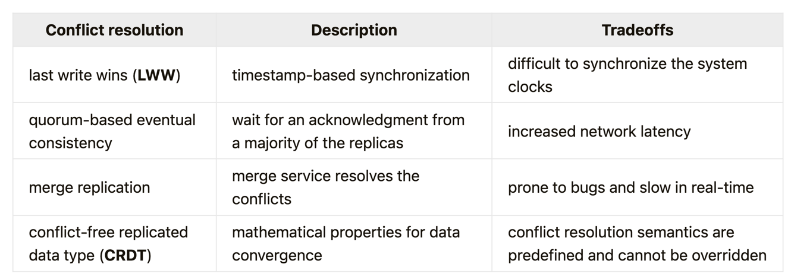

# Consistency and consensus

## Linearizability

## Ordering Guarantees

- In leader based replication, leader determins the order of writes in the replication log
- In DB serializability, it is about ensuring transactions behave as if they were executed in some sequential order
- The use of timestamps and clocks is another attempt to determine the order of events

