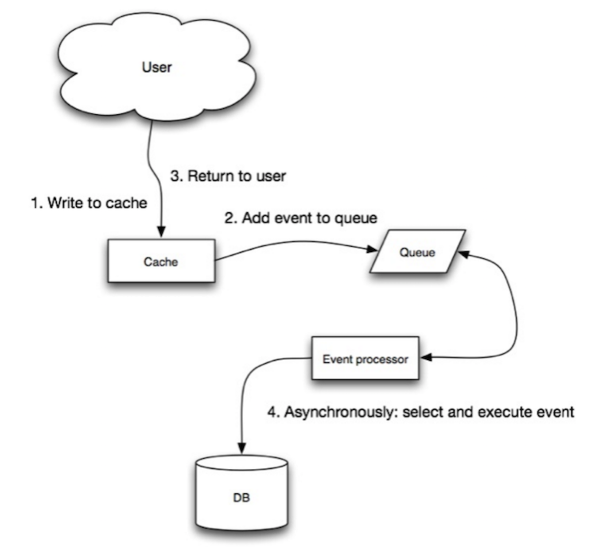
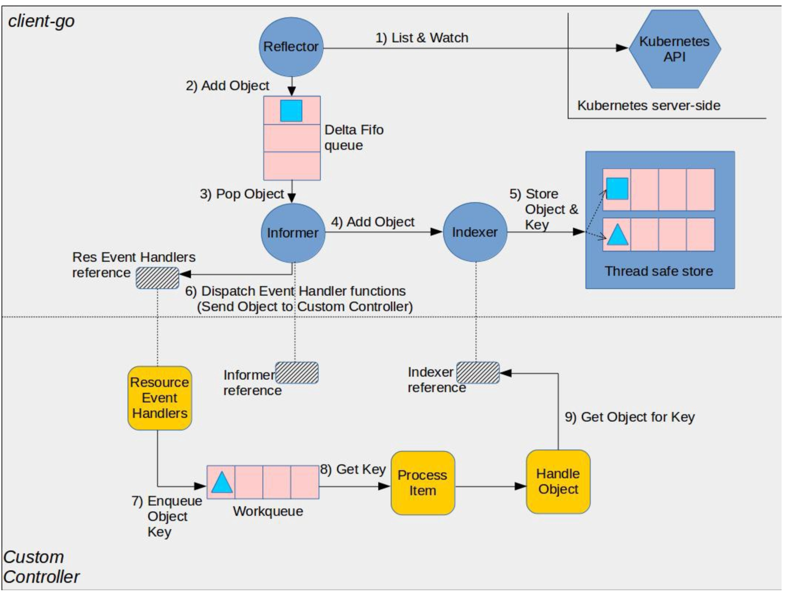

# Caching

## Why needs caching

- Hard disk or SSD read/write speed is slow
- Read heavy applications/services need a mechanism to speed up
- Read heavy applications/services need a mechanism to reduce load to backend
- Use in memory cache layer to store subset of data (capacity trade off performance)

When local caches are used, they only benefit the local application consuming the data. In a distributed caching environment, the data can span multiple cache servers and be stored in a central location for the benefit of all the consumers of that data.

There are different levels of caching:

- Client side caching: browser cache, OS cache
- CDN caching: used to cache static files, like images, videos, etc.
- Database caching: used to increase the data retrieval performance
- Caching layer between client and datastore: in-memory key-value store like `Redis` and `Memcached`

## Types of cache architecture

### Look-aside

#### On read

- client first checks the cache
- if cache-hit, cache returns the result
- if cache-misse, client gets the value from storage, then updates cache

---
Pros:

- client handles the logic, storage and cache are decoupled
- if cache server fails, client still work

Cons:

- Performance on cache-miss is low, three trips are involved
- Adding new cache server will cause surge traffic to backend
  - [Cold start solution from "memcached at Facebook" paper](https://youtu.be/Myp8z0ybdzM?t=3239)
  - Routing tier does not route request to it until it catches up

#### On write

- client writes to storage
- client deletes the entry in cache

---
Pros:

- client deletes the entry in cache could make sure the data consistency

Cons:

- Extra step to deletes the entry could cause some performance issue on write

### Look-through

#### On read

- client first checks the cache
- if cache-hit, cache returns the result
- if cache-miss, cache gets the value from storage, then updates itself

---
Pros:

- client's logic is easy to be implemented, it does not need to handle the logic of cache-miss

Cons:

- cache needs to hanle the cache-miss logic now, and to expose generic API for both upstream client and downstream storage
- the cache miss performance is still low

#### On write

##### Sync writes

- client writes to cache
- cache writes to storage in sync

---
Pros:

- client's logic is easy to be implemented

Cons:

- writes in sync has low performance
- not all writes need to be stored in cache (not the hot key)
- having cache layer to handle the distributed concurrent writes is complicated
- usually caching layer is deployed seperately in a different cluster, writes to cache increases the latency
- complicated error handling if db writes fail

##### Async writes

---
Pros:

- It probably has a better performance comparing with sync-write

Cons:

- not all writes need to be stored in cache (not the hot key)
- way too complicated !!!

## Cache write policies

Reference: [Open CAS cache mode](https://open-cas.github.io/cache_configuration.html#cache-mode)

- [Write-through Cache](https://www.youtube.com/watch?v=ptFn7f_SgSM&ab_channel=ASmallBug)

- [Write-around Cache](https://www.youtube.com/watch?v=mA5D48POAww&ab_channel=ASmallBug), the same idea of [look-aside](#look-aside) mentioned above.

- [Write-back Cache](https://www.youtube.com/watch?v=-ucqTc1eDuI&ab_channel=ASmallBug)

- [Write-invalidate Cache](https://open-cas.github.io/cache_configuration.html#write-invalidate)

## Granularity of caching key

We know that the caching usually is a key-value store, and what data to be stored in cache is case by case. Usually there are two types I could think of:

- **Hash of the queries as the caching key**: The value could be a result of complicated query with filters
  - Pros:
    - Delegate the computation of the query to data store layer
    - Application just tracks the static query
  - Cons:
    - If a small piece of data is updated, there could be multiple queries need to be invalidated. And how to track which queries are impacted ?

- **Hash of the object as the caching key (mirror the subset of data store)**: If the data store is key-value already, we could cache a subset of those key-value pairs
  - Pros:
    - cache invalidation is easy, since we know which key is updated and where to find it in cache
  - Cons:
    - Application needs to handle the computation of the final query result, e.g. filtering.

## How cache eviction work

- LRU: Evict the least recently used item. E.g. Netflix video caching
- MRU: Evict the most recently used item. E.g. Tinder does not want to show the most recent items.
- LFU: Evict the least frequently used item. E.g. Phone typing prediction

## How distributed caching(hash table) works

TBA

## How K8S client-go caching works

[How custom controller works](https://app.gitbook.com/@daniel-guo/s/notebook/k8s-related/extend-k8s/crds/custom-controllers)

There could be multiple controllers reconcile a same set of resources, it would be a huge load if all controllers talk to api server to ask for the state of resources. So caching is really important.

The `Thread Safe Store` is the cache where [informer](https://github.com/kubernetes/client-go/blob/fb61a7c88cb9f599363919a34b7c54a605455ffc/tools/cache/controller.go#L371) will add the object.

## Comparision between Redis and Memcached

- `redis` provides a superset of features comparing to `memcached`
- To implement `memcached` cluster, client needs to solve traffic rounting, e.g. using consistent caching
- They have different implementations on memory management

More details could be found from the links below in references section.

## References

- [What is caching (from medium)](https://medium.com/system-design-blog/what-is-caching-1492abb92143)
- [Caching overview (by AWS)](https://aws.amazon.com/caching/)
- [Everything you need to know about caching](https://levelup.gitconnected.com/everything-you-need-to-know-about-caching-system-design-932a6bdf3334)
- [Redis vs Memcached (by AWS)](https://aws.amazon.com/elasticache/redis-vs-memcached/)
- [Redis vs Memcached (by Alibaba Cloud)](https://alibaba-cloud.medium.com/redis-vs-memcached-in-memory-data-storage-systems-3395279b0941)
- [Cache Consistency: Memcached at Facebook (MIT Lecture)](https://www.youtube.com/watch?v=Myp8z0ybdzM&ab_channel=MIT6.824%3ADistributedSystems)
- [Paper: Scaling memcache at Facebook](./resources/memcache-fb.pdf)
