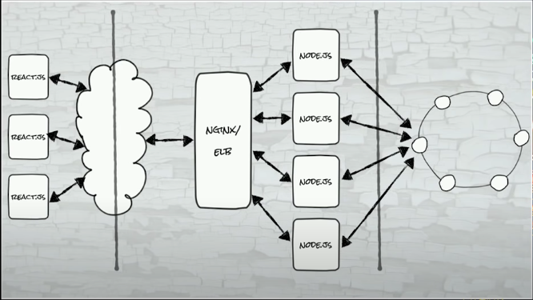
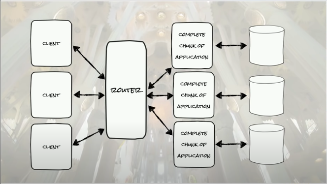
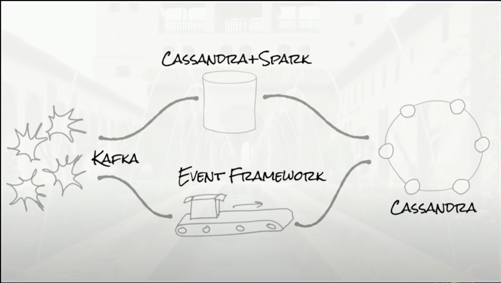
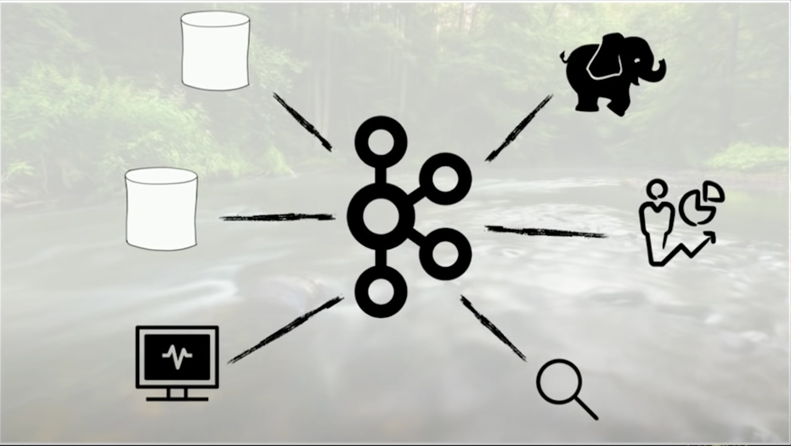

# Distributed systems architectural patterns

## Modern three tier

## Sharded architecture

## Lambda architecture

## Streaming architecure

## References

- <https://www.youtube.com/watch?v=tpspO9K28PM>