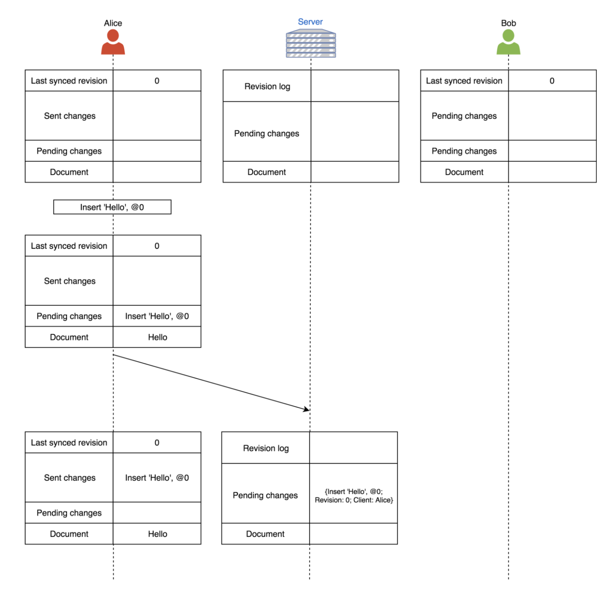
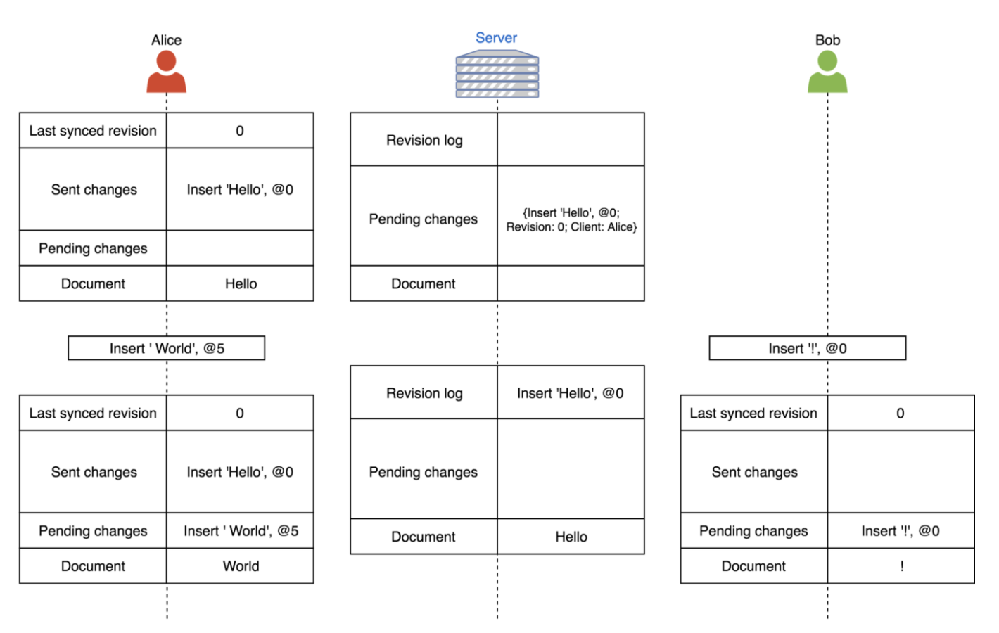
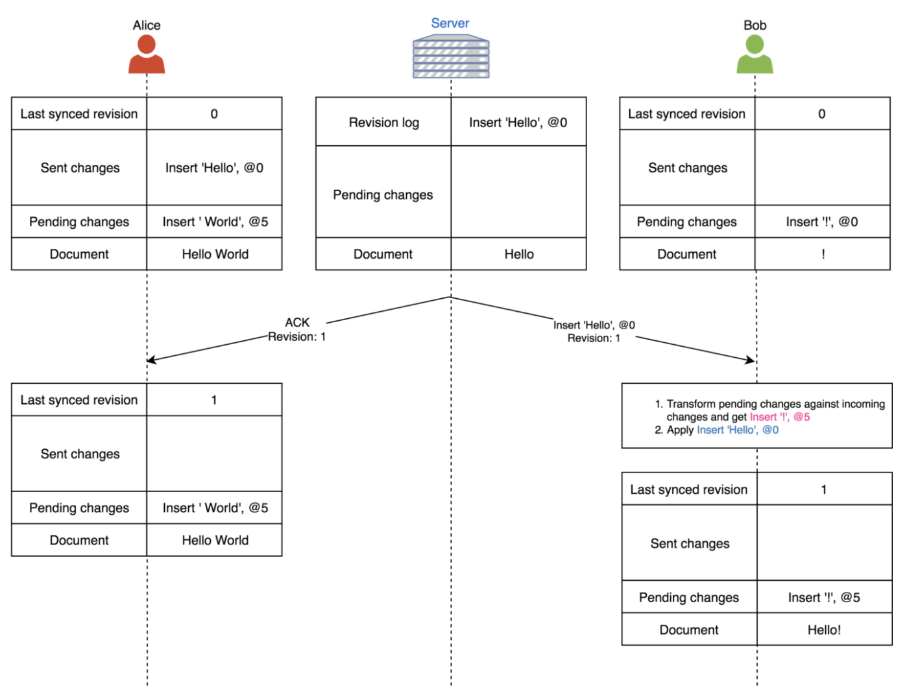
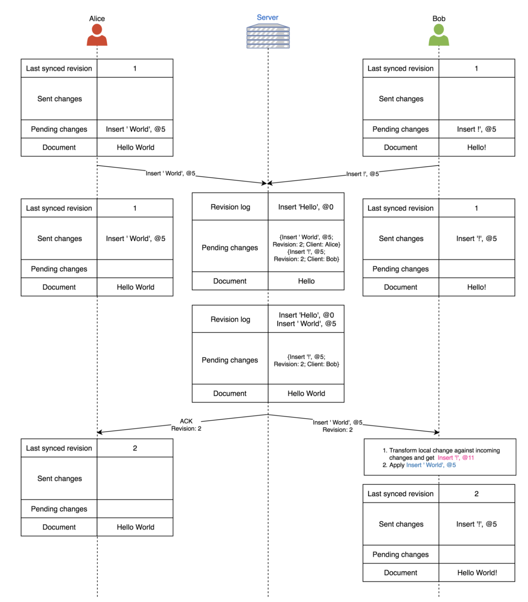
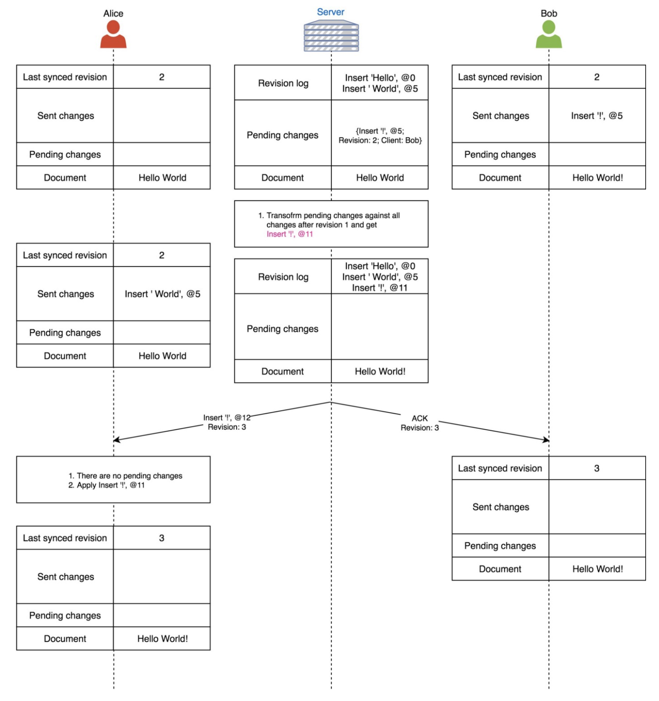

# How collaborative editing work

## Data model

``` golang
type Operation {
    Kind string  // Insert, Delete
    Data string  // "Hello"
}

type ClientDataModel {
    lastSyncedRevision int  // 1
    pendingOperations Operation  // Insert(5, " World")
    sentOperation Operation  // Insert(0, "Hello")
    doc string  // the final doc. e.g. "Hello World"
}

type ServerDataModel {
    pendingChanges []struct {
        Revision int
        Op Operation
        ClientID string
    }  // the pending changes have not been processed
    changeHistory []struct {
        Revision int
        Op Operation
        doc string // the doc
    }  // for history tracking
}
```

## Workflow

- Each client has connection to server
- Client A sents `Operation` (Insert or Delete) to server
- Server maintain a single the state path
  - Returns `ACK` back to client A if the `Opeartion` is processed(operational transformed)
  - Broadcasts the processed(operational transformed) `Operation` to all other clients
- Client A receives the `ACK`, means it is able to send next `Operation`
- Client B receives the Broadcast from server, does an operational transform on the `Incoming Operation` and `Local Operation` to get the latest state
  - If there are `Operations` from client B has been sent to server, but have not been processed. Those `Operations` will be processed(operational transformed) on server side as well. So that the final state of all clients and server are identical

Above is what Google Doc uses for its collaborative editing. It requires the `ACK` to be received by client before sending next operation.

**Alice type in "Hello"**


**Alice type in "World" and Bob type in "!"**

The change from Alice will be pending, because she does not receive the `ACK` from server on previous `Operation`. The change from Bob does not have to wait for the `ACK`, because it is the very first change from that client. If the broadcast from Alice's change delivers to Bob before sending out his change to server. The follow is what would happen. However it is also possible Bob sends out his changes before receiving the broadcast from server, the OT function on Bob side should calculate out the same result. Since we treat server as the source of truth.


On next step, both Alice and Bob will flush their pending changes to server. Server will process the first one gets delivered and response with `ACK` and broadcast to another client. The slower client will perform the operational transformation on its local.


The pending change on server side from Bob is out of data. Server expects to see the revision 3, but it is 2 instead. The operational transformation function on server side will calculte the correct position where to insert the changes from Bob, and applies it.


Now all clients and server have the identical docs.

**Transformation functions**:

``` python
Tii(Ins[p1, c1], Ins[p2, c2]) {
  if (p1 < p2) || ((p1 == p2) && (order() == -1))  // order() – order calculation
    return Ins[p1, c1]; // Tii(Ins[3, ‘a’], Ins[4, ‘b’]) = Ins[3, ‘a’]
  else
    return Ins[p1 + 1, c1]; // Tii(Ins[3, ‘a’], Ins[1, ‘b’]) = Ins[4, ‘a’]
}

Tid(Ins[p1, c1], Del[p2]) {
  if (p1 <= p2)
    return Ins[p1, c1]; // Tid(Ins[3, ‘a’], Del[4]) = Ins[3, ‘a’]
  else
    return Ins[p1 – 1, c1]; // Tid(Ins[3, ‘a’], Del[1]) = Ins[2, ‘a’]
}

Tdi(Del[p1], Ins[p2, c1]) {
  // Exercise
}

Tdd(Del[p1], Del[p2]) {
  if (p1 < p2)
    return Del[p1]; // Tdd(Del[3], Del[4]) = Del[3]
  else
    if (p1 > p2) return Del[p1 – 1]; // Tdd(Del[3], Del[1]) = Del[2]
  else
    return Id; // Id – identity operator
}
```

## Data persisitency

If client crashes or user closes the app/browser, we should be able to restore the latest change when user opens the application again. So that server needs to persist the (docID, revision, docContent) on disk. When user comes online, it will read from server with latest changes and display.

## References

- <https://medium.com/coinmonks/operational-transformations-as-an-algorithm-for-automatic-conflict-resolution-3bf8920ea447>
- <https://medium.com/@srijancse/how-real-time-collaborative-editing-work-operational-transformation-ac4902d75682>
