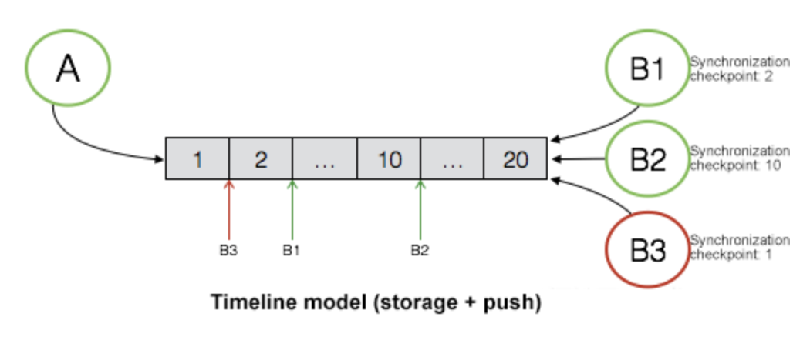
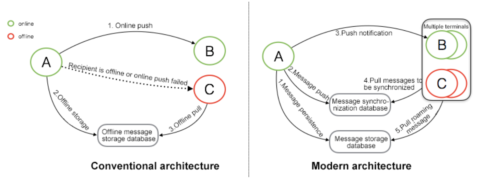
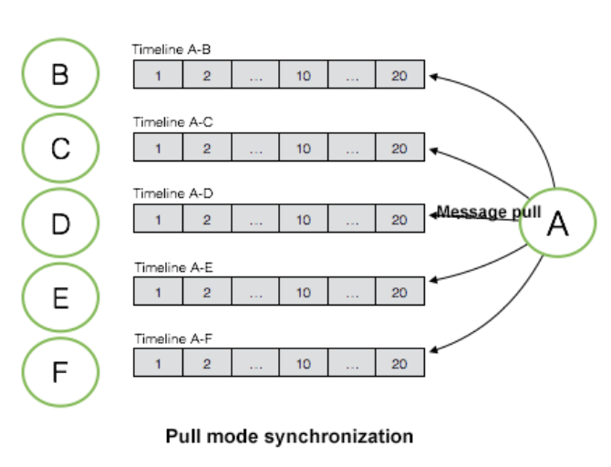
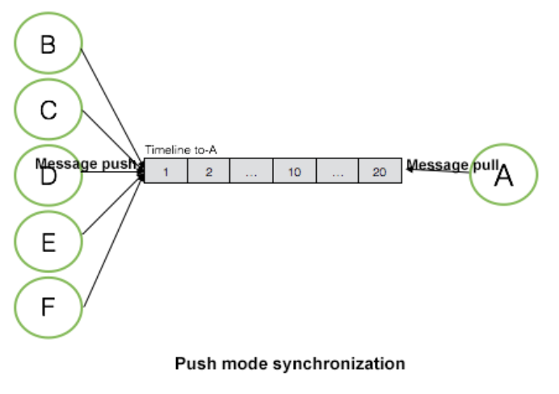
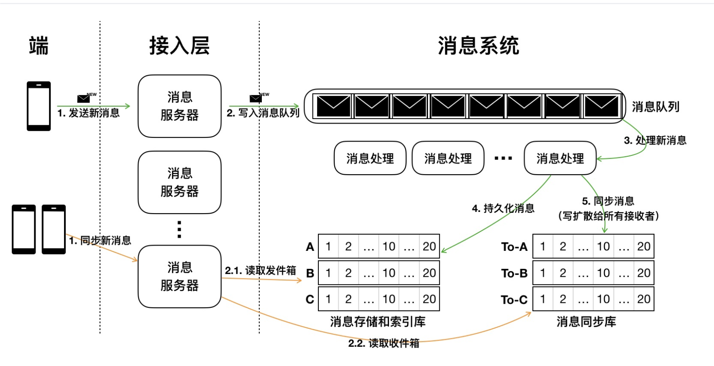
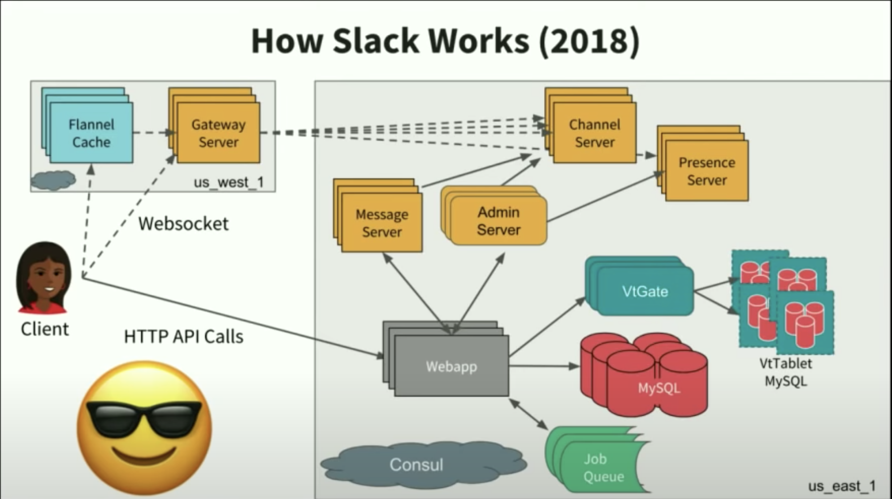

# Design instant messaging system

This is the notes for designing a facebook messager, Tencent wechat, Whatsapp, Slack, Alibaba Dingding like instant messager system.

## User stories

- As a user, I would like to send text/picture/video messages to another friend. (1:1 messaging)
- As a user, I would like to send text/picture/video messages to a group of friends. (Group messaging)
- As a user, I would like to use different devices to send/recieve messages, e.g. mobile app client and laptop app client. (NOT simultaneously)
- As a user, I would like the data to be persistent, so that different devices could load the full history of the message. (Message roaming)

## Out of scope for future research

- Rate limiting
- Search
- Monitoring and Logging
- Voice or Video calls

## Assumptions

- 75m DAU, 7KB/text message, 30 msgs/day
- Assume user would send message to `online` user most of the time

## Data model

### Client

``` json
// POST /api/v1/rtm.send
{
    "sourceID": "xxxxxx",  // message producer
    "targetID": "xxxxxx",  // clientID or groupID of the message consumer
    "text": "hello"
}

{
    "sourceID": "xxxxxx",  // message producer
    "targetID": "xxxxxx",  // clientID or groupID of the message consumer
    "encodedMedia": "4jsxied=="  // binary encoded media data
}
```

``` json
// GET /api/v1/rtm.receive
{
    "sourceID": "xxxxxx",  // message consumer
    "targetID": "xxxxxx",  // message producer
    "lastPos": "jD9ace6==" // the hash indicates the last read from message queue
}
```

### Message Server

``` golang
    type Message struct {
        sequenceID string  // channelID:timestamp to make it global unique, channelID could be mapped from sourceID and targetID if 1:1 messaging, or channelID could be the targetID if group messaging
        text       string  // text content of the message
        mediaURL   string  // the URL
    }
```

### Message processing backend

``` golang
    type MessageQueue struct {
        messages []Message
    }

    // In memory buffer to handle the incoming messages
    // wait worker to process the message
    type MessageBuffer struct {
        MessageQueue
    }

    // A collection of MessageQueue
    type MessageQueues struct {
        messageQueues []MessageQueue
    }
```

MessageQueue:



- Each message has an incremental ID, `sequenceID`.
- New messages are appended only, so that the messages in the queue is sorted based on the delivery order.
- Allow read from a position.

## Architecure



### Conventional architecture

1. If target is online, then messages are directly synced without storing in DB
2. If target is offline, the messages will be stored in `offline` DB
3. When target is back online, it could read from the `offline` DB

Analysis:

- This architecture seems nicely fit Snapchat use cases where message is sent and deleted.

### Modern architecture

1. Messages are stored in `MessagePersistentStore` first
2. Once messages are stored successfully, they will be pushed to `MessageSyncStore`
3. A notification will be sent to target which indicates there are new messages
4. Target pull messages from `MessageSyncStore`

Analysis:

- When target recieves the messages, they are guaranteed to be persistent already
- Multiple target devices could pull messages from the `MessageSyncStore` at the same time
- `MessagePersistentStore` allows messages could be persistent and message roaming

## How messages are synced

### Pull model



- Each individule sender maintains an message queue (overall it is a `MessageQueues`), every time when a sender wants to send data no matter target is online or offline, it sends to its own message queue. E.g. `B` has a session with `A`, `B` sends data into the `A-B` queue.
- Every time when receiver wants to read messages, it `pull`s from each message queue.

For example, I was chatting with 10 of my friends, there will be 10 message queues between my friends and I. Each time I open the app, it loops on all message queues to pull the messages.

The cons of this approach are:

- On read-heavy case, the `loop on all queues` is inefficient. Because not all queues have new messages.

### Push model



- The receiver maintains a big message queue, all senders send new messages to this queue for message sync. It combines all messages from all senders.
- When receiver wants to read, it just read from the queue.

The cons of this approach are:

- If user has several big groups with 1000 members, there could be lots of write(write heavy). Using this model will cause high latency on 1:1 messaging, because there could be tons of group messages in the queue.

### Conclusion

Most of the IM systems are using push model for 1:1 messaging and pull model for group messaging.

## How messages are persisted

## Overall architecture





## Questions

- what happens if we could add msg to `msg sync queue` but not in `msg persistent queue` ?
  - network partition makes the data persistent process delays. we might want to have a on-disk `msg sync queue` with a relatively larger size to temporarily persist the data on local disk, then the data persistent process could periodically back up the snapshot of the local on-disk `msg sync queue`.
  - or make the in-memory `mgs sync queue` larger ?
- A new group member is added to the group, do we allow him/her to see the full history ?
- How to deal with high peak of re-connection ? Flannel

## Others

- Slack is using:
  - `Redis` as the job queue
  - `Memecached` for caching
  - `Vitess` + `MySQL Cluster`(master-master strong consistent model) for data persistent
  - `Solr` for search
  - Team partitioning (Orgnization)
    - Easy to scale to lots of teams
    - isolate failures and performance issues

## Refereces

- [Youtube: Very brief IM design from Tushar Roy](https://www.youtube.com/watch?v=zKPNUMkwOJE&ab_channel=TusharRoy-CodingMadeSimple)
- [Youtube: How slack works](https://www.youtube.com/watch?v=WE9c9AZe-DY&ab_channel=InfoQ)
- [Implementation of Message Push and Storage Architectures of Modern IM Systems](https://alibaba-cloud.medium.com/implementation-of-message-push-and-storage-architectures-of-modern-im-systems-e0d73b8b6c81)
- [Youtube: Flannel: Slack's secret to scale](https://www.youtube.com/watch?v=s4xgfT81BTg&ab_channel=GeekWire)
- [Slack: Flannel, Application level edge cache](https://slack.engineering/flannel-an-application-level-edge-cache-to-make-slack-scale/)
- [SimpleIM.java](https://github.com/aliyun/tablestore-timeline/blob/master/src/test/java/examples/v1/SimpleIM.java)
- [Slack on AWS case study](https://aws.amazon.com/solutions/case-studies/slack/)
