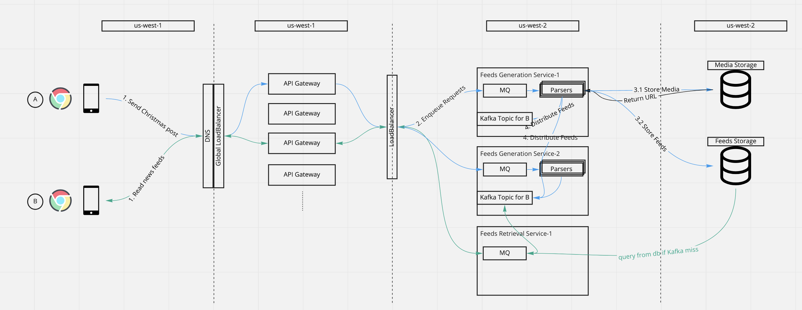
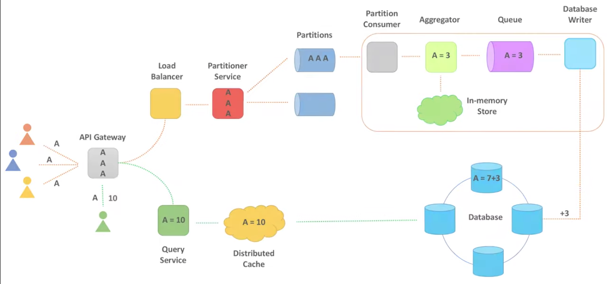
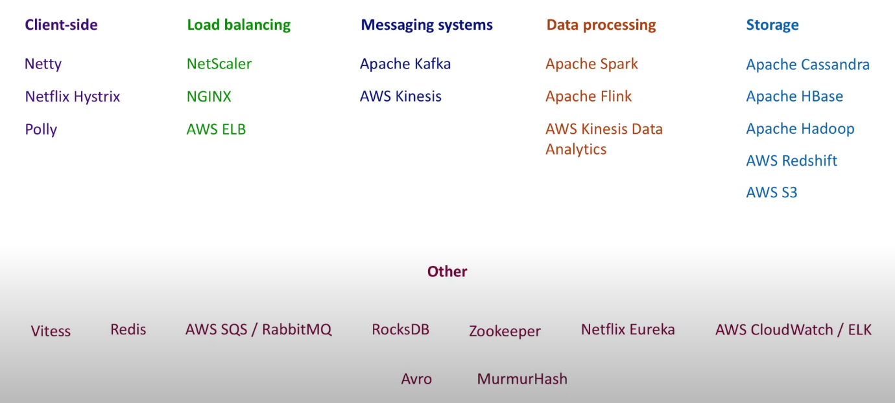

# Design news feeds system

## Requirements

- User could post a text/image/video feed
- User could view his/her own feeds sorted by time
- User could view the posts from his/her friends(he/her follows)
- User could comment on any posts
- User could add like to any posts

---

- User needs to see his/her own post in near real time (Read your own write)
- Any posts could never be lost (Highly data persistent)
- The system needs to be HA

## Assumptions

- What is the DAU ?
- What is the average size of each post ?

## Data model

### User profiles

``` golang
type UserProfile struct {
    UserID string
    Name   string
    Age    int
    ...
}
```

### User relations

``` golang
type UserRelations struct {
    UserID    string
    Follows   []string // a slice of user ids current user follows
    Followers []string // a slice of user ids who are the followers of current user
}
```

### Feeds

``` golang
type Feed struct {
    UserID   string
    FeedID   string // could be constructed by using userID + timestamp which could be used as a sequential ID
    Text     string
    MediaURL string // usually is generated by the object storage service with a uuid as a suffix
    Comments []struct {
        UserID  string // user who writes the comment
        Content string // the content of the comment
    }
    Likes    []string // the user ids who send the likes
    ...
}
```

### Media

``` golang
type Media struct {
    MediaID     string
    UserID      string
    MediaURL    string
    Description string
    ...
}
```

## Storage

### To persist data models

We need to persist the data models to fit the requirements of data persistent.

There are tons of the video out there talking about the diffs betwen sql and nosql databases, like [this one](https://towardsdatascience.com/databases-101-sql-vs-nosql-which-fits-your-data-better-45e744981351).

We would consider the following when making the decisions:

- Flexibility: In our case, some of the data models could be unchanged for a very long time, e.g. `UserProfile`. But others could be extended from time to time, e.g. `Feed`, facebook does not have `likes` feature at the very begining. So we could use SQL database for `UserProfile`, use NoSQL for `Feed`, `Media` and `UserRelations`.
- Scalability: NoSQL database is natually designed for distributed system. If using SQL database like `mysql cluster`, we might need to have another layer(`Vitess`) to manage its scalability.
- Feeds are read heavy, so we want a database service with a relatively good performance on reads and queries.

### To persist media

We need a seperate data store for pictures and videos. A good candidate could be an object storage which has HTTP API supports.

Click here to know more on [differences between file storage, block storage, object storage](https://daniel-guo.gitbook.io/notebook/miscellaneous/file-nas-vs-block-san-vs-object-storage)

### MessageQueue/Kafka to support Push/Pull model

In order to stream the feeds to consumers, the post requests could be sent to the message queue waiting to be processed, and then dispatched to Kafka to buffer the feeds for online consumers. This definitely could help to reduce the database access frequencies.

## Architecture



Above is the very brief high level architecture based on push model. The service does not necessarily to be `push based`. The blue lines are the workflow of posting a news feed, and the green lines are the workflow of getting a news feed.

## Components design

### API Gateway

API Gateway could help providing the following:

- Rate limiting
- Metadata caching: friends list
- User presence caching
- Authn/Authz to control the access to APIs

### Feeds generation service

- A message queue or golang channel to hold the requests
- Parsers are threads to parse the request:
  - Send media to object storage service (Async)
  - Persist the feed object to feeds storage (Sync)
  - (For push model) Enqueue feed event to kafaka for online consumers
    - `UserRelations` holds the data about which topics the parser should enqueue the events
  - (For poll model) Enqueue feed event to its own kafka topic for consumers

### Feeds retrieval service

- Get the userID from request
- Get the lastReadOffset from request
- (For push model) From userID knows which topic to fetch feed events
- (For poll model) Get the follow list which has a list of userIDs, then to each topics to fetch data

### Add comments

### Count likes



Above workflow is from [this youtube video](https://www.youtube.com/watch?v=bUHFg8CZFws&ab_channel=SystemDesignInterview)

### Streaming likes on Live video

More details could be found [here](./../../real-time-interactions-on-live-video/readme.md)

## Scaling

TBA

## Tools to use



## References

- [Youtube: Scaling Instagram Infrastructure](https://www.youtube.com/watch?v=hnpzNAPiC0E&t=12s&ab_channel=InfoQ)
- [Youtube: System design on counting likes](https://www.youtube.com/watch?v=bUHFg8CZFws&ab_channel=SystemDesignInterview)