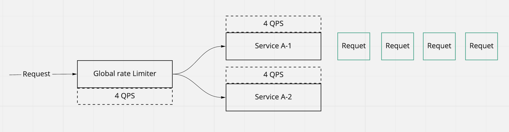

# Rate limiting

## Terminologies

- Fail close system: A system is set to shut down and prevent further operation when failure conditions are detected.
- Fail open system: A system set to fail open does not shut down when failure conditions are present. Instead, the system remains “open” and operations continue as if the system were not even in place.

For rate limiting system, it should be `Fail Open` system.

## Why rate limiting is needed

- Protect shared services from **excessive use** or prevent **resource starvation**(from malicious or non-malicious DoS)
- Managing policies and quotas. When the capacity of a service is shared among many users or consumers, it can apply rate limiting per user to provide fair and reasonable use, without affecting other users.
- Controlling flow. For example, you can distribute work more evenly between workers by limiting the flow into each worker, preventing a single worker from accumulating a queue of unprocessed items while other workers are idle.
- Avoiding excess costs. You can use rate limiting to control costs in the service which has traffic based auto-scaling feature.

## Requirements clarification

- Could we leverage software's horizontal scaling feature to handle the high load, e.g. K8S auto scaling ?
  - The auto scaling does not happen immediately
- Why not limit the max connections in LB and max threads count on a service endpoint ?
  - LB has no knowledge about the request priorities, we might want to limit some high cost requests but allow low cost requests to pass through.

### Functional requirement

- API returns `bool` to indicate whether a request is allowed

### Non-functional requirement

- Low latency on decision making
- Accurate on throttle calculation
- Scalable on arbitrarily large number of hosts
- `Fail Open`, if rate limiting fails we still want our service to be available

## Strategies

### No rate limiting

No rate limiting is the floor that the design needs to consider in worst-case situation. Using timeouts, deadlines, circuit-breaking pattern helsp your service to be more robust in the absense of rate limiting.

### Pass through

The service calls other service to fulfill requests. `429 Too Many Requests` http response might be used to return to the caller.

- Just forward the rate-limiting response from downstream back to the caller.
- Enforce the rate limits on behalf of the downstream service and block the caller.

### Enforce rate limits

Put the rate limits in place to protect current service or the downstream service.

To enforce rate limiting, first understand why it is being applied in this case, and then determine which attributes of the request are best suited to be used as the limiting key (for example, source IP address, user, API key). After you choose a limiting key, a limiting implementation can use it to track usage. When limits are reached, the service returns a limiting signal (usually a 429 HTTP response).

### Defer response

When under the high traffic responding to the caller's request is also a challenge.

- The service could response a simple job ID which could be used by caller to poll the request status.
- The caller could register a callback, the service will call it once the response is ready.
- The caller could subscribe to a event channel where the service will send the response into.

### Client side strategies

If the backend service does not provide the rate-limiting, the client could apply self-imposed throttling.

- Apply exponential backoff with random offset(jitter) on retries.

## Architecture

### Local rate limiting

- Admin could configure the rules via the config service, e.g. client A could have 100 QPS
- Rate limiting service pulls the configurations and store in the cache for quick access
- When requests come to backend service, the backend service checkes with rate limiting service to see if the requests are allowed
- Rate limit engine calculates the throttle and return back to the backend service if requests are allowed or rejected

#### Why not letting the rate limiting service to be the gateway ?

- In that case, the rate limiting service needs to handle the service discovery for all downstream services which is a big pain

#### What if the in-memory requests cache crashes ?

- All requests counts are lost, which could cause the peak traffic to backend service. So we need to make the `requests counts` persistent in a distributed way

### Distributed rate limiting

## How to implement rate limiting | Techniques for enforcing rate limit

### Token bucket

- Use a counter to indicate the number of available tokens
- Each time a request comes, it needs to "consume a token"(decrease the token counter)
- Refill the token(increase the token counter) at some rate

[Java sample implementation](https://github.com/vladimir-bukhtoyarov/bucket4j/blob/master/doc-pages/token-bucket-brief-overview.md)

### Leaky bucket

- The requests are consumed with a fixed rate
- If more requests come, it would queued up (uber implements this by using sleep, rather than discarding the leaking requests)

This is similar to token bucket, if no tokens are available, we could put the request to sleep until the tokens are refilled. Or we could discard the request and return `429 Too Many Requests` back to client.

[Golang implementation](https://github.com/uber-go/ratelimit/blob/master/ratelimit.go)

#### Pros of Token Bucket and Leaky bucket

- Could smooth out bursts at an approximately average rate
- Easy to implement on single node

#### Cons of Token Bucket and Leaky bucket

- Burst traffic could make so many requests sleep which causes high thread consumption
- There is no guarantee how long the requests could be processed

### Fixed window

- Divide the timeline into a fixed window. e.g. 60s or 3600s
- Define the rate for each window. e.g. 10 requests/3600s
- Use a counter to count the number of requests for a particular window
  - For each request, use floor(current_time) to decide which window it belows.
  - e.g. 12:00:03 would be in 12:00:00 window
- If counter exceeds the limit, discard the request (return `429` Http code)
- In a new time window, the counter gets reset

#### Pros

- Make sure the most recent requests could be processed in a new time window, it prevents starvation from using token bucket solution
- Memory efficient since we just use counter

#### Cons

- The bursts would happen near the boundary. e.g. spike at 12:59, and another spike at 1:00
- Requests to be retried could easily fill up next window and cause the spike and another amount of requests to be retried

### Sliding log

- Each request has a timestamp
- Store a window of logs and sorted by timestamp (this could be done by using treeMap in java or other data structure implement the red-back tree)
- When a new request comes, we calculate the sum of requests in the range of (currTime - windowSize, currTime). (logn to query)
- If the amount of requests have exceeded the limit, then discard the request, otherwise accept it

#### Pros

- No boundary burst
- Accurate

#### Cons

- Costy on request count calculation
- Costy on storing the logs

### Sliding window

- Has two states, `preState` and `currState`
- Lets say we have the following facts:
  - The window size is 60mins
  - `currTime` - `floor(currTime)` is 15mins
  - `preState.count` = 84
  - `currState.count` = 36
- We calculate the total amount of requests from `12:15` - `1:15`
  - `84 * (60 - 15) / 60 + 36`
- If the result from above exceeds the limit, then we discard the request, otherwise accept it
- If `currTime - floor(currTime)` >= `windowSize`, `preState = currState`. So that the window moves forward

#### Pros

- Overcome the query and storage issue from sliding log solution
- No bundary burst
- Approximately value is acceptable

#### Cons

- It is possible that all requests happen in [12:15 - 1:00], so the calculation will have some inaccuracy

## Rate limiting in distributed system

### Global rate limiting vs Local rate limiting

If we have **global rate limiting** set to be 4 QPS, each of the service needs to have the same QPS configurations. **It is NOT 4 / 2 QPS for each service**. It worst case, all requests have been redirected to one of the service, but 0 requests are directed to others. We should not allow new requests even there is one service has available slots.

In above case, tracking the count locally as local rate limiting is not feasible. We need to know what is the total number of requests have been received, so that to decide if we reach the limit.

Using the following formular to calculate if we have reached the limit

- Service A-1's remaining capacity - rest of service's used capacity = 0 - 0(service A-2)
- Service A-2's remaining capacity - rest of service's capacity = 4 - 4(service A-1)

How could we get `the rest of service's used capacity` ?

#### Solution 1

Broadcasting to all other services about current service's status. E.g. Service A-1 broadcast its status to service A-2. This is also called full mesh.

Challenges:

This solution does not scale when there are large number of services in one mesh.

#### Solution 2

Gossip protocol, one service picks another service randomly and tells its status. Yahoo is using this solution.

#### Solution 3

- Using a centralized data store to hold the rate limiting counts for a particular time unit and service. If using Redis, `key` could be `serviceID`, `value` could be `list` of time unit in sorted order (<https://redis.io/topics/data-types#lists>)
- When a new request comes, we could get the count from redis to decide if allow or reject the request
- For every new request, it evict the out of window boundary record first. OR we could use a circular queue just to overwrite.

Challenges:

- Latency caused by accessing centralized data store, e.g. redis
  - If the redis cluster is not local, we could use periodical resync mechanism to push data to redis, and using local memory for condition checks. This could potentially reduce the latency between nodes and redis cluster
- Race condition: `get-then-set` from/to data store under high concurrent requests would cause problem. If one request is in between of `get` and `set`, there is another request comes to `get`.
  - Adding a lock could be one solution, but would be the performance bottle neck
  - Using [incr](https://redis.io/commands/incr) to fulfill the `set-then-get` pattern

## Rate limiting in K8S

### K8S apiserver

The [implementation](https://github.com/kubernetes/apiserver/blob/master/pkg/server/filters/maxinflight.go#L139-L208) 
of apiserver has a flag called `maxInflightLimit` which is used to declare a buffered channel. Each time when a new 
request comes, it tries to add one element(`bool`) into the channel, the server invokes `handler.ServeHTTP(w, r)` and 
then poll one element out from the channel. If the buffer is full, 429 will be returned.

### client-go rate limiting

K8S controller runtime uses the client-go [default rate limiter](https://github.com/kubernetes/client-go/blob/master/util/workqueue/default_rate_limiters.go#L39-L45) 
if no custom rate limiters are provided by controller options. The client-go default controller rate limiter applies 
`ItemExponentialFailureRateLimiter` and `BucketRateLimiter`, returns the worst case response back. `BucketRateLimiter` 
uses the golang built-in [implementation](https://github.com/golang/time/blob/master/rate/rate.go#L310).

## References

- <https://cloud.google.com/solutions/rate-limiting-strategies-techniques>
- <https://konghq.com/blog/how-to-design-a-scalable-rate-limiting-algorithm/>
- <https://medium.com/nlgn/design-a-scalable-rate-limiting-algorithm-system-design-nlogn-895abba44b77>
- <https://www.figma.com/blog/an-alternative-approach-to-rate-limiting/>
- <https://stripe.com/blog/rate-limiters>
- <https://www.codementor.io/@arpitbhayani/system-design-sliding-window-based-rate-limiter-157x7sburi>
- <https://github.com/alibaba/Sentinel>
- [Youtube: Design rate limiting](https://www.youtube.com/watch?v=FU4WlwfS3G0&ab_channel=SystemDesignInterview)
- [Youtube: Leaky Bucket vs Token Bucket](https://www.youtube.com/watch?v=bL0I54Vac9Q&ab_channel=AvinashKokare-CS-ITTutorials)
- [Private repo: Golang rate limiter implementation](https://github.com/danniel1205/rate-limiter)
