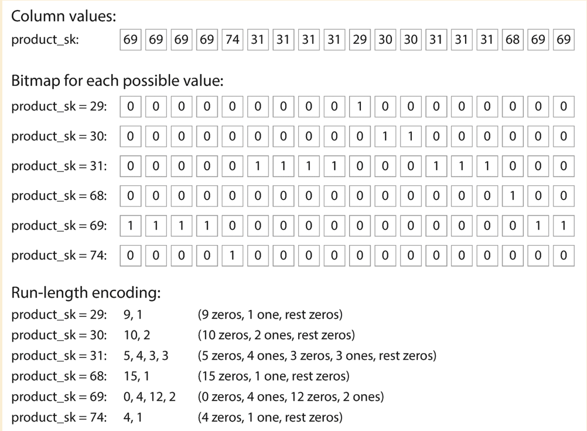

# Column oriented storage

The idea behind column-oriented storage is simple: don’t store all the values from one row
together, but store all the values from each column together instead. Bigtable model is still mostly row-oriented.

## Column compression

### Bitmap encoding

If distinct values from one column is small, we could have each bitmap for each value.
If distinct values from one column is large, we could use `run-length` encoding.

### Queries

`WHERE product_sk IN (30, 68, 69)`

Load the three bitmaps for product_sk = 30 , product_sk = 68 , and product_sk = 69 , and
calculate the bitwise OR of the three bitmaps, which can be done very efficiently.

`WHERE product_sk = 31 AND store_sk = 3`

Load the bitmaps for product_sk = 31 and store_sk = 3 , and calculate the bitwise AND . This
works because the columns contain the rows in the same order, so the k th bit in one column’s bitmap corresponds to the same row as the k th bit in another column’s bitmap.

## Sort order in column storage

### Why we want to sort

- Easier for index like SSTable
- Easier for compression
- Easier for query (e.g. we sort by date key, so query last month's record will be easy without having to load entire column into memroy)

The only problem is that we have to sort not only the current column, but other columns as well. Because we have to keep the ith element from column A is matching the ith element from column B.

### Mutiple sort keys

We could sort by date key first, then if dates are the same, then sort by product key.

In distributed system, we could have different machine has the database sorted by different key. So that a particular query could go to a particular machine which has the table sorted best for its use case.

## Write problem with sorted column

How to write a row of data into a sorted column oriented storage ?

Use the strategy of [LSM Tree](./log-structured-storage.md), because LSM Tree is sorted. Once the LSM Tree hits the threshold, it dumps the data onto disk and merge with existing column files. When query, we have to scan the `in-memory` LSM Tree as well as the on disk columes.