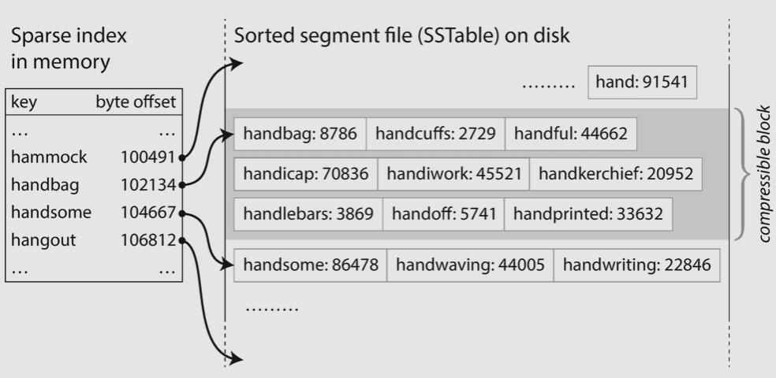
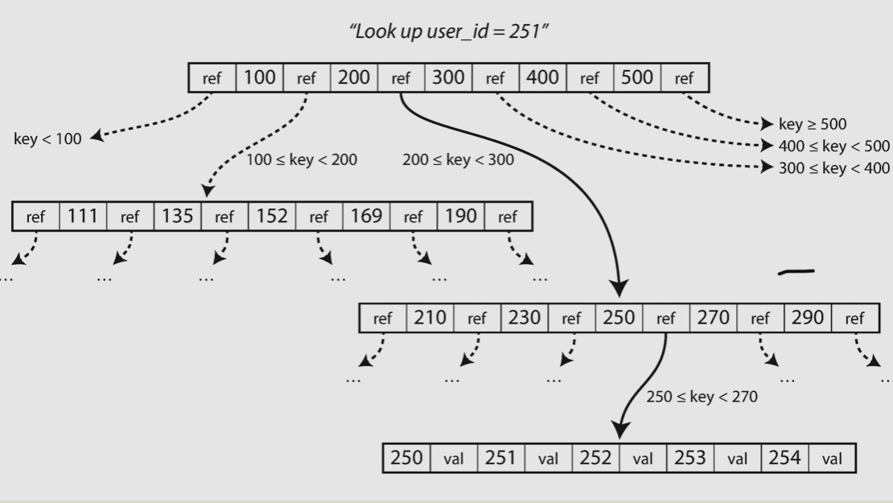

# Page oriented storage

## B-Tree

The most widely used indexing structure. Instead of having the log indexing on variable size segements, B tree uses `fixed-size` pages, and read or write one page at a time. The B tree is holding **in memory**, the leaf contains the ref(disk address) to the actual data.

Log indexing

B tree indexing

### On read

- Starting from the root of B tree
- Find the sub page from the boundires until hit the leaf
- The leaf has the ref to acutal data

### On write

- If updating the existing data
  - Starting from the root and find the leaf
  - Update the data or page directly
- If inserting a new data
  - Starting from the root and find the leaf
    - If there is space, then just insert the key and value holds the ref to actual data
    - If there is no space, then split the leaf into two, then insert the data

### Crash recovery

The B tree is in memory, if system crashes we need to rebuild the B tree. This could be done from `write-ahead-log`.

### Concurrency

`Latches` (lightweight locks) is used to protect the page from modified by concurrent thread/processes.

