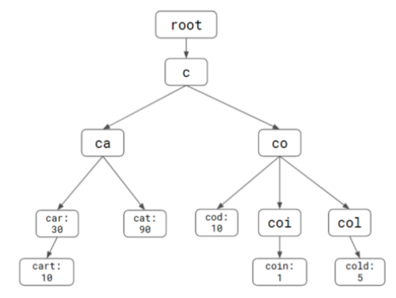
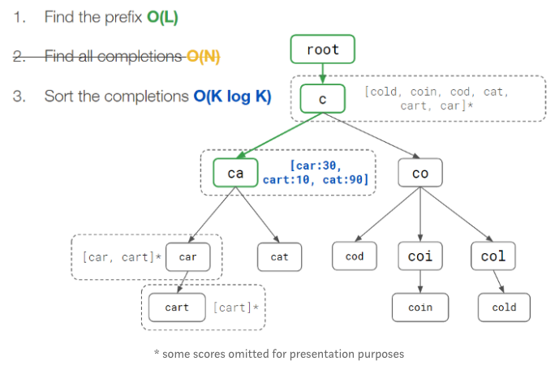
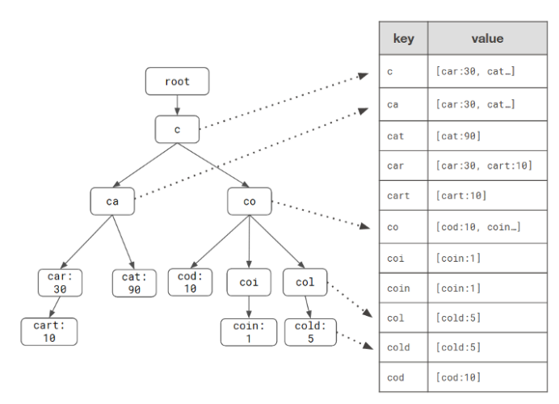

# Auto complete service

## Use cases

Design a Google Search like auto completion service, which takes user's real time input and return a set of top ranked completions from a given prefix.

## Requirements

- Performance on read: the auto completions need to be returned fast.
- The ranking is based on all users' input.
- Under air gap environment, the auto completion should based on the user local cache.

## Design

### Data model and Algorithms

Using trie tree as the data structure is a get-go solution. We could store the ranking score along with each word node. So that we could sort on it to get the top k records.

Current time complexity:

- O(L) to find the prefix, L is the length of a prefix
- O(N) to get all candidates, N is the number of word nodes starting from current prefix
- O(KLogK) to sort the candidates based on scores and return top K result.

From above solution, the O(N) could be the bottle neck if we have a large number of sub nodes to be processed. And this could be true since we want to generate the completions based on all users' input as one of the requirements.

---
A improvement from above is to store the list of completions as part of each node. This is called pre-computation.

This speeds up the read performance, but brings in some issues as well:

- Increases the space usage since each node has to store extra data
- Same data is duplicated on nodes
- Update the ranking score is costy

However, the cost on updating ranking scores is trivial comparing to the read performance. We could have a asyc process updating the ranking scores with some intervals, e.g. every 10mins or every 1000 read requests.

If we really want to improve on storing extra data, we could:

- Limit `L`. Some long query is rare, e.g. a long sentence. We could limit the prefix length to be a reasonable number, like 20 characters, which could help reduce storing extra data a little bit.
- Limit the `K`. We do not have to return all completions, instead top 10 or 15 is good enough.

Current time complexity:

- O(L) to find the prefix, L is the length of a prefix
- O(KLogK) to sort the candidates based on scores and return top K result

If we limited the `L` and `K`, the time complexity is constant.

---
Now we need to persist the data model into database, because we do not want to lose the prefix tree we have generated in the case of system rebooting. If using relational database, we need to have ORM(Object-Relation-Mapping) to map the data structure into schemas which might increase the overhead of encoding and decoding and have an impact on performance. With NoSQL databases, things will be easier because a tree structure could be stored as a Document(MongoDB) or a nested JSON. Updating the tree structure would be also easier, and also distribute the persistent data.

We could use Prefix Hash Tree to store our prefixes and completions, because it could map the prefix to a hash key and the completions to the hash value, so it could be very easily implemented in NoSQL database.

The disadvantage will be the space. It does not share the prefix of each key in the map. But we could accept the tradeoff.

---
Lets say we have the maping between prefix and completions list. Since we have to return a sorted completions based on sores, so we have two options: a) sort on read, b) sort on write. If we sort on read, it definitely will increase the response time. So sort on write might be a better solution.

And We have the following operations need to consider:

- Search for a prefx. When user type in `ca`, we have O(1) time complexity to return ["car", "cat", "cart"].
- Update the ranking score of existing word if user picks it. e.g. If the word user's pick is `car`, we need to update the score for word `car` in all its parent prefix nodes(keys). In above case, keys of ["c", "ca", "car"] need to be processed in order to udpate the scores. In order to process all the parents keys, we need to have maintain the curr -> parent refs. This could be easily done in MongoDB to store tree as document, or in Redis we need two maps because Redis does not support nested data structure. Within each key -> value, updating the score is pretry easy: a) binary search on the word, b) increment the score, c) move it to a new location. The overall time complexity could be O(logK), just like insertion sort. Or we could use native feature of database, e.g. Redis has sorted set supported.
- Add a new word and delete a word out of `K`. If a new word is added, a new entry in the completions list is added. If the size of completions list has reached `K`, we need to eliminate the lowest score element and then add the new word. We could set the score of the new word to be the `current lowest score + 1`. In this case, we could avoid the new word to be eliminated immediately once another new word is added. Adding a new word needs to process all its parent keys as well like what we do for update the score of existing word.

The database processing is time consuming, we could have a background process to do the job instead of doing it synchronously.

#### How to store tree in data store

[how to store tree in data store](https://github.com/danniel1205/tech-notes/blob/master/system-design/2-data-models-and-query-languages/how-tree-is-stored-in-database.md)

### Cache

Now another concern comes into the picture, disk IO is expensive for reading/writing the prefixes, scores back and forth between the service and database.

So, we could use an in-memory based database as a cache in between disk based database and server code. Reids is a good candidate. The LRU policy could keep the latest records and if cache misses, data could be read from the disk. Another reason of picking redis is that it is also distributed in-memory database which has a very high scalabilty.

### On disk database

We discussed on NoSQL database could be a best fit in our case. And a key-value based database could make the persisitence process easier, because it could avoid some overhead to encoding/decoding data between two different models.

### Data sharding

If we support average 5 words auto suggestion, each word has average 10 characters, and we have 1 billion unit sentences. So we will end up with `5 * 10 * 8(byte) * 1,000,000,000 = 400GB` data. This data cannot fit in to memory and cannot fit into reglular K8S node. So we have to shard our data across all nodes in our service cluster.

// TODO: Add design for data sharding

### Data replication

// TODO: Add design for data sharding

### Client design

- Wait 500ms or 1s before sending out the request to server
- Client might want to maintain a search history list in order to have a consistent user experience in air gap environment

## Further analysis

- When reading with a cache miss, should we update the cache first or return to the client first and let cache updates happen asynchronously
- When writing a new record, should we update cache first or disk database first

## References

- <https://medium.com/@prefixyteam/how-we-built-prefixy-a-scalable-prefix-search-service-for-powering-autocomplete-c20f98e2eff1>
- <https://prefixy.github.io/>
- <https://docs.mongodb.com/manual/applications/data-models-tree-structures/>
- <https://medium.com/@chethanbandi/storing-tree-structure-in-redis-cf43c3775c99#:~:text=Redis%20doesn't%20support%20nested,get%20the%20list%20of%20children.>
- <http://oldblog.antirez.com/post/autocomplete-with-redis.html>
