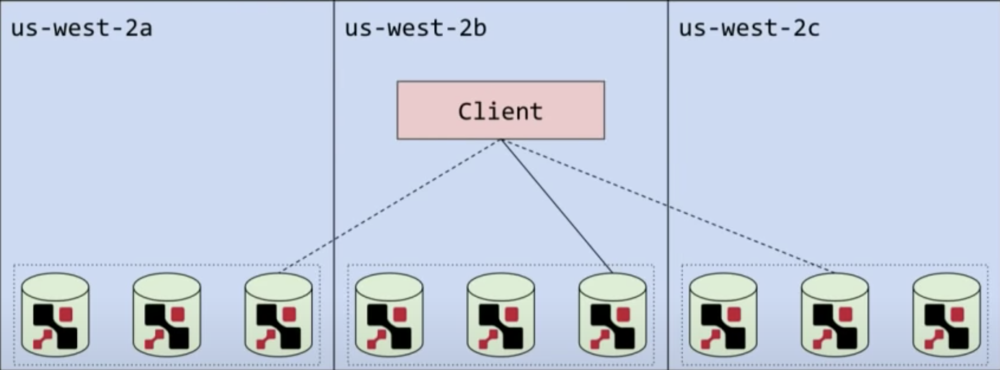
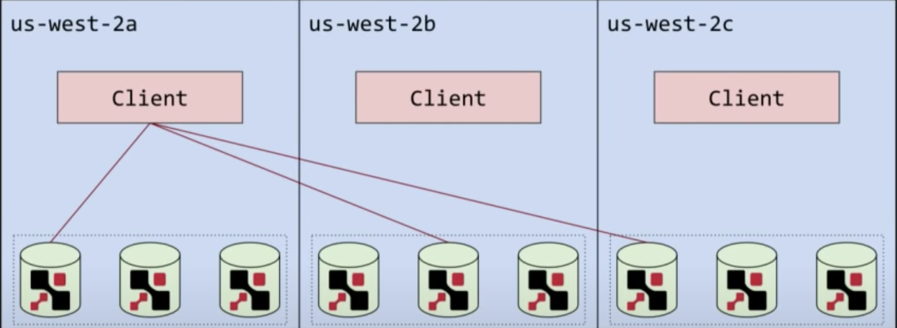
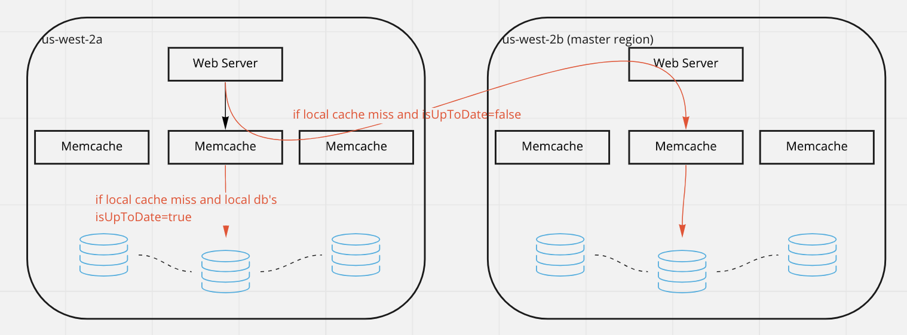
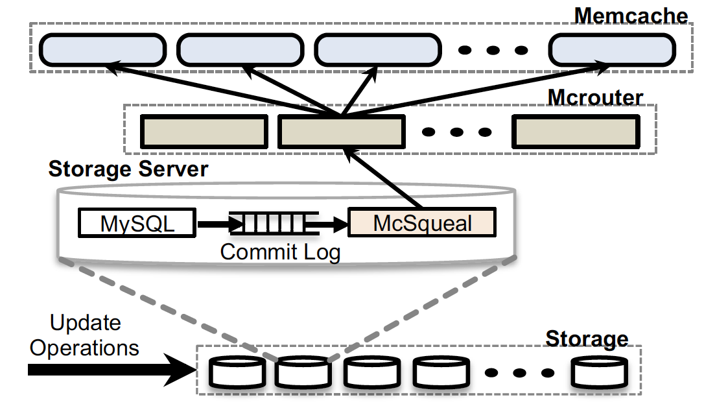
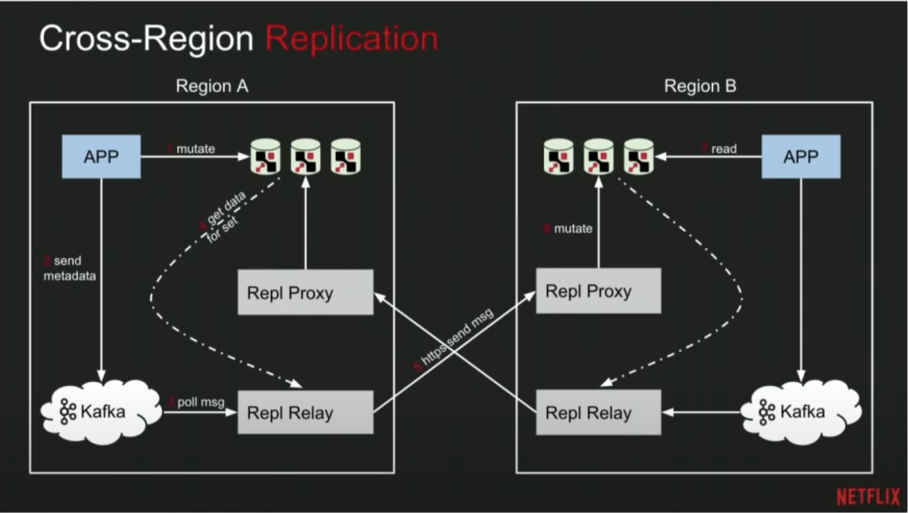
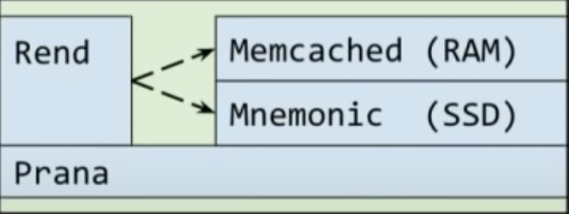

# Caching

## Why needs caching

- Hard disk or SSD read/write speed is slow
- Read heavy applications/services need a mechanism to speed up
- Read heavy applications/services need a mechanism to reduce load to backend
- Use in memory cache layer to store subset of data (capacity trade off performance)

When local caches are used, they only benefit the local application consuming the data. In a distributed caching
environment, the data can span multiple cache servers and be stored in a central location for the benefit of all the
consumers of that data.

There are different levels of caching:

- Client side caching: browser cache, OS cache
- CDN caching: used to cache static files, like images, videos, etc.
- Database caching: used to increase the data retrieval performance
- Caching layer between client and datastore: in-memory key-value store like `Redis` and `Memcached`

## Cache write policies

Reference: [Open CAS cache mode](https://open-cas.github.io/cache_configuration.html#cache-mode)

- [Write-through Cache](https://www.youtube.com/watch?v=ptFn7f_SgSM&ab_channel=ASmallBug)
  - In Write-Through mode, the cache engine writes data to the cache storage and simultaneously writes the same data
    “through” to the backend storage

- [Write-around Cache](https://www.youtube.com/watch?v=mA5D48POAww&ab_channel=ASmallBug),
  the same idea of [look-aside](#look-aside) mentioned above.
  - Write does not touch cache
  - Read from cache first
    - if cache hits then return the value to client
    - if cache misses then read from the db. Return the data back to client, update cache simultaneously

- [Write-back Cache](https://www.youtube.com/watch?v=-ucqTc1eDuI&ab_channel=ASmallBug) (risky of data loss)
  - The cache engine writes the data first to the cache storage and acknowledges to the application that the write is
    completed before the data is written to the backend storage
  - The data is written back to DB when the key is evicted in cache

- [Write-invalidate Cache](https://open-cas.github.io/cache_configuration.html#write-invalidate)

## Types of cache architecture

### Look-aside

#### Look-aside On read

- client first checks the cache
- if cache-hit, cache returns the result
- if cache-miss, client gets the value from storage, then updates cache(Write-around)

---
Pros:

- client handles the logic, storage and cache are decoupled
- if cache server fails, client still work

Cons:

- Performance on cache-miss is low, three trips are involved
- Adding new cache server will cause surge traffic to backend
  - [Cold start solution from "memcached at Facebook" paper](https://youtu.be/Myp8z0ybdzM?t=3239). The idea is to have a
    flag to mark the new cache server/clusters as cold, so that reads will be redirected to some warm cache/clusters to
    get the data instead of going to db directly. Once the cold cache gets the data, it will update as well.
  - Routing tier does not route request to it until it catches up

#### Look-aside On write

- client writes to storage
- client deletes the entry in cache(Write-invalidate)

---
Pros:

- client deletes the entry in cache could make sure the data consistency

Cons:

- Extra step to deletes the entry could cause some performance issue on write

### Look-through

#### Look-through On read

- client first checks the cache
- if cache-hit, cache returns the result
- if cache-miss, cache gets the value from storage, then updates itself

---
Pros:

- client's logic is easy to be implemented, it does not need to handle the logic of cache-miss

Cons:

- cache needs to hanle the cache-miss logic now, and to expose generic API for both upstream client and downstream storage
- the cache miss performance is still low

#### Look-through On write

##### Sync writes

- client writes to cache
- cache writes to storage in sync

---
Pros:

- client's logic is easy to be implemented

Cons:

- writes in sync has low performance
- not all writes need to be stored in cache (not the hot key)
- having cache layer to handle the distributed concurrent writes is complicated
- usually caching layer is deployed seperately in a different cluster, writes to cache increases the latency
- complicated error handling if db writes fail

##### Async writes

---
Pros:

- It probably has a better performance comparing with sync-write

Cons:

- not all writes need to be stored in cache (not the hot key)
- way too complicated !!!

## Granularity of caching key

We know that the caching usually is a key-value store, and what data to be stored in cache is case by case. Usually
there are two types I could think of:

- **Hash of the queries as the caching key**: The value could be a result of complicated query with filters
  - Pros:
    - Delegate the computation of the query to data store layer
    - Application just tracks the static query
  - Cons:
    - If a small piece of data is updated, there could be multiple queries need to be invalidated. And how to track
      which queries are impacted ?

- **Hash of the object as the caching key (mirror the subset of data store)**: If the data store is key-value already,
  we could cache a subset of those key-value pairs
  - Pros:
    - cache invalidation is easy, since we know which key is updated and where to find it in cache
  - Cons:
    - Application needs to handle the computation of the final query result, e.g. filtering.

## How cache eviction work

- LRU: Evict the least recently used item. E.g. Netflix video caching
- MRU: Evict the most recently used item. E.g. Tinder does not want to show the most recent items.
- LFU: Evict the least frequently used item. E.g. Phone typing prediction

## Distributed cache

### How distributed caching(hash table) works

Having the local cache cluster within each region. And have it replicated to all other regions.

#### Netflix EVCache Reading

- Read from the local cache first, if cache-miss then read from another cluster in different region

#### Netflix EVCache writing

- Write to all regions

#### Facebook Memcache Reading

- There is one region is master region which holds the master databases for both reads and writes. Replica regions are
  read only
- If read from replicate region and cache miss
  - If `isUpToDate==true`, then read from local database. Because it means that local database has
  replicated the latest data from master region
  - If `isUpToDate==false`, then redirect the reads to master region to read from the cache first. If still cache miss
  then read from the database in master region

#### Facebook Memcache Writing

##### Write from master region

- Write to the database
- Invalidate the key in all cache replicas by using `mcsquel`. We want the data to be replicated then invalidate the cache
  in non-master region. Because that if we invalidate the cache first while the data has not yet been available, any
  subsequent queries will cache-miss and read the stale data from local database then update the cache.(It causes data 
  inconsistency)
  

##### Write from non-master region

- Invalidate cache in local cluster
- Write data to master database
- Let the `mcsquel` to handle the cache invalidation broadcast 

### How distributed cache replica cross region

#### Netflix cross region replication

- Application mutate the cache data
- Application will send the mutation metadata to `Kafka` as producer
- An agent called replication relay poll the message from `Kafka` or get the data from cache directly
- The agent sends the data to remote replication proxy via `https`
- The remote replication proxy in turns mutate the cache

### How to scale cache

#### To have more shards

Not all keys reside in a single node of cache cluster, keys are sharded into multiple nodes and each of the node holds
a subset of keys. Redis has 16384 hash slots, it uses `CRC16 of the key modulo 16384` to find the location of a key. When
a new shard is added with empty, we need to transfer keys from other nodes to the new nodes. Once the new shard catches
up we could clean up them from original nodes. Redis has to run `resharding` cmd manually to move keys, we could also use
consistent hash ring to minimize the data move.

#### To have more replicas of a particular shard

Adding a new replica of a shard is easy, we just need to copy data to it from the main/master shard. Once it catches up
we could allow that node to do consensus voting.

#### To put some cold data on SSD

## How K8S client-go caching works

[How custom controller works](https://app.gitbook.com/@daniel-guo/s/notebook/k8s-related/extend-k8s/crds/custom-controllers)

There could be multiple controllers reconcile a same set of resources, it would be a huge load if all controllers talk
to api server to ask for the state of resources. So caching is really important.

The [`Thread Safe Store`](https://github.com/kubernetes/client-go/blob/fb61a7c88cb9f599363919a34b7c54a605455ffc/tools/cache/thread_safe_store.go)
is the cache where [informer](https://github.com/kubernetes/client-go/blob/fb61a7c88cb9f599363919a34b7c54a605455ffc/tools/cache/controller.go#L371)
will add the object.

## Comparision between Redis and Memcached

- `redis` provides a superset of features comparing to `memcached`
- To implement `memcached` cluster, client needs to solve traffic rounting, e.g. using consistent caching
- They have different implementations on memory management

More details could be found from the links below in references section.

## References

- [What is caching (from medium)](https://medium.com/system-design-blog/what-is-caching-1492abb92143)
- [Caching overview (by AWS)](https://aws.amazon.com/caching/)
- [Everything you need to know about caching](https://levelup.gitconnected.com/everything-you-need-to-know-about-caching-system-design-932a6bdf3334)
- [Redis vs Memcached (by AWS)](https://aws.amazon.com/elasticache/redis-vs-memcached/)
- [Redis vs Memcached (by Alibaba Cloud)](https://alibaba-cloud.medium.com/redis-vs-memcached-in-memory-data-storage-systems-3395279b0941)
- [Cache Consistency: Memcached at Facebook (MIT Lecture)](https://www.youtube.com/watch?v=Myp8z0ybdzM&ab_channel=MIT6.824%3ADistributedSystems)
- [Paper: Scaling memcache at Facebook](resources/memcache-fb.pdf)
- [Youtube: Caching at Netflix](https://www.youtube.com/watch?v=Rzdxgx3RC0Q&ab_channel=StrangeLoop)