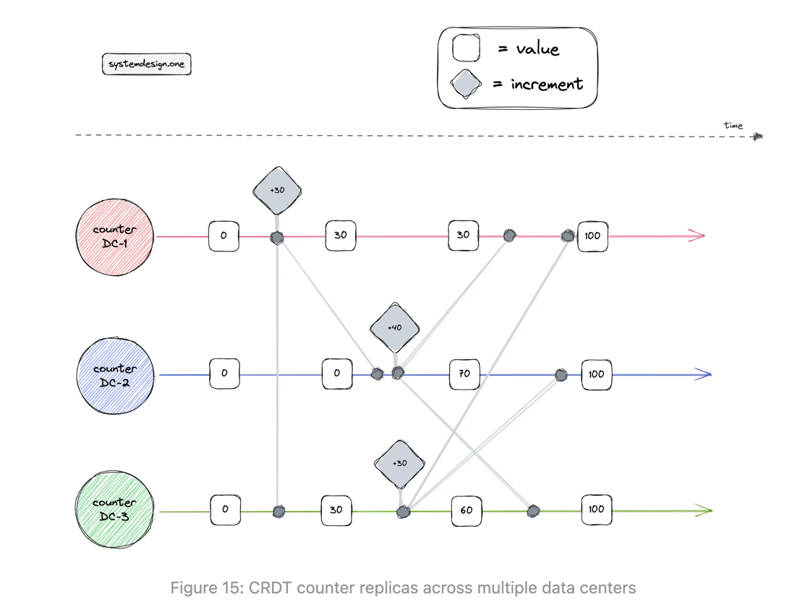
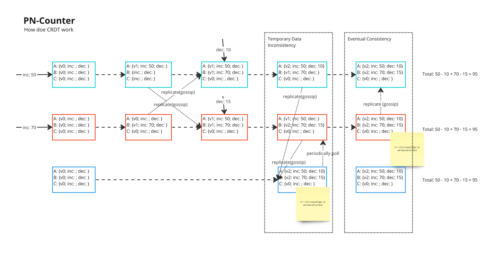
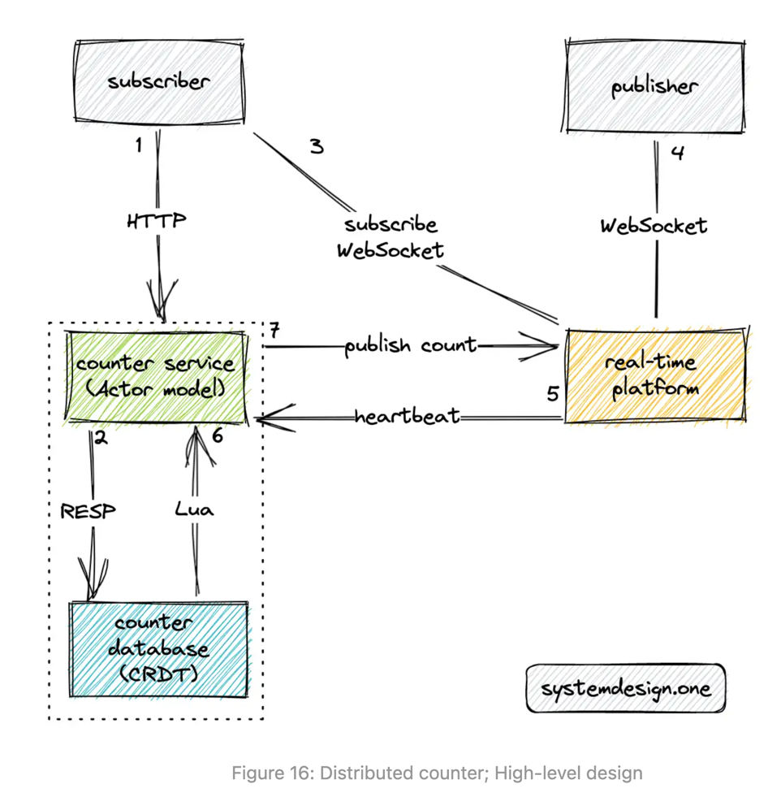

# CRDT Distributed Counter

Please read [this](../../../general-knowledge-base/conflict-free-replicated-data-types/readme.md) to understand what
CRDT is.

The CRDT is a replicated data type that enables operations to always converge to a consistent state among all replicas
nodes. The CRDT allows **lock-free concurrent reads and writes** to the distributed counter on any replica node.

CRDT-based consistency is a popular approach for multi-leader support because the CRDT offers high throughput, low
latency for reads and writes, and tolerates network partitions. The CRDT achieves high availability by relaxing
consistency constraints. The CRDT can even accept writes on the nodes that are disconnected from the cluster because the
data updates will eventually get merged with other nodes when the network connection is re-established.

The CRDT replication exchanges not only the data but also the operations performed on the data including their ordering
and causality. The merging technique in CRDT will execute the received operations on the data.

The following are the benefits of using CRDT to build the distributed counter:

* offers local latency on read and write operations through multi-leader replication.
* enables automatic and deterministic conflict resolution.
* tolerant to network partitions.
* allow concurrent count updates without coordination between replica nodes.
* achieves eventual consistency through asynchronous data updates.

Some of the popular CRDTs used in the industry are the following:

* G-counter (Grow-only)
* PN-counter (Positive-Negative)
* G-sets (Grow-only sets)

// TODO: What is handoff counter

## How does CRDT work in distributed counter

* Updates on counter are stored on the local CRDT database.
* Asynchronously replicated to peers' CRDT database (Eventual consistency model).
* Commutative property of CRDT operations ensure count accuracy among replicas.

## Workflow of distributed counter

* the subscriber (user) queries the counter service to fetch the count over the HTTP GET method
* the counter service queries the counter database to determine the count
* the user subscribes to the count of a particular web page through the real-time platform and establishes a WebSocket
  connection
* the publisher (user) establishes a WebSocket connection with the real-time platform
* the real-time platform emits heartbeat signals to the counter service over UDP at periodic intervals
* the Lua script in the counter database emits an event using the pub-sub pattern whenever there is any update to the
  distributed counter
* the counter service publishes an event to the real-time platform over the HTTP PUT method
* the real-time platform broadcasts the counter to the subscribers over WebSocket

## Reference

* <https://systemdesign.one/distributed-counter-system-design/#crdt-distributed-counter>