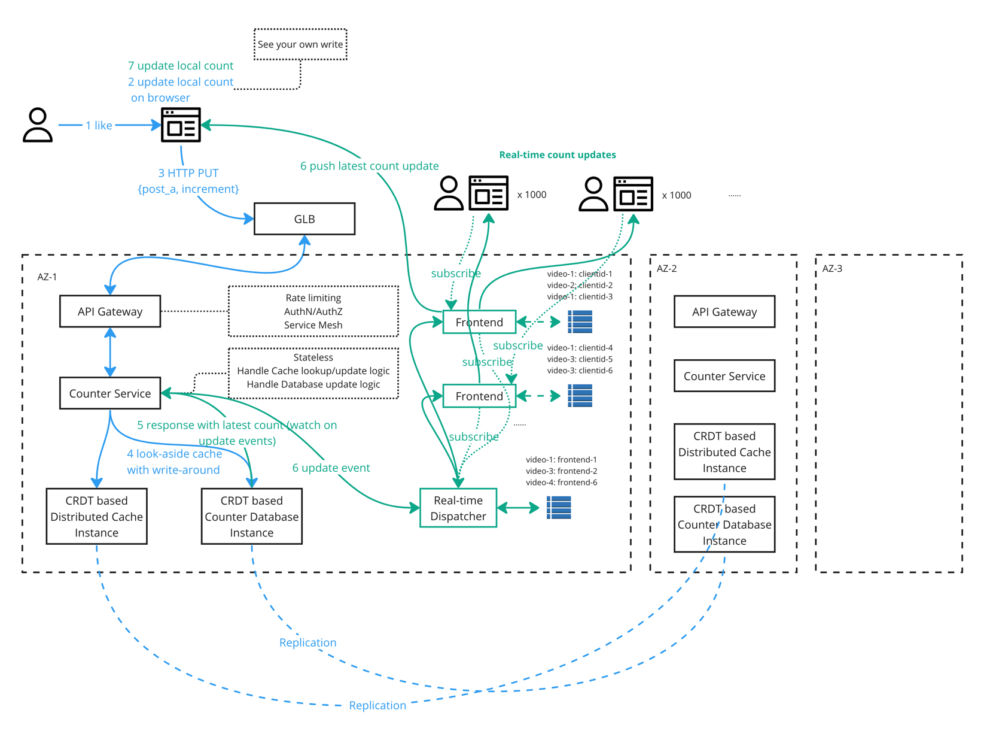
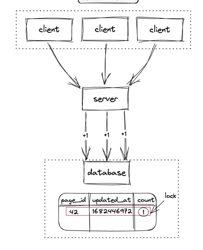
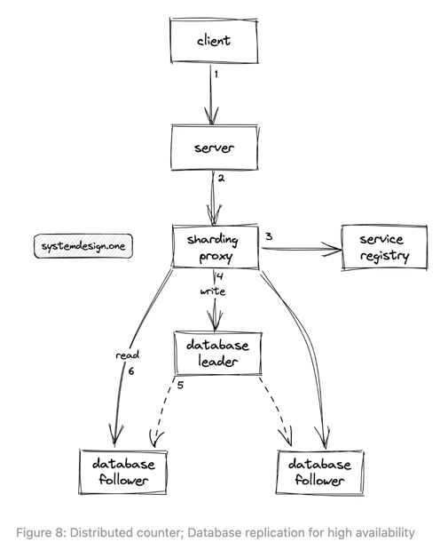
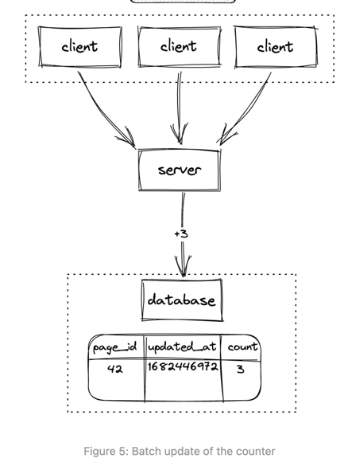
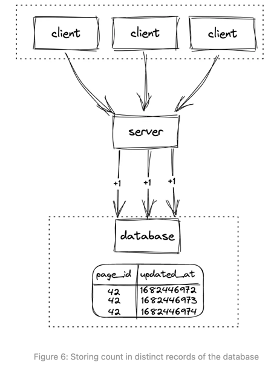
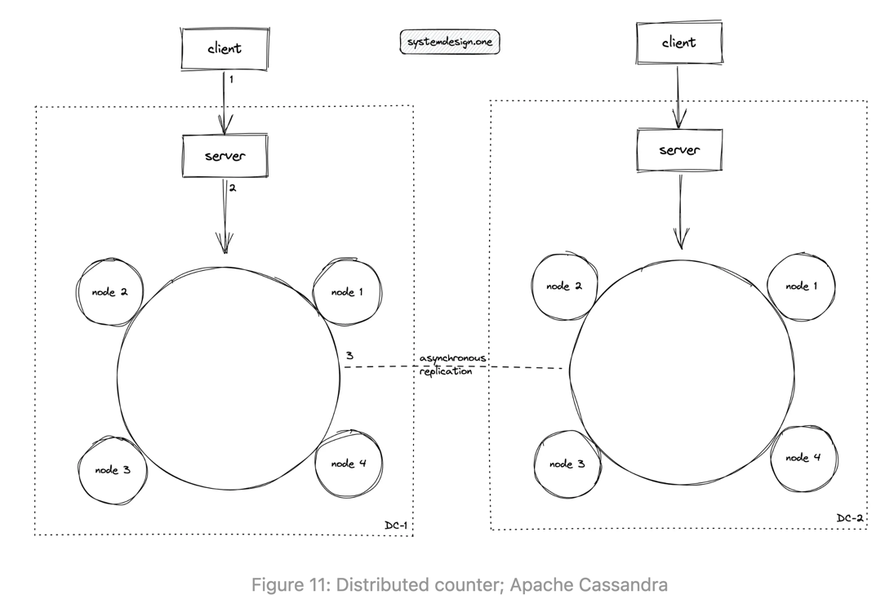
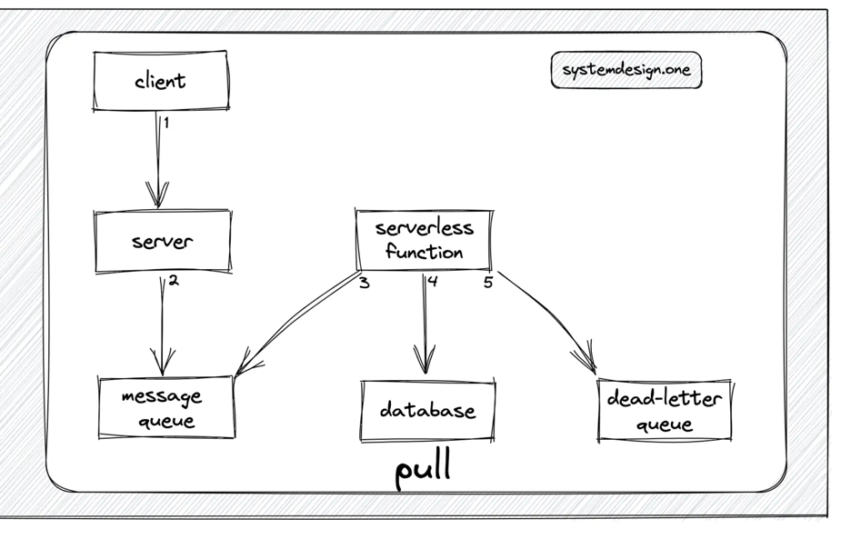
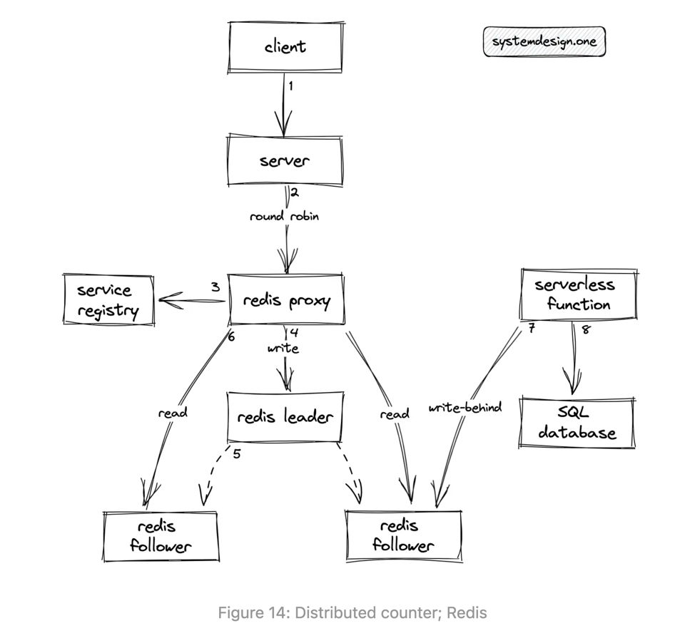
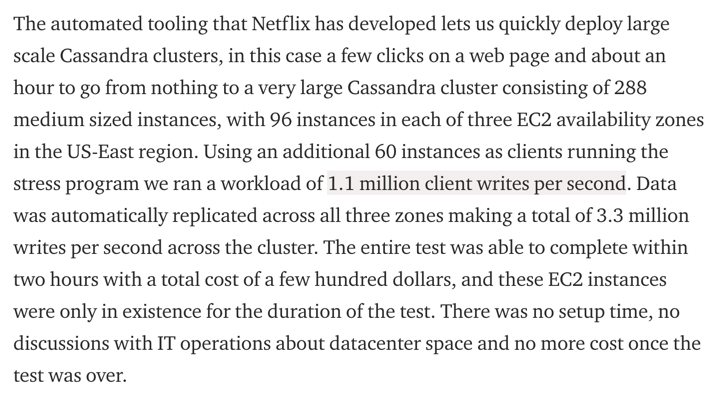

# Distributed counter

## Requirements and User stories

### Functional requirements

* As a user, I would like to click on the `like` button on a post and see the counter gets incremented by 1.
* As a user, I would like to click on the `dislike` button on a post to unlike and see the counter gets decremented by 1.
* As a user, I would like to see the total `likes/views/live users` of a post with low latency.
* As a user, I would like to always see the post with its likes count from different devices. (HA)
* As a user, the likes count I see from different devices should be eventually the same. (Eventual data consistency)
* As a developer of this distributed counter, I would like to have this system highly scalable.

### Non functional requirements

Should ask:

* What is the total posting of the platform?
  * 8 billion
* What is the total count of users on the platform?
  * 1 billion
* Is the system highly concurrent?
  * Yes, the system must support extremely high concurrency for write and read operations
* What is the average amount of concurrent online users?
  * 100 million
* What is the expected peak traffic?
  * 300 million concurrent users
* What is the anticipated read: write ratio of the distributed counter?
  * 10: 1
* Should the distributed counter be strongly consistent?
  * No, the distributed counter can be eventually consistent as it does not affect the user experience
* Should the value of the distributed counter be approximate?
  * No, the distributed counter should be accurate
* Are there any limitations to the storage of the distributed counter?
  * The storage used by the distributed counter should be as low as possible
* What should be the operational complexity of the distributed counter?
  * he operational complexity should be kept minimum

---

* HA
* Eventual consistency
* Highly scalable
* Low Latency

## Calculation

## Data model

```go
type Post struct {
	Post_ID  int64
	User_ID  int32
	Title    String
	Content  String
	VideoRef String
}
```

```go
type Counter struct {
	Post_ID    int64 // The id for posts, page, videos. Cannot use int32, because unsigned 32bits integer can only handle
	                 // 4 billion as its max value. Signed 32bits integer can handle 2 billion
	Count      int32 // Is it realistic to  2 biilion counts ? (int32 signed can handle 2 billion)
}
```

## APIs

```shell
curl -X PUT https://endpoint/v1/post_id/counter \
-d {action: "increment"}
# Above endpoint can be https://endpoint/v1/post_id/views or likes

# Response
status code: 200 OK
content-encoding: gzip
content-type: application/json
{
  count: 812,
  updated_at: "2030-10-10T12:11:42Z"
}

---
curl -X PUT https://endpoint/v1/post_id/counter \
-d {action: "decrement"}

# Response
status code: 200 OK
content-encoding: gzip
content-type: application/json
{
  count: 811,
  updated_at: "2030-10-10T12:14:42Z"
}

---
curl -X GET https://endpoint/v1/post_id/counter

# Response
status code: 200 OK
content-encoding: gzip
content-type: application/json
{
  count: 811,
  updated_at: "2030-10-10T12:16:42Z"
}
```

## Architecture



### Database

#### Relational Database Solution

Challenges:

* Relational database is row-based.
* The row lock must be acquired for update. (Reader-Write locks mechanism can be used to improve the performance, but it
  is still slow). Lock mechanism provides the strong consistency.

  

* Write scalability is a challenge because traditional relational database often have a single master node for write,
  creating bottleneck for high write volumes.
* If we want to iterate and provide more features which causes complex queries, that can be computationally expensive
  and slow.

Potential solutions and enhancements:

* Sharding: Partition data horizontally across multiple servers. This helps to improve the write performance. And a
  [sharding proxy](https://shardingsphere.apache.org/document/legacy/3.x/document/en/manual/sharding-proxy/) can be used
  to route traffic between instances.
  * Cons: But it does not help with read performance.
* Replication: Create replicas on multiple servers for redundancy and read scaling. This helps improve read performance.
  Leader-less or multi-master replication model can also improve the write performance.
  * Cons: Even we have multi-master or leader-less model to improve the write performance. But each replica still has to
    handle a large mount of concurrent write. Those concurrent write to a single row will still be slowed down because
    of the row locking.

  

* Batch update(because we might not want a very frequent database IO): Backend server aggregates the count update, and
  perform a batch update.
  * Cons:
    * It has latency to get accurate result.
    * The batch processing is memory consuming.
    * Is not fault tolerant, because all in-memory batch date will be lost if server crashes.

  

* Each update is written as a separate row. This supports high concurrent writes, because there will be no lock needed.
  (A little bit like WAL:write-ahead-log).
  * Cons:
    * Read is expensive, because database needs to scan entire table to find the latest. We can use index to improve the
      read performance, but constructing/updating index is also expensive.

  

**Conclusion**: No relational database. There still are some fundamental problems about relational database.

* Most of them are transactional, makes write expensive.
* Fixed schema which is hard to extend in the future. If in the future, we want to have multiple counters for different
  things(likes, active users, views, clicks). It is not easy to changes the existing schema, you have to have separate
  table for them, that makes join query expensive.

#### NoSQL Database solution

NoSQL database is popular because of its highly scalability. A key-value store is good fit for our use case, or we can
also consider wide-column database like Cassandra.

A modern NoSQL database can easily handle ~600 kOp/s with 3-5 nodes cluster (operations per second: including File IO,
Network traffic, API requests, System Calls, Task completions). Ref: <https://benchant.com/blog/mongodb-vs-scylladb-benchmark>



##### Where is the count of a post stored

Leader based:

* On write:
  * Requests will be routed to leader `A`, then the leader will replicate to follower `B` and `C`.
  * If majority instances response with a `success` signal, the write is successful.
* On read:
  * Read from any instance. (If the instance has not yet been updated, the counter data might be inaccurate)
  * Or redirect the read request to leader. (This will slow down the read performance)
  * Or quorum read from n / 2 + 1 instances. (We need to implement the logic to handle the convergence on conflicts)

The biggest problems with this leader based solution are 1) write/read performance 2) leader throughput bottleneck. If
we don't want both read and write go through leader, will leader based with partition work ?

Leader based with partition:

* `Post A` and `Post B` are partitioned to different database instances. (This helps a little bit, but if `Post A` is
   very popular, it does not solve the hot partition problem)
* `Post A` is partitioned into `Post A-1`, `Post A-2`, etc. And spread out to multiple instances.
  * On write: using Round robin or Consistent Hash Ring to decide which instance to write to. For each partition,
    it is leader based replicated.
  * On read: read from all partitions and sum up the final counts. (This slows down the read performance because we have
    to read from multiple instances and sum up all counts)

Even we do partition, all writes still have to be redirected to partition's leader. Read performance is not improved
if we have `Post A-1`, `Post A-2` kind of partition.

Leaderless based:

* Each instance will have a counter for the same post. Read and write can go to any instances.
* On write:
  * Request can be sent to any instance. The instance will update its counter, and using gossip protocol (or broadcast
    to all other instances) to spread out the counter update events. (This is similar to CRDTs)
* On read:
  * Read from any instance with eventual consistency in mind. (We can provide configuration on consistency level. If we
    want strong consistency, we can do quorum read and quorum write.)

---

* Click [here](../../5-replication/readme.md) to learn more about replicas
* Click [here](../../6-partitioning) to learn more about partitions
* Click [here](../../../general-knowledge-base/distributed-consensus/readme.md) to learn more about distributed
  consensus.
* // TODO: Add consistency and consensus notes from DDIA

### Cache

From the analysis in above, NoSQL database usually can handle ~600 kOps/s. Imagine we have 100 million users
concurrently watch the same post/video or click on `like`, we have to handle 100 million concurrent writes in worst case
scenario. ~600 kOps/s is way less than that.

Between database and backend server, can we have a cache layer? So that we can offload some traffic directly hits the
backend database. The answer is yes.

#### Using message broker as the buffer



* The message queue is used to buffer the count update events emitted by the client.
* The serverless function or CronJob will query the message queue at periodic intervals and subsequently update the
  database.
* If database is inaccessible, serverless function or CronJob will persist count update events in the dead-letter queue.

**Cons**:

* High latency to get the accurate data due to the asynchronous processing of data.
* To implement the exactly once message delivery, we will sacrifice the performance. Because we have to use two-phase
  commit mechanism. [See here for more details](../message-broker-and-event-streaming/readme.md#how-to-guarantee-exactly-once)

#### Redis



* The Redis proxy can be used as the sharding proxy to route the reads to the Redis follower instances and redirect the
  writes to the Redis leader instance.
* The write-behind cache pattern can be used to asynchronously persist the counter in the relational database for
  improved durability. (If Redis can be configure to periodically persist data on disk, we might not have to use this
  method). See [here](https://redis.io/docs/management/persistence/) to understand how Redis persists data to disk.

**Cons**: Redis's INCR and DECR commands directly modify the value stored at a key without any built-in mechanisms to
track previous values or prevent multiple updates from having cumulative effects. Repeatedly executing INCR on the same
key will always increment the value, even if the same request is sent multiple times. This lack of idempotency can lead
to over-counting or under-counting in certain scenarios. If network partition happens between backend server and Redis, we
have to be very careful on server "retries", because it might cause inaccurate counts.

#### CRDT based cache

We can have a CRDT(PN-Counter) based in-memory counter as the cache. See [here](crdt-distributed-counter.md) for more
details on how does CRDT solution work. [Redis does have CRDT supported](https://redis.com/blog/diving-into-crdts/).

It can be implemented as [look-aside with write-around architecture](../caching/readme.md).

## Push real-time count updates to all users(subscribed users)

Please see [this notes](../realtime-interactions-on-live-video/readme.md) for more details on how Linkedin handles the
live likes updates. Also the `Green` boxes in architecture diagram shows the workflow.

## Failure handling

Monitoring and health checks on the distributed counter should be implemented. The following entities should be
monitored:

* number of invocations of the counter service
* hardware resources used such as the CPU and memory

Chaos engineering can be used to test the resiliency of the distributed counter and identify any single point of
failure (SPOF). The CRDT database should be tested against the partitioned network scenario. A sample test case for the
partitioned network in the CRDT database is the following:

* isolate the CRDT database replicas
* deploy the CRDT counter across multiple data centers and increment all of them
* stop the counter and observe the individual counter on each data center
* the counter should only show the local increment
* re-establish the network
* the distributed counter on every data center should show the total count

## Scaling

// TODO: What will happen if adding a new node to Redis cluster or adding a new node in DB cluster ? How data migration
// is handled ?
// TODO: How to scale front-server for real-time `like` streaming ?

## Miscellaneous

* Cassandra stress test

  

  * <https://netflixtechblog.com/benchmarking-cassandra-scalability-on-aws-over-a-million-writes-per-second-39f45f066c9e>

* Millions of websockets
  * <https://alexhultman.medium.com/millions-of-active-websockets-with-node-js-7dc575746a01#:~:text=The%20theoretical%20limit%20is%2065k,*%2020k%20%3D%201%20mil).>
  * <https://dzone.com/articles/load-balancing-of-websocket-connections>

## References

* <https://systemdesign.one/distributed-counter-system-design/>


