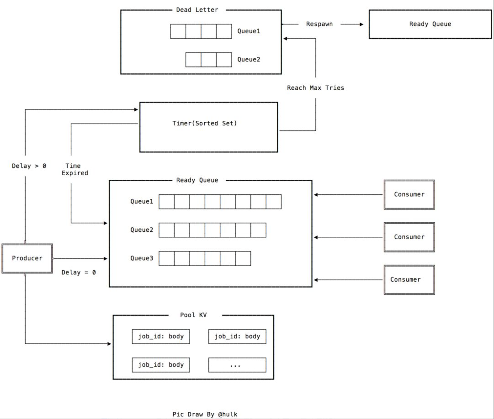
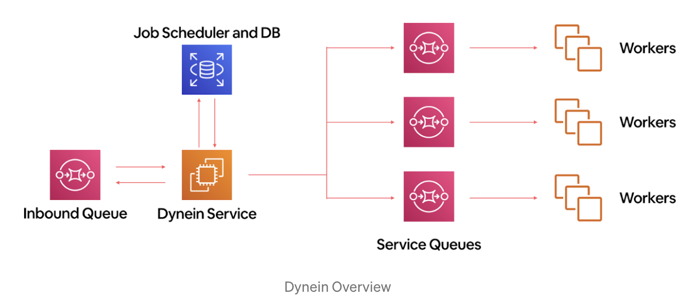
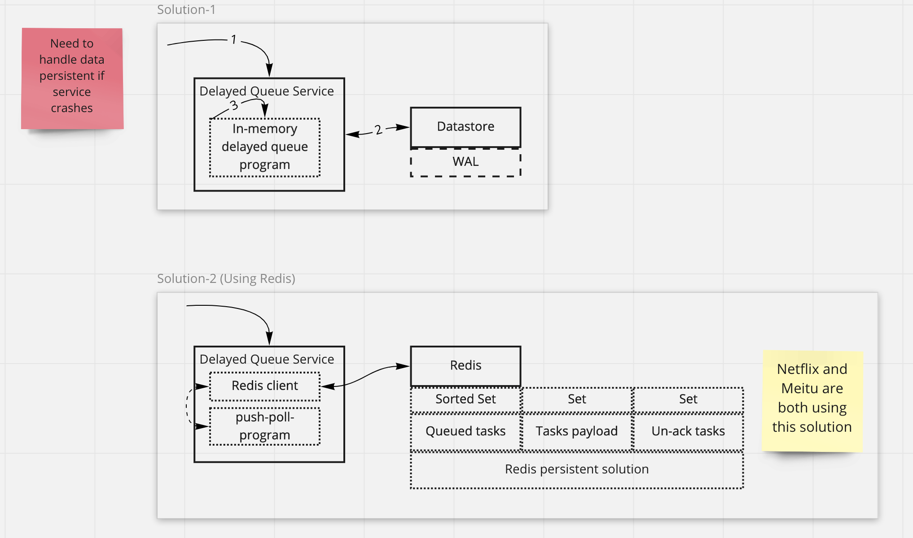
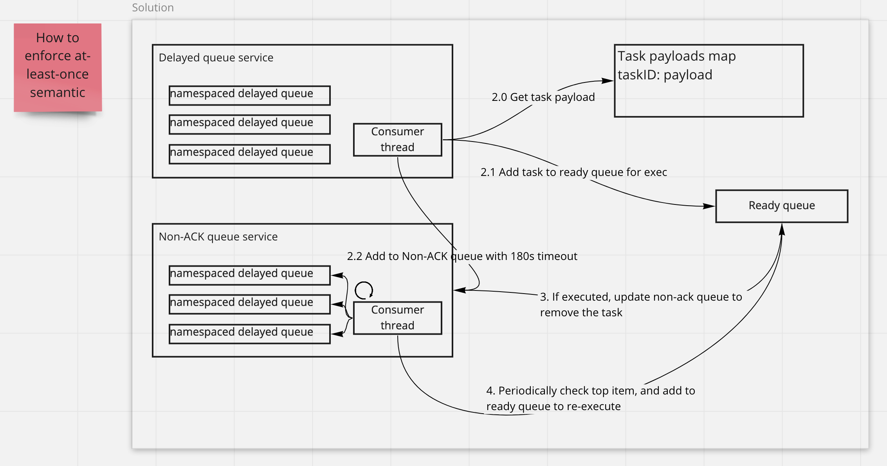
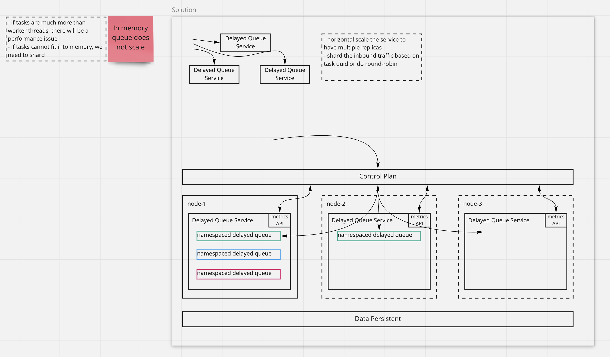

# Design a distributed delayed job queueing system

## Requirement

### Functional requirement

- In a system with the limited resources, we want to put the task which uses intensive compute resource to a job queue for
  later execution. Or we want the system to execute a job based on its execution time configuration(Send email/notification
  at Mar 20th 2021 17:00).
- The job needs to be executed at least once with a maximum retry.
- The job should be able to be unscheduled at any time.

### Non-functional requirement

- Reliability: No data lost on system fails or restarts.
- Scalability: Allow horizontal scaling with the growth of capacity.
- Isolation: The system provides a shared service that all applications might use. A single application's queue being
  overwhelmed should not affect other job processing.
- Timing accuracy: The job needs to be executed on time. Or P95 is less than 10 seconds.

## Data model

### Task

```go
type Task struct {
  ID string        // globally unique task ID
  Namespace string // the namespace of a task to provide queue isolation
  Delay Time       // the delay when task needs to be executed
  Score int        // the score which could be used to calculate the priority other than time
  Payload Payload
}

type Payload struct {
  // this should contain the payload of task, e.g., topics, what to be executed
  Topics string // for consumers to subscribe
  CallbackFuncName string // for consumers to invoke the callback function
  Args []string // args pass to the callback function
}
```

## Delayed queue APIs

```go
type DelayedQueue interface {
    Push(task Task) error
    Poll() error
    Delete(taskID string, namespace string) error
    Update(task Task) error
}
```

```shell
# Create a new delayed task
curl -X PUT https://endpoint/v1/delayedqueue \
-d {id: 1, namespace: default, delay: 5s, score: 10, payload: {...}}

# Update a task
curl -X POST https://endpoint/v1/delayedqueue \
-d {id: 1, namespace: default, delay: 15s, score: 10, payload: {...}}

# Delete a task
curl -X DELETE https://endpoint/v1/delayedqueue \
-d {id: 1, namespace: default}

# Get a task status
curl -X GET https://endpoint/v1/delayedqueue/status \
-d {id: 1, namespace: default}
```

## Architecture

### Meitu delayed queue architecture



### Airbnb architecture



## How to handle data persistence



## How to enforce at-least once semantics



## How to implement un-schedule feature

- `taskID` could globally identify a task
- The client will send `taskID` for un-schedule or deletion
- Priority queue uses O(n) on average to delete an element; Sorted set(BST based) uses O(log(n)). If we want to speed up
  the deletion/update to the queue element, we could build up an index. Key could be the `taskID` and the value could be
  `pointer to queue element`. Here is the trade-off between space and performance. If building index, there will other
  problem like "how to persist the index"

## How to prevent noisy tasks to occupy all the queue resource (isolation)

- Service A has way too many delayed tasks than Service B, so Service B's tasks will starve.
- Service A has too many long delayed tasks (1 month), the performance of other operations decrease.

## How to handle the scaling



- node-1 reaches the capacity
- control plane detects that from `metrics api`
- control plane create a new service instance on node-2 and node-3 if necessary
- control plane directs the incoming task scheduling requests to different service instances
- the same data persistent logic applies at the bottom

The control plane looks like a LB/ingress controller which provides the round-robin or other advanced L7 routing rules.

## How delay queue is implemented in Java's implementation

- PriorityQueue: Hold the objects on a sorted order (sort by expiration time)
- ReentrantLock: Handle the concurrent read-write problem
- Multiple producer threads and consumer threads
- Leader-follower pattern for consumer threads: Improve the performances
  ([code inline comments](https://github.com/openjdk/jdk/blob/master/src/java.base/share/classes/java/util/concurrent/DelayQueue.java#L84))

### How producer adds objects

```java
/**
 * Condition signalled when a newer element becomes available
 * at the head of the queue or a new thread may need to
 * become leader.
 */
private final Condition available = lock.newCondition();

/**
 * Inserts the specified element into this delay queue.
 *
 * @param e the element to add
 * @return {@code true}
 * @throws NullPointerException if the specified element is null
 */
public boolean offer(E e) {
    final ReentrantLock lock = this.lock;
    lock.lock();
    try {
        q.offer(e);
        if (q.peek() == e) {
            /*
            if the newly added object becomes the top element:
            - the old leader who is waiting for the second element(now) needs to be reset. we need a new leader to take
              the current top element.
            - available.signal() wakes up the next waiting thread, tells it there is an element might expire now.
             */
            leader = null;
            available.signal();
        }
        return true;
    } finally {
        lock.unlock();
    }
}
```

### How consumer poll objects

```java
/**
 * Retrieves and removes the head of this queue, waiting if necessary
 * until an element with an expired delay is available on this queue.
 *
 * @return the head of this queue
 * @throws InterruptedException {@inheritDoc}
 */
public E take() throws InterruptedException {
    final ReentrantLock lock = this.lock;
    lock.lockInterruptibly();
    try {
        for (;;) {
            E first = q.peek();
            if (first == null)
                // if current thread sees the current top object is null, then a) release lock, b) step away to wait
                // when it awakes, it will reacquire the lock and continue
                available.await();
            else {
                // if current thread sees the current top is NOT null
                long delay = first.getDelay(NANOSECONDS);
                if (delay <= 0L)
                    // and current top object expires, then just return it to caller
                    return q.poll();
                // otherwise the current thread needs to step away and wait
                first = null; // don't retain ref while waiting
                if (leader != null)
                    // if current thread sees there is already a leader waiting in the queue to process the current
                    // top object, then it steps away to wait
                    available.await();
                else {
                    // otherwise promote current thread to be leader who has privilege to handle the current top object
                    Thread thisThread = Thread.currentThread();
                    leader = thisThread;
                    try {
                        // current thread becomes the leader and just need to wait "delay" amount of time, then it could
                        // awake and proceed. When it awakes the lock will be reacquired so that no other threads could
                        // enter, and it will continue to the beginning of the loop to take the top object
                        available.awaitNanos(delay);
                    } finally {
                        // if current thread is leader and it is about to process the current top object, resets leader
                        // so that other threads have chance to work
                        if (leader == thisThread)
                            leader = null;
                    }
                }
            }
        }
    } finally {
        if (leader == null && q.peek() != null)
            // if current leader has processed the top object and the next top element is NOT null, notify next waiting
            // thread to process it
            available.signal();
        lock.unlock();
    }
}
```

### What is leader-follower pattern for consumer threads and why needs it

How multiple consumers check if the top object has expired?

- All consumers check the top object periodically
  - CPU inefficiency caused by loop

## Questions

- If we have multiple tasks expired at the same time, will one by one dequeue has performance issue?

## Caveat

- SQS maximum delay time is 15 minutes

## Conclusions

- Using namespace to provide the isolation and using different queues for different business logic
- Using three collections
  - a priority queue or sorted set for **scheduling** (delay or score info used by sorting)
  - a map for **task payload**
  - a priority queue or sorted set for non-ack task metadata(this is to track requeue or fail)
- Using wait/notify instead of using thread looping to check if task is ready

## References

- [How airbnb implements delayed queue](https://medium.com/airbnb-engineering/dynein-building-a-distributed-delayed-job-queueing-system-93ab10f05f99)
- [How netflix implements delayed queue](https://netflixtechblog.com/distributed-delay-queues-based-on-dynomite-6b31eca37fbc)
- [How Meitu LMSTFY implements delayed queue](https://zhuanlan.zhihu.com/p/94082947)
- <https://github.com/airbnb/dynein>
- <https://www.baeldung.com/java-delay-queue>
- <https://javapapers.com/java/java-blockingqueue/>
- <https://javapapers.com/java/java-delayqueue/>
- <https://github.com/openjdk/jdk/blob/master/src/java.base/share/classes/java/util/concurrent/DelayQueue.java>
- <https://redislabs.com/ebook/part-2-core-concepts/chapter-6-application-components-in-redis/6-4-task-queues/6-4-2-delayed-tasks/>
- <https://github.com/bitleak/lmstfy/>
- <https://juejin.cn/post/6844904150703013901>
- <https://tech.youzan.com/queuing_delay/>
- [How Timer wheel works](https://www.fatalerrors.org/a/time-wheel-in-netty.html)
- [Reinventing timer wheel](https://lwn.net/Articles/646950/)