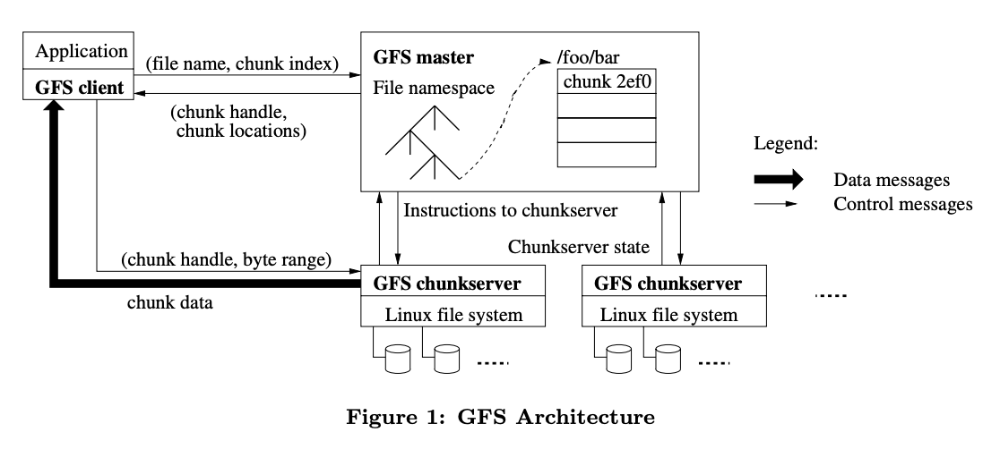
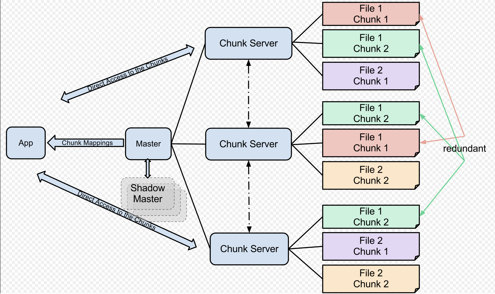

# Distributed file system

## Requirements

- Be able to store large files, several TBs
- Write operations:
  - Create a new file
  - Append to an existing file
  - Update an existing file
  - Handle concurrent writes
- Read operations:
  - Streaming read
  - Random read at any arbitrary offset
  - Handle concurrent reads
- HA

## Design overview

- Split large files into small chunks with fixed size, e.g. 64 MB.
  - Each chunk is tracked by `chunkID` (called `handle` in GFS)
- Store the chunks on different distributed servers as the Linux files.
- Have a control plane to:
  - Generate the `chunkIDs`.
  - Allocate chunk servers for storing the chunks.
  - Maintain the chunk servers discovery metadata.
    - Master maintains two mappings:
      - file name -> array of chunk ids/handlers
      - id/handler -> [`list of chunk servers`, `version #`, `primary chunk server`, `lease expiration`]
- Have a client lib which is used by application for data IO. No data goes through control plane node.

### High level architecture

### Write flow

- Application wants to write a new file(`fileOffset=0`) or append data to an existing file(`fileOffset=filesize`).
  - Application uses client lib to calculates the `chunk index` based on offset.
  - Application uses client lib to send the write request(`file name, chunk index`) to control plane.
- Control plane receives the request.
  - From the file name and chunk index to get the `chunk ID`. Generate a new `chunk ID` if no entry found in the map, it
    means that the write operation is writing a new file.
  - From the `chunk ID` to get the `list of chunk servers`.
  - Return the `chunk ID` and `chunk server locations` back to client.(The chunk servers hold the replicas)
- Client writes data directly to **all** chunk servers with the request(`chunk ID`, `chunkOffset`, `data`). See
  more details on [how to handle concurrent writes](#how-to-handle-concurrent-writes) and [how to handle write failure](#how-to-handle-write-failure)

#### how to handle concurrent writes

Multiple applications could write data to the same file at the same time, we want data to be consistent between all
replicas. There are two principles:

- All replicas need to apply the change in same order.
- Version number could be used for optimistic concurrency control.

The problem becomes the distributed consensus problem. We could choose to use leader based replica solution and use [Raft
algorithm](../../../distributed-consensus/raft-distributed-consensus.md) to guarantee the data consistency among all
replicas. So that during write operation, client could write data to leader and leader will take care of the date replication.
This helps reduce the network traffic between the client and chunk server, the network bandwidth within chunk servers would
be fast because it is the internal network.

#### how to handle write failure

- Client fails to write to leader chunk server. We could retry with the exponential backoff with jitter.
- Leader chunk server fails to write to followers. If implementing Raft algorithm, the failure will be handled by leader
  with retries. So this is eventually consistent.

### Read flow

- The client sends file name and offset to the control plane.
  - Application uses client lib to calculates the `chunk index` based on offset.
  - Application uses client lib to send the write request(`file name, chunk index`) to control plane.
- Control plane receives the request.
  - From the file name and chunk index to get the `chunk ID`.
  - From the `chunk ID` to get the `list of chunk servers`.
  - Return the `chunk ID` and `chunk server locations` back to client.(The chunk servers hold the replicas)
- Client caches the result for future reads.
- Client choose the closest chunk server to read the data.

### APIs DataNode|chunk server has

- replicate file chunks to other nodes
- remove local file chunk replicas
- re-register or to shut down the node
- send an immediate file chunk report to control plane
- send heartbeat to control plane

### How to handle control plane failure

- In Kafka, the control plane called `NameNode`, there is also a `BackupNode` holds the replicated data of `NameNode`. If
  `NameNode` fails, `BackupNode` has the replicated data. The paper does not mention how it fails over. However, using Raft
  leader election might be also a good idea.
- In GFS, the control plane called `GFS Mater`, it has replicas on multiple machines. If it is just process failure, it
  could be restarted immediately. If it is machine failure, the monitoring infra will start a new master process on different
  replicated machine.

### How to handle chunk server|DataNode failure

- Each file chunks are replicated to different machines.
- Process failures are restartable.
- Machine failure will cause the data lost on that machine.
- There are Heartbeats between control plane and server where the replica is located. So that control plane knows if there
  are any chunk servers are not available. If client sends a read requests, the control plane could return available server
  list.

### What will happen if adding a new server

- New server is empty.
- File chunks will be rebalanced to new server. E.g., if there are two replicas of a same file chunk located on the same
  server, they will be rebalanced to different servers.
- If replica factor is changed, e.g., from 3 to 5, each file chunks will be copied to the new server. The file chunks could
  be copied in parallel.

## References

- [GFS Paper](resources/gfs.pdf)
- [HDFS Paper](resources/hdfs.pdf)
- <https://www.youtube.com/watch?v=EpIgvowZr00&ab_channel=MIT6.824%3ADistributedSystems>
