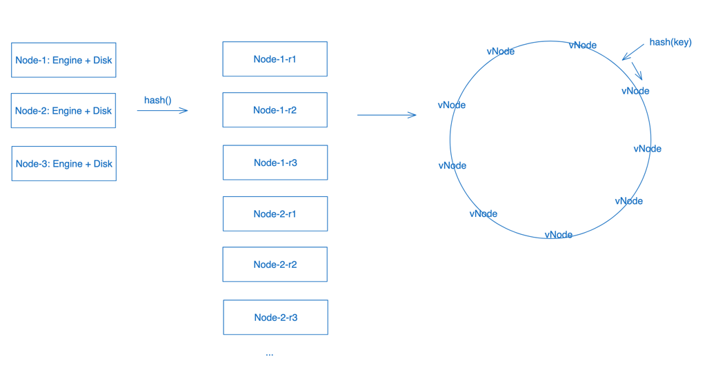

# Design a key-value store

## Requirements

### Func requirements

- user can use `put(key, value)` to store
  - key: string
  - value: string
- user can use `get(key)` to retrieve

### Non-func requirements

- Scalability
  - Limit on key range ? No
  - Single node(MVP) --> Multiple nodes
- Consistence
  - strong consistency on single node
  - eventual consistency on multiple nodes
- Availability
  - HA
- Performance
  - Read: 10^6 qps
  - Write: <= read

### Other constraints

- Existing tech stack ?
- Operational cost considerations ?

## High Level Blueprint


## Data model

### Hash Table

Using in memory hashmap to store data.

On write: map.put(key, value); On read: map.get(key)

Pros:
- Easy to implement
- Fast read and write

Cons:
- Data loss
- Memory capacity limit

### Log structured (LSM + SSTable)

Data is appended only, using in memory RB tree structure(memTable) + on disk segment file (SSTable) to store data.
Using sparse indexing for data fetching.

```text

a:xxx
b:1
c:xxx
b:3

-->

a:xxx
b:xxx
b:xxx
c:xxx

-->

      b 3
   a    b 1
           c
```

Pros:
- Optimized disk usage
- Fast on write
- Easier for data compression

Cons:
- Relatively slow on read (scan memTable+SSTable)

### Page oriented (B Tree)

```go
    [100, ref, 200, ref, 300, ref]
          |
   [101, ref, 150, ref, space, space]
          |
leaf: [key,value,key,value,key,value]
```

Pros:
- Fast on read

Cons:
- Slow on write (write amplification)
  - A new key is added --> re-balance the page branching --> rebuild entire B tree
- Space Segments
- Difficult on compression

## Architecture 

[Client] <--> [Storage Engine] <--> [Memory/Disk/SSD]

[Storage Engine]:
- memTable + WAL
- Logic to flush SSTable
- Bloom filter for query optimization
- Compression logic

[Disk/SSD]:
- SSTable

## Scaling

Single node cannot handle all data. We need to partition the key-value pairs to multiple nodes, so read/write requests
can be distributed. The downside is the read performance on range query.

### Key Partitioning Mechanism

- Range partition
- Hash based partition

### Key Placement Mechanism



- Consistent Hashing

### Request routing

- Independent routing layer (zookeeper)
- Node side routing
- Client side routing

## Replication and error handling

### Leader based

All writes are redirected to leader. All nodes can handle read.

Pros:
- Consistency guarantee on write
- High performance on read with eventual consistency

Cons:
- Leader is the bottleneck on high volume writes.

### Leaderless

All nodes can independently handle read and write.

Pros:
- High performance on both read and write.

Cons:
- Additional efforts needed to handle conflicts.