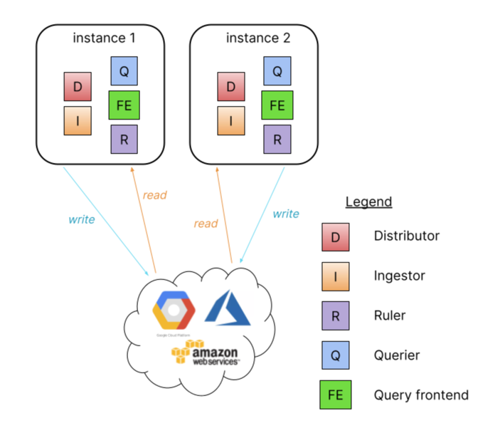
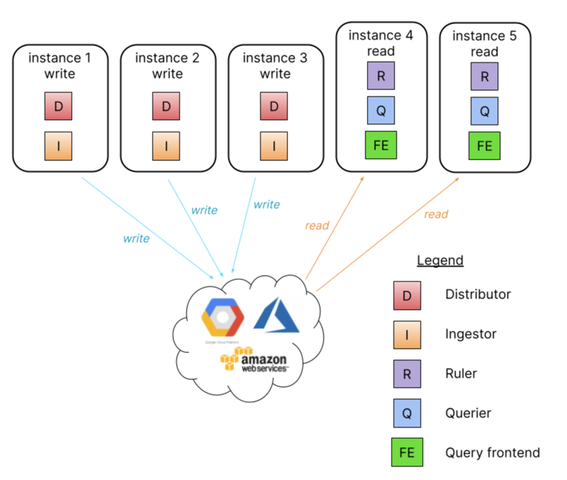
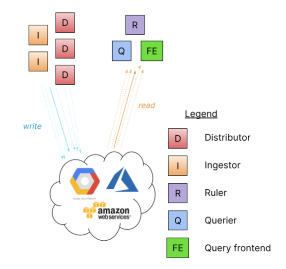
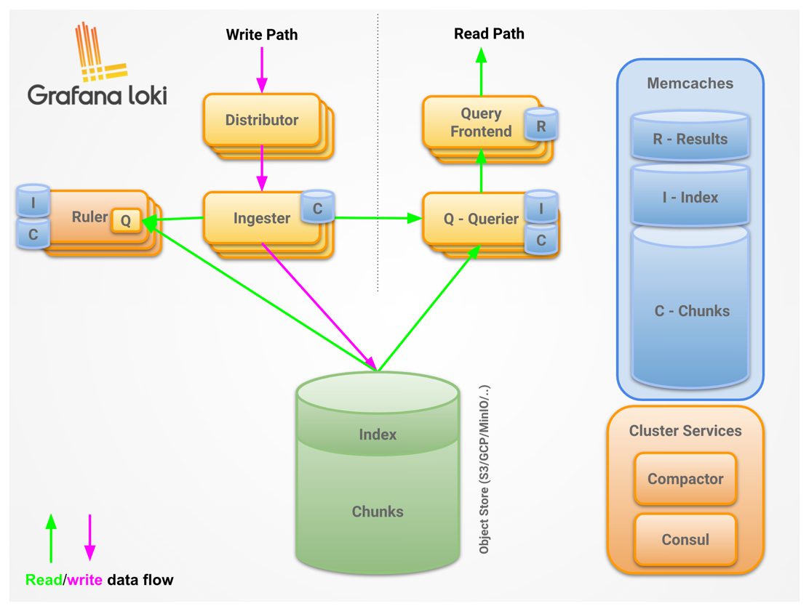
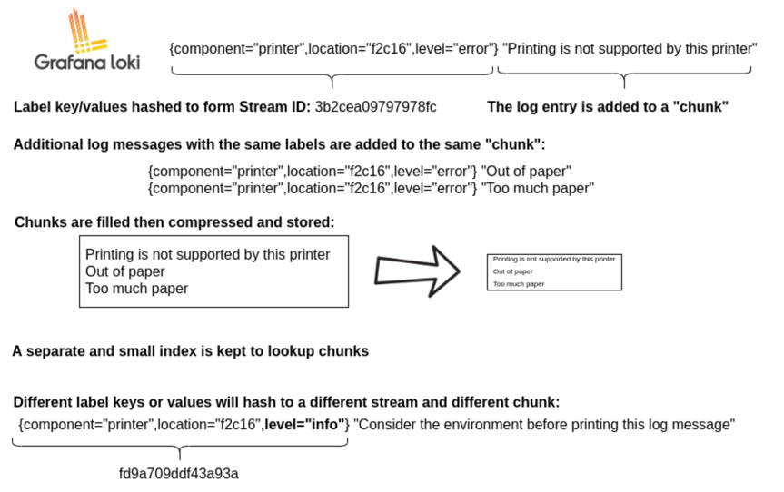

# Distributed log aggregation

**Note**: This article is basically Grafana Loki architecture notes

## Requirements and User stories

### Functional requirements

- As a user, I would like to have a service which collects logs from my various workloads and persists them, so that
  I could quickly debug issues from the persisted logs.
- As a user, I would like to query the logs based on label or text.

### Non functional requirements

- This log aggregation service needs to be able to handle large traffic on log delivery.
- This log aggregation service needs to be highly available.

## Calculation

TBA

## Data model

TBA

## APIs

TBA

## Architecture

### Grafana Loki's architecture

#### Monolithic architecture

- Run all components inside a single process or docker image.
- Handle small read/write volumes of up to approximately 100GB per day.
- Could bring up more instances that share the same object store.

#### Simple scalable deployment mode

- This deployment mode can scale to several TBs of logs per day and more.
- Separate read and write.
  - Higher availability of write path by providing dedicated nodes.
  - Separately scalable read path to add/remove query performance on demand.
- Requires LB in front of Loki.
  - Redirect write requests to write node.
  - round robin among read nodes.

#### Microservices mode

##### Distributor

<https://grafana.com/docs/loki/latest/fundamentals/architecture/distributor/>

- Stateless component
- First stop of an incoming stream from client.
- Use gRPC to communicate with ingesters.
- What it does:
  - Validations: check labels, discard too old log lines, check log length.
  - Label normalization: Sort labels for cache and hashing purposes.
  - Rate limiting:
    - distributorLimit = tenantLimit / numOfDistributors
  - Forwarding to ingesters using consistent hashing and replica factor to decide which ingesters should receive the stream.
    Distributor uses quorum writes mechanism to prevent single point failure of ingester and data lost.

##### Ingester

- Write log data to long-term storage(DynamoDB, S3, Cassandra, etc).
- Return log data fro in-memory queries.
- State: Pending, Joining, Active, Leaving, Unhealthy.
- Register themselves into the hash ring with their token + state.(A hash ring stored in Consul is used to achieve consistent
  hashing).
- Buffer the log data into chunks and flush to storage backend with configurable interval.
  Chunk here has the similar concept as Prometheus.
- Chunk is hashed on tenantID + Labels + contents, this is for deduplication.
- Timestamp ordering:
  - Accept out of order writes with configuration
  - Validate if the log line follows the expected order, reject and return error if it does not follow the order.

##### Query frontend

- Stateless.
- Expose querier's API endpoints.
- Internal query queueing:
  - Ensure large query could be retried on failure(OOM).
  - Distribute multiple large requests across all queriers.
- Split large queries into multiple smaller queries, executing them in parallel.
- Cache the query result.

##### Querier

- Handle queries using LogQL language.
- Fetch logs from ingester and long-term storage.
- Quorum read from ingester and deduplicate identical logs.

##### Read path

To summarize, the read path works as follows:

- The querier receives an HTTP/1 request for data.
- The querier passes the query to all ingesters for in-memory data.
- The ingesters receive the read request and return data matching the query, if any.
- The querier lazily loads data from the backing store and runs the query against it if no ingesters returned data.
- The querier iterates over all received data and deduplicates, returning a final set of data over the HTTP/1 connection.

##### Write path

To summarize, the write path works as follows:

- The distributor receives an HTTP/1 request to store data for streams.
- Each stream is hashed using the hash ring.
- The distributor sends each stream to the appropriate ingesters and their replicas (based on the configured replication factor).
- Each ingester will create a chunk or append to an existing chunk for the stream’s data. A chunk is unique per tenant and per labelset.
- The distributor responds with a success code over the HTTP/1 connection.

## References

- <https://grafana.com/docs/loki/latest/fundamentals/architecture/>
- <https://medium.com/@vagrantdev/distributed-logging-best-practices-and-lesson-learned-d52143fae266>
- <https://dzone.com/articles/distributed-logging-architecture-for-microservices>
- <https://bravenewgeek.com/building-a-distributed-log-from-scratch-part-1-storage-mechanics/>