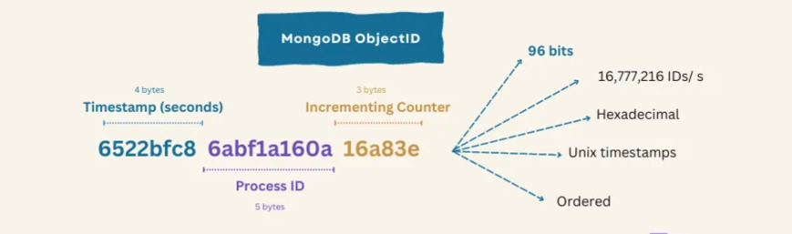
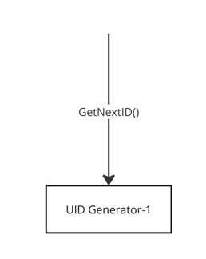

# Distributed Unique ID

When you create a new post on social media or submit an transaction, the backend service will generate unique IDs for
those objects.

## What are the most popular ways to generate distributed unique IDs

### UUID or GUID (128bits)

```text
6e965784–98ef-4ebf-b477–8bd14164aaa4

5fd6c336-48c4-4510-bfe5-f7928a83a3e2

0333be18-5ecc-4d7e-98d4-80cc362e4ade
```


There are multiple versions of UUID. Consumers need to think which one fits their use cases the best.

* Version 1 — Time-based MAC: This UUID uses the MAC Address of your computer and the current time.
* Version 2 — DCE Security: Similar to Version 1 but with extra info like POSIX UID or GID.
* Version 3 — Name-based MD5: This one takes a namespace and a string, then uses MD5 to create the UUID.
* Version 4 — Randomness: Every character is chosen randomly.
* Version 5 — Name-based SHA1: Think of Version 3, but instead of MD5, it uses SHA-1.
* Version 6 — Reordered Time: A tweak to Version 1, allowing UUIDs to be sorted by creation time, optimizing database
  storage.
* ... (There are more versions)

#### Pros

* Easy to generate. And no need centralized service to manage those IDs.

#### Cons

* Not monotonically increasing and not time-based sortable (except v1 and v2).
* Too long.
* Does not reveal much information about itself.

### NanoID (126bits)

```text
NUp3FRBx-27u1kf1rmOxn
XytMg-01fzdSaHoKXnPMJ
_4hP-0rh8pNbx6-Qw1pMl
```


126bits, and only support `A-Za-z0-9_-`(64=2^6) characters. 6bits can be used to represent a character, so 126/6 = 21
character in total.

#### Pros

* Only contains `A-Za-z0-9-_`, which is URLs friendly.
* Shorter than UUID

#### Cons

* Not sortable
* Does not reveal much information about itself.

### Auto_increment ID (Single Node)

Using MySQL or other database's auto_increment ID feature.

```sql
CREATE DATABASE `SEQ_ID`;
CREATE TABLE SEQID.SEQUENCE_ID (
    id bigint(20) unsigned NOT NULL auto_increment,
    value char(10) NOT NULL default '',
    PRIMARY KEY (id),
) ENGINE=MyISAM;
```

#### Pros

* Simple
* Monotonically increasing

#### Cons

* Single point of failure

### Auto_increment ID (Multiple Node)

```sql
-- Node 1
set @@auto_increment_offset = 1;     -- Init value
set @@auto_increment_increment = 2;  -- delta
```

```sql
-- Node 2
set @@auto_increment_offset = 2;     -- Init value
set @@auto_increment_increment = 2;  -- delta
```

```text
1、3、5、7、9
2、4、6、8、10
```


#### Pros

* Sortable IDs

#### Cons

* Horizontally scale is hard. Adding a new node requires to re-configure existing nodes' configuration.
* Global sorting is impossible. (we do not know `3` and `4` which is generated earlier.)

### DB based batch ID generation

Get a batch of monotonically increasing IDs from DB service. Every time to get a ID range from DB, [1, 1000] means 1000
IDs from 1 to 1000, and load in memory.

```sql
CREATE TABLE id_generator (
  id int(10) NOT NULL,
  max_id bigint(20) NOT NULL COMMENT 'current max usable id',
  step int(20) NOT NULL COMMENT 'range length',
  biz_type    int(20) NOT NULL COMMENT 'business type',
  version int(20) NOT NULL COMMENT 'optimistic version',
  PRIMARY KEY (`id`)
)
```

When a batch of IDs are used up, client calls DB service to claim new ID batch and update the table.

```sql
update id_generator set max_id = #{max_id+step}, version = version + 1 where version = # {version} and biz_type = XXX
```

version field is used for optimistic concurrency control to handle conflicts.

#### Pros

* Offload the ID generation request by using batch generation.

#### Cons

* DB service is still the single point of failure.

### ObjectID (96bits)

MongoDB's way for generating document ID.

* Timestamp(4 bytes): Time in second from Unix epoch.
* Random value(5 bytes): Each machine or process gets its own random value.
* Counter(3 bytes): A simple incrementing counter for a given machine.



#### Pros

* Ensures a global order (time-based) with uniqueness (does not need a central registry to generate the ID).
* Shorter than UUID and NanoID.
* Reveals information about the process or machine from that 5 bytes random value.

#### Cons

* Security concern on that 5 bytes random value. It might reveal too much information.

### Twitter Snowflake (64 bites)

```text
 1 bit  |  41 bits   |  10 bits  |  12 bits
------------------------------------------------
Sign bit | Timestamp | Machine ID | Sequence Number
```

* Sign bit: Usually unused and is 0 by default.
* Timestamp: The delta from a fixed starting time in millisecond level. 41 bits can be used for 69 years.
* Machine ID: In twitter, 5 bit datacenter ID + 5 bit worker ID.
* Sequence Number: Incrementing, used to ensure uniqueness for IDs generated by the same machine at the same time. 4096
  Sequence numbers can be generated within 1 millisecond.

Core concept: Combine timestamp, machine ID and sequence ID together.


### Baidu UIDGenerator based off Snowflake ID

```text
 1 bit  |  28 bits   |  22 bits  |  13 bits
------------------------------------------------
Sign bit | Delta second | Machine ID | Sequence Number
```

* Delta second: Unit in second. Can support 8.7 years.
* Machine ID: Maximum value is 4.2 million. Use a built-in database's incrementing ID for worker id assigning.
  * **Cons**: 22 bits support ~ 4 million numbers, that means either machine # has to be less than 4 million. Or the total
    machine restart times have to be less than 4 million.(A newly restarted instance will have a new record)
* Sequence Number: Maximum value is 8192.
  * Synchronized to ensure thread safe.
  * If current ID is within the same second as previous one, sequence number increases.
  * If there has already been 2^13 - 1 IDs generated within the same second, wait for next second.
  * In new second, sequence number starts from 0.

#### Using RingBuffer to increase the sequence number generation performance


* Two RingBuffers, one for UID and another one is for status.
* RingBuffer 2^n, n >= # of bit of sequence number field.
* Tail Pointer: Represents the latest produced UID. If tail catches cursor, no put is allowed.
* Cursor: Represents the latest already consumed UID. If cursor catches tail, no take is allowed.

#### Cons of Snowflakes based approach

* Need to a third part service (zookeeper or DB) to manage Machine/Node IDs.

## Requirements and User stories

### Functional requirements

* Uniqueness: All IDs generated in the system should be unique.
* Scalable: The system should be able to generate IDs at a high rate without collisions.
* Sortable & Monotonically increasing

### Non functional requirements

* High available
* Can handle high throughput 1 million UIDs / second

## Calculation

```text
x bits    |  y bits    |  z bits
-------------------------------------------------
Timestamp | Process ID | Sequence Number
```

* Timestamp: Let's assume we want UID to be valid for 100 years. That is `3,153,600,000` seconds ~= `3*2^30` ~= `32bits`
  for timestamp.
* Sequence Number: We want to support 1 million UIDs per second, that needs `20bits`.
* Process ID: How many process or how many generator instances we need to support high throughput ? We need to consider
  the scale of our clients. Twitter uses `10bits` for their scale.

So far, we have ~64bits ~= `8 bytes` for UIDs.

## Data model

We do not need to persist anything in storage.

## APIs

## Architecture


### UID Generator

```java
public synchronized long getNextId() {
        long currTimeStamp = getNewTimeStamp();
        if (currTimeStamp < lastTimeStamp) {
            throw new RuntimeException("Clock moved backwards.  Refusing to generate id");
        }

        if (currTimeStamp == lastTimeStamp) {
            sequence = (sequence + 1) & MAX_SEQUENCE;
            if (sequence == 0L) {
                currTimeStamp = getNextSecond();
            }
        } else {
            sequence = 0L;
        }

        lastTimeStamp = currTimeStamp;

        return (currTimeStamp - START_TIMESTAMP) << TIMESTAMP_LEFT //Timestamp
                | podId << POD_ID_LEFT                  // Pod ID
                | sequence;                             // Sequence ID
    }
```



#### The simple approach cannot handle high throughput concurrent requests


We can have multiple UID generator instances + loadbalancer to offload load from single instance and also it survives
from single point failure.

#### Update sequence ID has performance issue

Updating sequence ID is not thread safe, which means we need to use lock to make sure its atomicity. This has a huge
performance drawbacks when large amount of concurrent requests come in. Can we not use lock?


Baidu uses `RingBuffer` to solve this problem:

* Two RingBuffers, one for UID and another one is for status.
* Size of RingBuffer is 2^n, n >= # of bit of sequence number field.
* Tail Pointer: Represents the latest produced UID. If tail catches cursor, no put is allowed.
* Cursor: Represents the latest already consumed UID. If cursor catches tail, no take is allowed.
* Pointers are `AtomicLong` in Java which is lock-free. [Implementations](https://github.com/baidu/uid-generator/blob/master/src/main/java/com/baidu/fsg/uid/buffer/RingBuffer.java)

## Scale

Someone did an [experiment](https://towardsdatascience.com/ace-the-system-design-interview-distributed-id-generator-c65c6b568027)
that one 2019 MacBook pro with 6 cores can generate 5K UIDs/ms. So if we deploy the UID generator in K8S with replica=3
should be good enough.

## Failure handling

The whole service is stateless. If one instance dies, another will be provisioned and continue serving. When the new pod
gets provisioned, timestamp will be different, so there will be no conflicts.

## References

* <https://levelup.gitconnected.com/how-to-generate-unique-ids-in-distributed-systems-6-key-strategies-37a8ab3b367d>
* <https://towardsdatascience.com/ace-the-system-design-interview-distributed-id-generator-c65c6b568027>