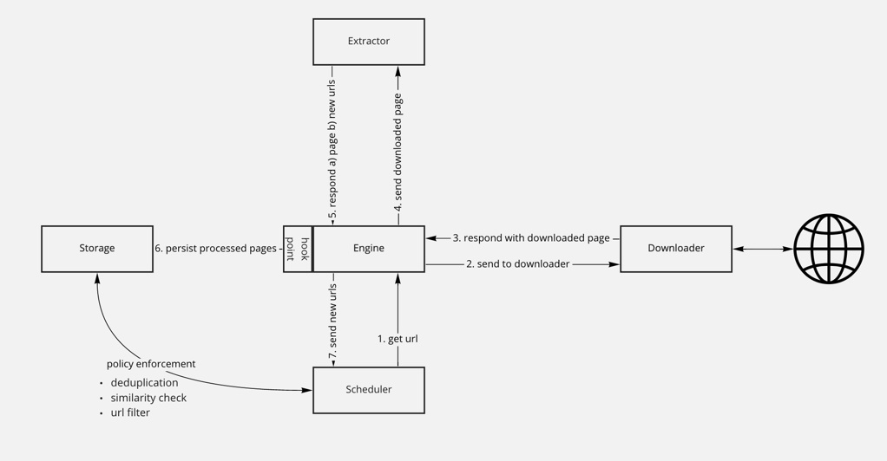
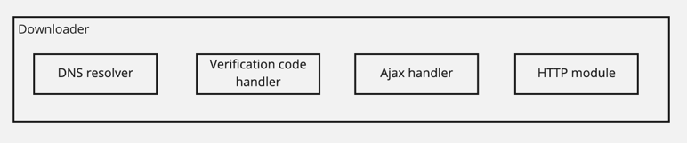
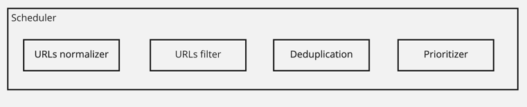
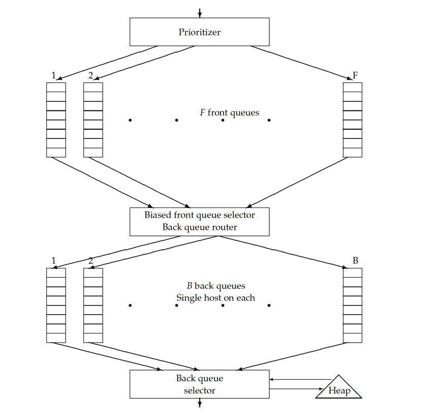
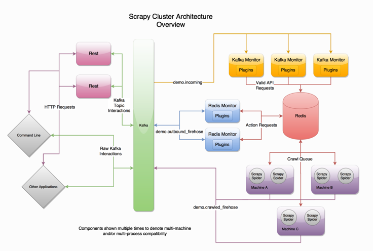
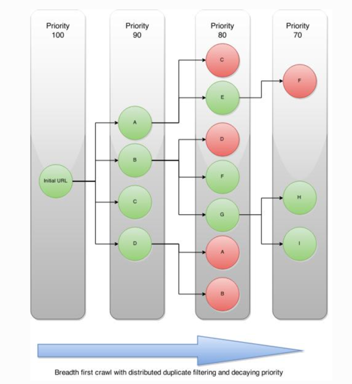
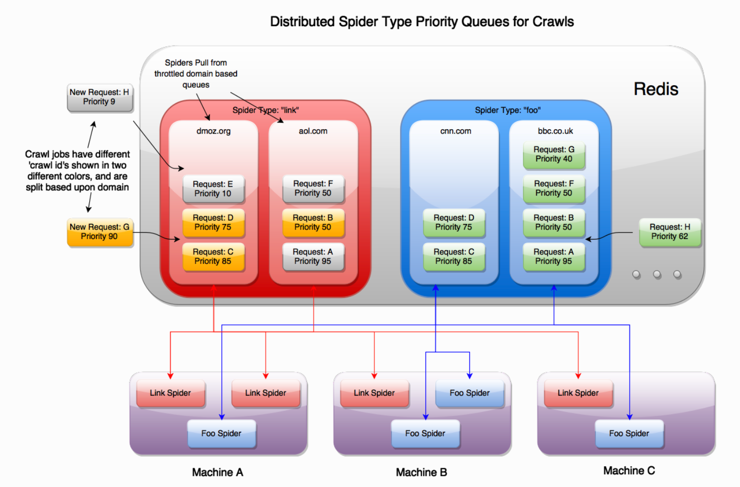

# Distributed web crawler

## Requirements and User stories

### Functional

- As a user, I would like to use this service to crawl a list of URLs:
  - So that, I could build reverse index of the terms in that page.
  - So that, I could generate page preview with some metadata.
- As a developer, I would like to have the downloaded page be able to consumed by different downstream consumers. I.e.,
  data analysis, Index builder.
- As a developer, I would like to have this service to handle multiple protocols.
- As a developer, I would like to have this service NOT to store medias.

### Non functional

- This service needs to be highly scalable.
- This service needs to do its best to be highly available(based on SLA).
- This service needs to have some level of isolation: Crawling large website should not block crawling smaller websites.
- Crawler should not fall into infinity loop.(Crawler trap, Deduplication).
- Policy management on crawling service: Politeness, Priorities, Intervals, etc.

## Terms

- Sitemap: A sitemap is a file where you provide information about the pages, videos, and other files on your site, and
  the relationships between them. Search engines like Google read this file to crawl your site more efficiently. A sitemap
  tells Google which pages and files you think are important in your site, and also provides valuable information about
  these files.
- robot.txt(whitelist): A robots.txt file tells search engine crawlers which URLs the crawler can access on your site. This is used
  mainly to avoid overloading your site with requests; it is not a mechanism for keeping a web page out of Google. To keep
  a web page out of Google, you should block indexing with noindex or password-protect the page.
- `noindex` meta tag(blacklist): It is a way to tell search engine do not crawl a particular page. See more details [here](https://developers.google.com/search/docs/advanced/crawling/block-indexing).

## Calculations

### Data storage

- The downloaded pages need to be persisted for different consumers. (500 KB page size * 4 Billion links/Month --> 2 PB/Month)
- The processed index needs to be persisted to serve searching. If we want to index all possible phrases from all pages,
  the size will definitely be very large. We want to handle this in a distributed way.

### Traffic

- For crawler, it is a write-heavy service.
- For search, it is a read-heavy service.

We will be mainly focusing on crawler in this post, so a "write-heavy" it is.

## Data model

```go
// CrawlItem is the entity which is instantiated for Scheduler's front queue
type CrawlItem struct {
	URL string
	Priority int
  Status string // Running, Idle, Invalid
}

type Page struct {
	ID string
	Domain string
	URL string
	Content []byte // The page content in bytes
	LastVisited Time
	SimHash string // TBD: We store it or compute on runtime ?
	...
}
```

## APIs

```go
// Downloader
func Download(url string) string
// Extractor
func Extract(html string) []string
// Storage
func Add(page Page) error
func Get(url string) Page
// Scheduler
func Enqueue(url string, priority int) error
func Dequeue() string
```

## Architecture



- Engine: Control data flow between each component, like api-server in K8S.
- Scheduler: Scheduler for all urls to be crawled(Enqueue the urls, prioritize the urls, dequeue the urls).
- Downloader: Given the urls and download its content from internet.
- Extractor: Given the downloaded HTML, parse it and extract new urls.
- Storage: Data persistent layer which all the policies/states/downloaded contents are persisted.

### Engine

- `Engine` pulls urls from `Scheduler` proactively? Or `Scheduler` pushes urls to `Engine`?
  - If `Engine` pulls, how does `Engine` know when the data is ready?
    - This is from Kafka Doc: `The deficiency of a naive pull-based system is that if the broker has no data the consumer
      may end up polling in a tight loop, effectively busy-waiting for data to arrive. To avoid this we have parameters
      in our pull request that allow the consumer request to block in a "long poll" waiting until data arrives (and optionally
      waiting until a given number of bytes is available to ensure large transfer sizes).`
  - If `Scheduler` pushes, will it DDos the `Engine`? Yes, it will.
  - [Kafka Doc: Pull vs Push](https://kafka.apache.org/08/documentation.html#theconsumer) explains above question in details.
  - **CONCLUSION**: Using Pull
- Could `Engine` be replaced with just `Kafka`?
  - TBA

### Downloader



- DNS resolver
  - Why do we need it?
    - DNS resolution might entail multiple requests and round-trips across the internet.
    - DNS resolution might end up with recursive calls to other DNS servers.
  - Solution?
    - Implement the DNS cache(TODO: How to handle the data inconsistency and make cache has fresh data)
- Ajax handler
  - Why do we need it?
    - With Ajax, the content downloaded by crawler might be a JavaScript + HTML. We need to execute the Javascript
      in order to fetch the real data.
  - Solution?
    - Implement a Ajax engine to execute Javascript code.
  - Note: [Google has deprecated Ajax crawling back in 2015](https://developers.google.com/search/blog/2015/10/deprecating-our-ajax-crawling-scheme)
- Verification code handler
  - Why do we need it?
    - Some pages need verification code in order to be accessed.
  - Solution?
    - [Optical character recognition](https://en.wikipedia.org/wiki/Optical_character_recognition).
    - [Handle sliding verification code](https://www.programmersought.com/article/68073639479/)
- HTTP module
  - Why do we need it?
    - It is used to download remote content.

### Scheduler



- URLs normalizer
  - Why do we need it?
    - URLs might have different suffixes, we want to remove those unnecessary suffixes.
    - Upper letters to lower letters.
    - [More details](https://en.wikipedia.org/wiki/URI_normalization).
  - Solution?
    - An implementation of RFC 3986 could be used to handle this.
- URLs filter
  - Why do we need it?
    - This is part of the policy management, that we might disallow to crawl some restricted domains.
    - Some URLs are restricted by `robots.txt`, we need to filter out those URLs which are not supposed to be crawled.
  - Solution?
    - Policy is persisted somewhere in DB or cache.
    - Check the configuration(e.g., a list of domains) before going forward.
- URLs deduplication
  - Why do we need it?
    - Some URLs have been crawled recently, we do not want to crawl it again.
  - Solution?
    - A crawled URL with its timestamp will be stored in DB or cache.
    - A normalized URL has unique hash value.
    - Compare hash value and check timestamp, we could determine if this URL needs to be enqueued to crawl.
    - Alt: Bloom filter
- Prioritizer
  - Why do we need it?
    - If a URL or a domain has been recently crawled, it has lower priority.
    - User might pass in customized priority configurations for a particular domain.
  - Solution?
    - Calculate a score for each URL based on timestamp + other factors.
    - Use [distributed priority queue](../distributed-delayed-job-queueing-system/readme.md) to store the URLs.
    - Should we use Pull or Push model?
      - This has been discussed [here](#Engine)

#### Alt solution of Prioritizer with politeness: Front queue(priority) + Back queue(politeness)

This solution is mentioned in this [PDF](resources/webcrawler.pdf)



- Front queues(FIFO).
  - Number of queue instances = Number of priorities.
  - Prioritizer implements the logic to distribute URLs into different queues based on its priority.
- Back queue router.
  - Take the URLs out from front queues to feed into back queues.
  - Make sure there are no back queues are empty when front queues still have URLs to be crawled.
- Back queues(FIFO).
  - Each queue instance is responsible for a single host. I.e., youtube.com
    - Question: What if we have billions of hosts?
    - Solution: Dynamically instantiate the queue and release it when there are no URLs of that host for a long time. Maybe
      this back queue could be replaced by Amazon's lambda function ? Or any other serverless solutions.
- Host to queue Map
  - Need to maintain a map:
    - allow back queue router to distribute a specific URL to a queue instance.
    - allow back queue selector to pop URLs from a queue for a particular host.

  |Host|Back queue ID|
      |:---:|:---:|
  |youtube.com|1|

- Heap
  - Why do we need it?
    - It is used to guarantee politeness. The element has `host` and `lastVisitedTime` as properties, and ordered by the
      diff between current time and `lastVisitedTime`. Top element has the earliest `lastVisitedTime`.

##### End to end workflow

- Prioritizer assign a score to an incoming URL.
- The URL is distributed to a particular front queue.
- The back queue router fetches URL i and check the host:back-queue map, so that it could either create a new queue instance
  or insert URL i to existing queue.
- The back queue selector consult the top element from heap, and then check the map to select URL from a particular queue.
- The URL pulled out will be sent to downloader.

### Extractor

- Similarity check. This depends on business logic that we might not want to extract or process the similar page. There
  are several ways to check the page similarity or duplication:
  - minhash
  - simhash(google)
  - fuzzy search
  - latent semantic indexing
  - standard boolean model
- HTML content parser

### Storage

- Store the processed page/URLs
  - Downstream service might need to build up the inverted index, that is how google search could show the page preview.
  - Scheduler needs to filter the recently processed URLs.
- Store the page hash
  - This is for similarity check.
- Store the policy
  - Scheduler needs it to do URL filtering.
  - Scheduler needs it to calculate the priority.

## Could we use Kafka to replace Engine component

Short answer is yes, we could use Kafka as the event bus and all components are just producers and consumers connected to
it.

This is also what [`scrapy-cluster`](https://scrapy-cluster.readthedocs.io/en/latest/topics/introduction/overview.html) does:



## Using BFS or DFS

In the case of `scrapy-cluster`, it uses BFS strategy.





- Each level(sub-link from the same domain) has lower priority. So the URLs with same priorities will be crawled first.
- The back queue(domain based) used by `scrapy-cluster` is Redis Priority Queue. So it can make sure the higher priority URLs could be
  crawled first.

## References

- <https://www.youtube.com/watch?v=BKZxZwUgL3Y&ab_channel=TechDummiesNarendraL>
- <https://developers.google.com/search/docs/advanced/guidelines/how-search-works>
- <https://github.com/donnemartin/system-design-primer/blob/master/solutions/system_design/web_crawler/README.md>
- <https://github.com/DreamOfTheRedChamber/system-design-interviews/blob/master/Scenario_WebCrawler.md>
- <https://blog.twitter.com/engineering/en_us/a/2011/spiderduck-twitters-real-time-url-fetcher>
- <https://docs.scrapy.org/en/latest/topics/architecture.html>
- <https://en.wikipedia.org/wiki/Web_crawler>
- <https://scrapy-cluster.readthedocs.io/en/latest/topics/introduction/overview.html>
