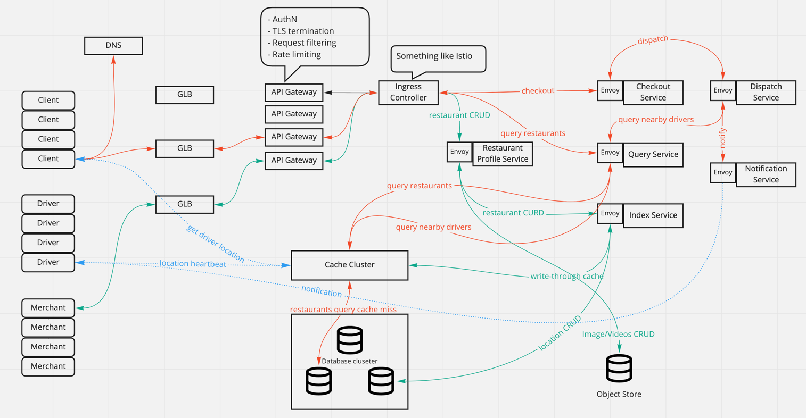

# Geolocation based service

## Use cases

- As a Yelp/DoorDash/UberEat merchant, I would like to register and add my restaurant location to the platform.
- As a Yelp/DoorDash/UberEat user, I would like to query nearby restaurants based on my current location.
- As a Yelp/DoorDash/UberEat user, I would like to place an order and choose pickup or delivery.
- As a Yelp/DoorDash/UberEat user, I would like to see driver's real-time location while delivering my food.
- As a Yelp/DoorDash/UberEat driver, I would like to accept or reject a notification for food delivery.

## Requirements

### Functional requests

- Allow adding, deleting, updating an object's location(For drivers, we might also need real-time location updating).
- Allow geolocation based query. Input a location and return a list of nearby objects(search for nearly drivers or nearby
  restaurants).
- Allow user and driver share real-time location.

### Non-functional requests

- HA: One backend service failure would not affect the overall service availability.
- Scalability: With the user growth, the service should be able to horizontally scaled out without service downtime.
- Low latency: The query service or location sharing service should be close to real-time.
- High traffic on query(read heavy).
- High traffic on both read and write in terms of real-time location updating.

## Some ideas of indexing geolocation

### GeoHash

- Convert longitude and latitude to binary code.
- Combine the binary code of longitude and latitude. Longitude at odd positions and latitude at even positions.
- Every 5bits of binary represent a number between 0-32. Base32 encodes each 5bits to generate the final GeoHash.

#### GeoHash problems

- One is the `edge-case`, two closer points could have completely different GeoHash value, but two
  farther points could have same GeoHash value (shown in the figure below).


- Another issue is called `non-linearity`, `0111`
  and `1000` are close, but they are far away from each other on the map.


Query might result in searching so many blocks because of above known issues. So we want to improve: a) continuity in search,
b) make sure there are minimum blocks to be queried.

### Quadtree + GeoHash

[Quadtree wiki page](https://en.wikipedia.org/wiki/Quadtree#Point_quadtree)

- Root represents the entire map.
- Leaf node represents the minimum region on the map. It might contain the following properties:
  - `Geohash` the geolocation hash of the region.
  - List of object IDs within this region.
- Inner node represents the region on the map. It might contain the following properties:
  - `Geohash` the geolocation hash of the region.
  - List of object IDs within this region.

Now the `search nearby` becomes searching all sibling leaf nodes or the leaf nodes under a particular common ancestor. If
we convert the tree structure to be key-value pairs (key is the geohash, value is the serialized node properties), it becomes
searching the key-value pairs having the same prefix.

#### Quadtree + GeoHash problem

The problem is also from the limitations of GeoHash. GeoHash values of two adjacent nodes might not be continuous, like
what is shown in `non-linearity`, so just searching the common prefix nodes is not enough.

### Quadtree + Hilbert Curve


- Quadtree helps model the Geolocation into a tree structure and provide a nice query from root to leaf. (However it still
  has problem to deal with nearby query).
- Hilbert Curve line assigns consecutive IDs to nodes under the same level. We could draw different Hilbert Curve lins at
  different level. This [blog](http://blog.notdot.net/2009/11/Damn-Cool-Algorithms-Spatial-indexing-with-Quadtrees-and-Hilbert-Curves)
  describes how IDs are generated by using Hilbert curve algorithm.
- **The ID has the following properties: The binary representation for a random cell N on the curve of order o: Hₒ(N)=101011001…1011.
  The four children n₀, n₁, n₂, n₃ of Hₒ(N) of order o+1 will have the representations: Hₒ₊₁(n₀) = Hₒ(N) · 00, Hₒ₊₁(n₁) = Hₒ(N) · 01,
  Hₒ₊₁(n₂) = Hₒ(N) · 11, Hₒ₊₁(n₃) = Hₒ(N) · 11**. It means nearby query is much efficient!!!
  (currentID - range, currentID + range).


## Data models and APIs

```go
type QuadTreeNode struct {
	ID        string   // Generated by Hilbert Curve algorithm based on the coordinates
	Level     int      // The depth of current cell in quadtree
	Parent    Cell     // The pointer to the parent cell
	Children  Cell     // Four children under current cell
	Latitude  string   // Latitude current cell represent
	Longitude string   // Longitude current cell represent
	Objects   map[string]string // List of object IDs and their serialized properties, the object could be restaurant or driver or user
}

type Restaurant struct {
	ID string
  Latitude  string   // Latitude current cell represent
  Longitude string   // Longitude current cell represent
  Dishes []Dish
}

type Order struct {
	ID string
	RestaurantID string
	CustomerID string
	Dishes []Dish
}

type Person struct {
	ID string
	Type string // driver or customer
  Latitude  string   // Latitude current cell represent
  Longitude string   // Longitude current cell represent
  Profile map[string]string
}

// E.g. add a new restaurant on map
func AddObject(latitude string, longitude string, level int, properties map[string]string) bool {}
// E.g. delete a restaurant on map
func DeleteObject(latitude string, longitude string, level int) bool {}

func SearchNearby(latitude string, longitude string, radius int, maxCount) []Object {}

// More TBA
```

## Data store

### Static data

- User profile
- Restaurant locations
- Menus
- Dishes

All kinds of "metadata" follow the "write-once" pattern, they could be stored in database for durability. It does not matter
SQL or NoSQL.

- Uber uses Cassandra for raw location data.
- Lyft used MongoDB several years ago.
- MySQL also could be used.

### Ephemeral data store

- Moving objects location data (Driver location or user location)

Those ephemeral data could be stored as `key-value` in memory. Lyft uses Redis for real time driver locations. Kafka is not
a datastore, it is also ok if you want to push driver location heartbeat events to it.

## Architecture



## Components design

### Location service

Location service itself is stateless, so that it could be easily horizontally scaled. The location data is persistent in
cache or database cluster.

- Implement the logic of generating restaurant ID from altitude and longitude.([More details on how to generate ID](#how-to-generate-regionid))
- Implement the Hash logic for sharding.
- Implement nearby query.

### Checkout service

- Handle checkout requests.
- Perform checkout validations:
  - validate payment method
  - validate restaurant availability
- Invoke dispatch service for food delivery

### Dispatch service

- Handle dispatch event from checkout service.
- Query nearby drivers through location service.
- Send notification to selected driver through notification service. Driver has to confirm before a timeout, otherwise
  dispatch service will pick next available driver.

### Notification service

- Handle the dispatch event or order confirm event
- Send notification to driver or customer

## How to generate RegionID

- A point on map is an un-splittable region, or it is a region with close enough latitude(12.001,12.002) and
  longitude(21.001, 21.002).
- A regionID could be generated by using Hilbert Curve algorithm.
  - A map is the largest square.
  - Based on coordinates one could know if a region is on top-left(`Pattern 1`).
  - Recursively we know the region is on top-right of `00` cell(`Pattern 4`), so it's ID is `01`.
  - Combine the upper level `00` with `01`, the region ID is `0001`.
  - The same applies to other regions.

All regions will be "Hilbert Curve" linked if running through above process. The longer the region ID is the more granular
the region would be.


## How to add/update/delete a new landmark on map

### How to register a new restaurant

- Merchant gets the global load balancer IP address by consulting DNS which returns a list of records.
- Merchant sends request to global load balancer IP address with the payload to register the restaurant.
- Ingress controller handles the incoming requests and route to location service.
  - Restaurant ID is generated based on latitude and longitude.
  - Metadata is persistent in storage. Index is built for restaurant IDs.
  - If using write-through cache, we might want to add the restaurant entry into LRU cache. If we have performance requirement,
    updating the cache could be async.

### How to delete a new restaurant

For deletion, the restaurantID is passed in as part of the payload, so backend service can easily delete the corresponding
data entries from cache and database.

There is a **special case** we might want to handle is that if customer places order and restaurant deletion happen
concurrently:

- Update cache to make sure the restaurant is "unavailable". The subsequent query could see that particular
  restaurant is unavailable.
- Init the database deletion simultaneously.
- If database deletion succeeds, evict the cache entry.

Deletion succeeds when above steps succeeds. Or we could have another check right before checkout to make sure the restaurant
does still exist.

## How does query nearby work

- Current location is sent.
- Location could be converted to quad tree node ID through hilbert curve algorithm(the same way obj ID is generated).
- Sharding function will redirect the request to a particular cache shard or database shard.
- Binary search to locate which object ID is closest to the current location in cache if using something like sorted set
  of redis(Objects which are close to each other are stored in adjacent rows in storage). Adding or subtracting radius for
  range query.
- In database, the rows are not sorted so that we could not use binary search. SQL database has `LIKE` semantic to query
  by prefix. For NoSQL database, it is really depends on the internal implementation for indexing system(Hbase has `PrefixFiler`
  support). Cassandra has configs to support `sorting by key` for row entries([details](https://ayogo.com/blog/sorting-in-cassandra/#:~:text=The%20properties%20(good%20and%20bad,disk%20are%20sorted%20by%20key))).

## How to partition

- Shard by region + product. E.g. Region(GeoHashing|HilbertCurve Idx) + UberPool|UberX.
  - Take `6dye8w(California)xcz46d(San Jose)iflsh7ds(North San Jose)` as an example.
  - We could choose to shard by `6dye8w`, but this could easily cause hotspot.
  - Then we could also choose to shard by `6dye8wxcz46d`(shard a smaller region)

### How does Uber solve hotspot

[Uber Ringpop](https://eng.uber.com/ringpop-open-source-nodejs-library/)

- Shard by a smaller region
- Data replication(split read traffic to all replicas, writes to multiple copies)

## How drivers and customer share real-time location

- Driver sends heartbeat with location updates every 3-10s.
- Cache layer(Redis) holds the updates of driver location, customer queries driver's location periodically from cache
  layer (Redis:"sorted set" sort by timestamp).

Above is how lyft implements the driver-customer location sharing.

However, it could also be implemented by using the pub-sub streaming mechanism that both driver and customer subscribe to
the same temporary topic. Driver publish location update events to topic, a backend consumer thread consumes the events
and send updates to customer. OR the customer's client lib consumes the events by querying from the topic.

## How is driver notified an order

// TODO: Design notification service

## References

- <https://blog.zen.ly/geospatial-indexing-on-hilbert-curves-2379b929addc>
- <http://blog.notdot.net/2009/11/Damn-Cool-Algorithms-Spatial-indexing-with-Quadtrees-and-Hilbert-Curves>
- <https://kousiknath.medium.com/system-design-design-a-geo-spatial-index-for-real-time-location-search-10968fe62b9c>
- [How Uber shards its geolocation](https://www.youtube.com/watch?v=AzptiVdUJXg&ab_channel=UberEngineering)
- <https://eng.uber.com/h3/>
- <https://www.youtube.com/watch?v=cSFWlF96Sds&ab_channel=RedisLabs>
