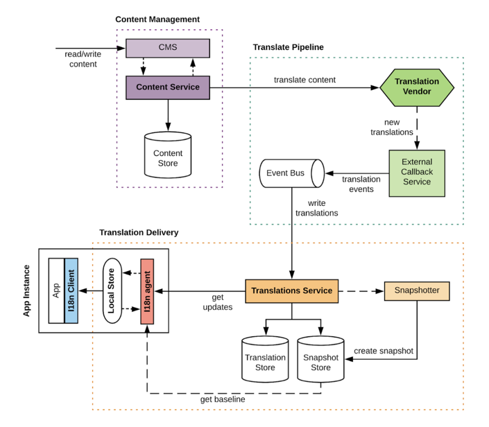
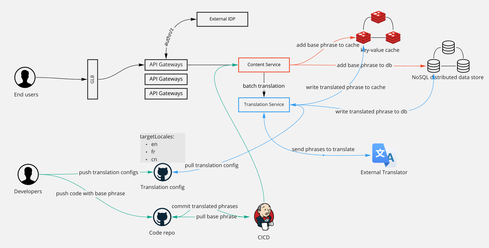
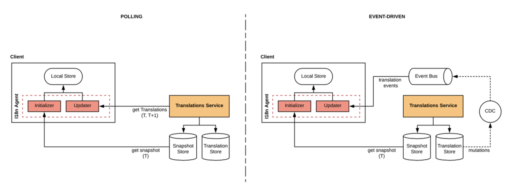

# Design i18n service

## What is i18n

Internationalization is the process of adapting software to accommodate for different languages, cultures, and regions
(i.e. locales), while minimizing additional engineering changes required for localization.

## Requirements

### Functional requirements

- A shared service which takes locale and phrase as input, return an output under the specific locale.

### Non-functional requirements

- Various types of client.
- High available: A shared service cannot tolerate any service unavailable.
- Low latency: When client sends a request, the service needs to return a result in low latency.
- Scalable: It is possible that more and more phrases in different languages are added, we need to be able to scale.
- Read heavy: The shared service is read heavy.

## Data models

### Phrase

A phrase is consist of a word or a sentence, it is the base unit in a translation service.

```go
type Phrase struct {
	ID string // A global unique ID which identifies a phrase
	Locale string // A string used to identify the locale, i.e., en, fr, cn
	Version string // Used to track different versions of a phrase. Could also use timestamp as the version.
	Default string // The default text of the phrase
	Singular string // The text of a phrase in singular, i.e., he or 他
	Plural string // The text of a phrase in plural, i.e., they or 他们
	...
}
```

We could use `ID+Locale` as the key to identify all phrases including the translated phrase, i.e., 123_en, 123_fr. We could
also use `ID+Locale+Version` as the key to identify all versioned phrases, it is also fine to use timestamp for versioning.

## Data persistent

We need to store the base phrase when it is created, and also need to store the translated phrases.

### SQL or NoSQL

- Data model is simple and no ACID requirement, so it does not have to be SQL.
- It is hard to define a fit-to-all schema at the very beginning for a shared service. So there could be some changes against
  schema in the future. Use NoSQL could be more flexible.
- No schema could increase the read-write performance.

### Which NoSQL to use

- key-value could be used to handle the i18n in programming. I.e., Java i18n messaging, there is no need to worry about
  singular or plural.
- wide-column could be used to handle more advanced cases.

  |   |default|singular|plural|
  |---|---|---|---|
  |123_cn|他|他|他们|
  |123_en|he|he|they|
  |124_cn|你好| | |
  |124_en|hello| | |

Considering the extensibility, using wide-column data store like DynamoDB, BigTable, Cassandra would be a good idea.

### Leader based or leaderless

Cassandra has the leaderless distributed architecture, however DynamoDB, BigTable are leader based.

- For handling writes, both are ok. Cassandra is optimized for writes, and DynamoDB as a leader based DB could also be fit
  in this case since the shared service is read heavy.
- For handling reads, Cassandra might have low performance if we want strong consistency because read needs to get the quorum.
  DynamoDB might also have slow performance if we need strong consistency because read needs to be handled by leader. In
  this particular case, we do not have strong consistency requirement, so either one should be good.

## APIs

```go
type I18n interface {
	// Add a phrase, return phrase ID and error status
	AddPhrase(defaultText, singular, plural, locale string) (string, error)
	// Get a phrase, return the phrase and error status
	GetPhrase(id, locale string) (string, error)
	// Translate a phrase from one locale to another
	// externalTranslator is a hook point which could be used to link to external translation service
	Translate(id, sourceLocale, targetLocale string, externalTranslator func(phrase, sourceLocale, targetLocale string) (string, error)) (string, error)
}
```

## Architecture

### Airbnb i18n platform



### My own architecture



## Components

### Content service

- The service handles the addition of a base phrase under a particular locale.
- The service handles the retrieval of a phrase under a particular locale.
- The service sends translation requests to external pluggable translator in a **batch**.

### Translation service

- Provide a hook point to talk to external translator. We could plugin different translation vendor.
- Provide a hook point to talk to external configuration service, i.e., Github.
- Implement the logic on when to do the translation, where to get the phrases, where to store the result and what
  external translator to use.

## Workflow

- Users add a phrase either using client lib programmatically or using REST endpoint.
  - `AddPhrase("This is an apple.", "", "", "en")`
- DNS server resolves the fqdn and request is sent to GLB.
- API Gateway does AuthN/Z, RateLimiting, etc.
- The validated request reaches the **Content Service**.
  - "This is an apple." needs to have a deduplication check.(could use hash value)
  - The **Content Service** generates ID `123` to "This is an apple.".
  - The **Content Service** stores it in database.

    |   |default|singular|plural|
    |---|---|---|---|
    |123_en|This is an apple.| | |

  - The **Content Service** adds/updates in cache(this could happen simultaneously with storing the phrase in database)
    - `key: 123_en`
    - `value: This is an apple.`
  - The **Content Service** add the event to an event bus, and the consumer of this event bus will be **Translation Service**.
    - `{id:123, default:"This is an apple.", sourceLocale:"en"}`
  - The **Translation Service** gets translation config to know what target locales need to be translated to.
  - The **Translation Service** buffers the events and process them in a batch.
  - The **Translation Service** translate the phrase to target phrases by invoking the external translator.
  - The **Translation Service** stores the translated phrases into database and updates cache as well.

    |   |default|singular|plural|
    |---|---|---|---|
    |123_en|This is an apple.| | |
    |123_cn|这是一个苹果。| | |
  - Client who wants to retrieve the message could read from cache or databases if cache misses.

## Design details

### Row structure if using wide-column

|   |default|singular|plural|
|---|---|---|---|
|123_cn|你好| | |
|123_en|hello| | |

---

|   |cn_default|cn_singular|cn_plural|en_default|en_singular|en_plural|
|---|---|---|---|---|---|---|
|123|你好| | |Hello| | |

---

|   |default|singular|plural|
|---|---|---|---|
|123|encode(cn:你好,en:Hello)| | |

We could have three ways to structure a row, each of them has pros and cons and there are few things need to be considered:

- Row key would be the partition key. The first one will be more flexible on partition, however the following two could
  only be partitioned based on the ID which means all translations of a phrase will be partitioned together. Putting all
  translations together is not a bad idea because it could provide some level of data locality.
- The third one will have some performance issue when query a particular phrase under a particular locale because the entire
  bit cell will be retrieved and then filtered.

### Failure handling

#### Content Service failure

- Content Service is stateless and have multiple replicas to distribute the load. If any `Content Service` instance is down,
  we could just restart it. I.e., Content Service as a K8S Deployment with replica = 3.
- Clients could retry the failed request if there is no ACK received. The Content Service is idempotent and has deduplication,
  so it is ok to have requests retried.
- Batch translation is just an event, it is either sent or not. If clients retry, the event will be triggered again.

#### Translation Service failure

- Is Translation Service stateful or stateless? It depends on whether we are using MQ or Kafka as the event bus.
  - If using Kafka, Translation Service needs to persist the offset and coordinate between consumer threads(deduplication)
  - If using MQ, Translation Service does not need to persist what has been processed, just consume next one after restart.

If Translation Service needs to persist the offset, there are two options to handle the failures:

- Have producer side or external coordinator(zookeeper) to periodically have checkpoint. Translation Service resumes from
  that checkpoint on restart.
- Have the offset replicated across multiple instances, like having a built-in distributed metadata store.

#### Database failures

Distributed datastore has its own solution to handle the failures like node crash etc. The basic idea is to have replicas
with leader selection(coordination and concurrency handling).

#### Cache layer failures

- Distributed cache has its own failure handling.
- Worst case is cache miss, and requests will be redirected to data store.

### Client local store

- Client could be in air-gap environment.
- To reduce the latency so that client does not have to send all the requests to backend to retrieve a phrase.
- Some code has the phrase bundle packaged within the client lib, that phrase bundle needs to be synced.

This is why Airbnb's i18n platform will have client lib and i18n agent installed on client side:



The goal is to make the client local store to be in sync with server side. The server side is the source of truth.

- Pull(on the left side): Pull the delta, but hard to control the pulling frequency.
- Event-driven(on the right side): An backend update will trigger a notification to client, so the client could load the
  updates.

## References

- [Airbnb: i18n platform](https://medium.com/airbnb-engineering/building-airbnbs-internationalization-platform-45cf0104b63c)
- [Square: Building a System for Front-End Translations](https://engineering.squarespace.com/blog/2018/building-a-system-for-front-end-translations)
- [Java i18n](https://docs.oracle.com/javase/tutorial/i18n/intro/index.html)
- [Golang i18n](https://github.com/nicksnyder/go-i18n)