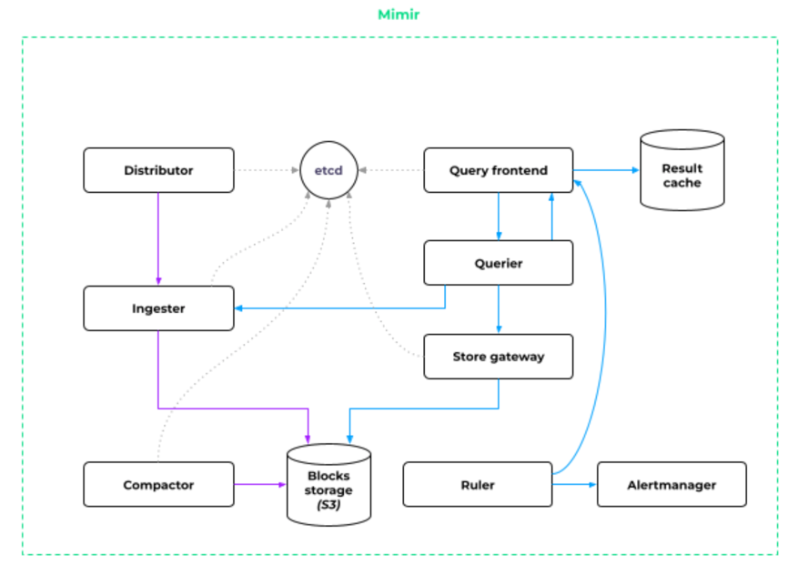
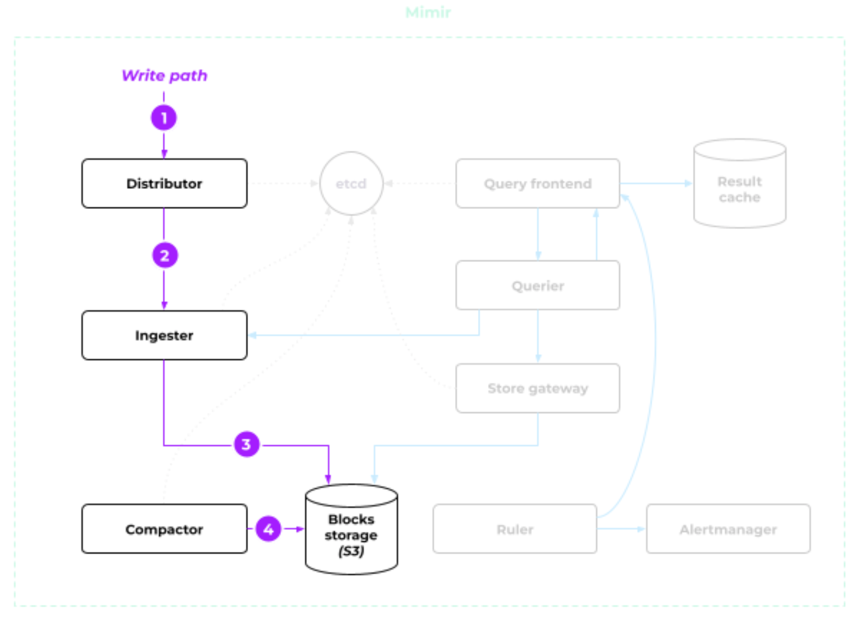
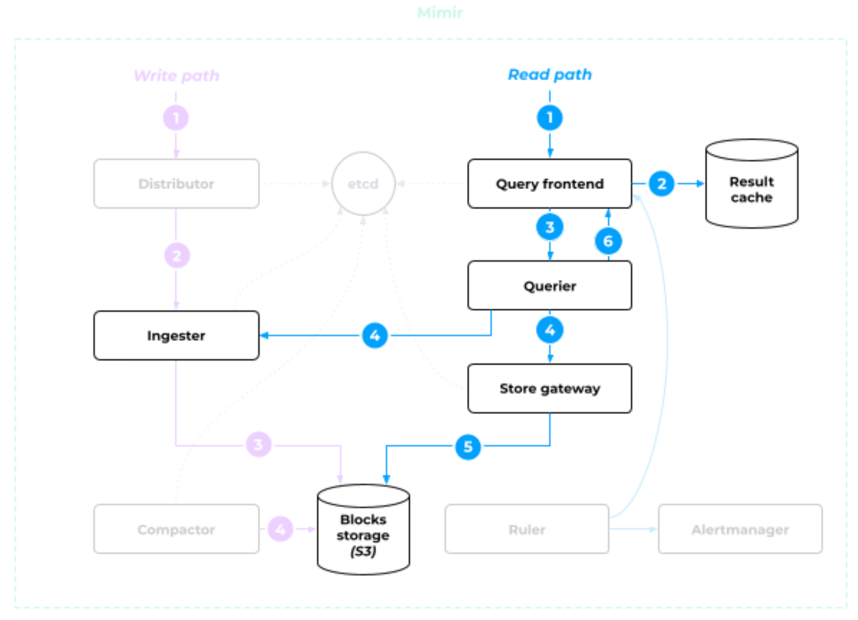

# Mimir

A microservice version of Prometheus

## Architecture

## Workflow

### On Writes

* Data is written to `Distributor`
  * Check format
  * Select `Ingester`
* Data is forwarded to `Ingester`
  * Generate data blocks in memory
  * Once data block is full (e.g., 2 hours window), it finalized it and save to disk and long-term storage
* Data is written to `S3`
  * `Compactor` comes to do compaction

### On Reads

* Request hits query frontend, it checks result cache
* If no result found from cache, the request is forwarded to `Querier`.
  * Query from `Ingester` for latest data
  * Query from Storage for older data
  * `Store Gateway` acts like a cache layer of `S3` and also maintain an index (matching labels to blocks in S3) for
    quick S3 access.

## References

* <https://blog.palark.com/prometheus-centralized-storage-mimir/>