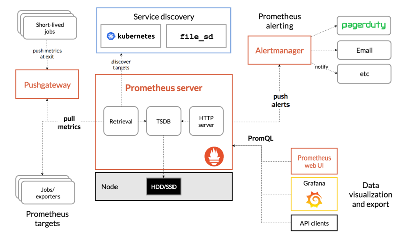
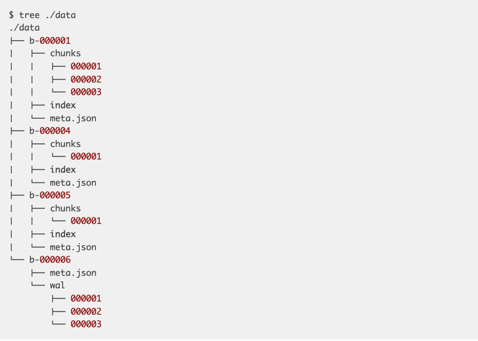
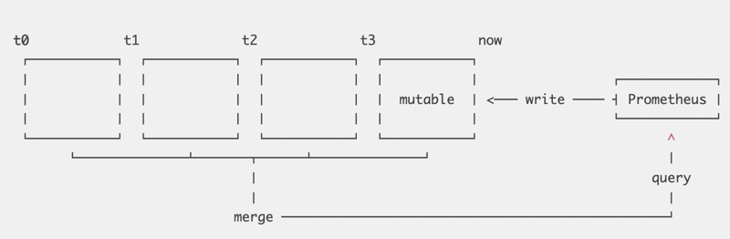

# Distributed monitoring system

This contains notes after the research on Prometheus. Google Monarch has a completely different design, see
[this article](../../../how-google-xxx-series/monarch-planet-scale-in-memory-time-series-database/readme.md) for more details.

## Architecture



### Prometheus server

- Running on single node, in K8S its replica=1.
- No native support for HA. ([Ref](https://medium.com/miro-engineering/prometheus-high-availability-and-fault-tolerance-strategy-long-term-storage-with-victoriametrics-82f6f3f0409e))
  But could run two independent instances with same configurations to achieve HA, AlertManager will deduplicate the same
  alert.
- **Pull Model**: Scrape/Pull metrics with a configurable interval.
- Support federation: Instance A scrape metrics from Instance B.

### PushGateway

- Metrics from short-lived job could be sent to PushGateway.
- Metrics are stored on disk. In K8S, we could enable PV. ([Ref](https://www.metricfire.com/blog/prometheus-pushgateways-everything-you-need-to-know/))

### AlertManager

- Prometheus server pushes alerts to AlertManager.
- Support HA with native clustering support. ([Ref](https://prometheus.io/docs/alerting/latest/alertmanager/#high-availability))

## TSDB within Prometheus Server

The following is based on V3 design. ([Prometheus TSDB from scratch](https://fabxc.org/tsdb/))



- `b-000001` is a block(2h time window). ([Ref](https://prometheus.io/docs/prometheus/latest/storage/#on-disk-layout))
- `chunks/000001` holds the raw data for various series:
  ```text
  ^
  series
  |
  | {__name__="request_total", method="GET",  ["t1:v1","t2:v2"]}
  | {__name__="request_total", method="POST", ["t1:v1","t2:v2"]}
  | {__name__="error_total",   method="GET",  ["t1:v1","t2:v2"]}
  | {__name__="error_total",   method="POST", ["t1:v1","t2:v2"]}
  -----------------------------------------------------time---->
  ```
- Each block has an inverted index file.
- Each block has an metadata file.



- Most recent block is held in memory with WAL to prevent failure.
- Old blocks could be compacted by a background process.

### Good to know

- SSDs are known for fast random writes, they actually can’t modify individual bytes but only write in pages of 4KiB or
  more. This means writing a 16 byte sample is equivalent to writing a full 4KiB page.
  This behavior is part of what is known as [write amplification](https://en.wikipedia.org/wiki/Write_amplification).
- [mmap(2)](https://en.wikipedia.org/wiki/Mmap), a system call that allows us to transparently back a virtual memory
  region by file contents. This means we can treat all contents of our database as if they were in memory without occupying
  any physical RAM. Only if we access certain byte ranges in our database files, the operating system lazily loads pages
  from disk.

## Compare prometheus with others

This section is a summary of this [doc](https://prometheus.io/docs/introduction/comparison/#comparison-to-alternatives)

### VS Graphite

#### VS Graphite Scope

Prometheus scrape data VS Graphite passively waits data to be sent[ref](https://graphite.readthedocs.io/en/latest/feeding-carbon.html#feeding-in-your-data).

#### VS Graphite Data model

Graphite uses [statsD](https://github.com/etsy/statsd/) aggregated data with dots-separate components in metrics name

```text
stats.api-server.tracks.post.500 -> 93
```

Prometheus uses label(key-value) and preserve the instance as a dimension

```text
api_server_http_requests_total{method="POST",handler="/tracks",status="500",instance="<sample1>"} -> 34
api_server_http_requests_total{method="POST",handler="/tracks",status="500",instance="<sample2>"} -> 28
api_server_http_requests_total{method="POST",handler="/tracks",status="500",instance="<sample3>"} -> 31
```

#### VS Graphite Storage

Graphite stores time series data on local disk in the [Whisper](https://graphite.readthedocs.org/en/latest/whisper.html)
format, an RRD-style database that expects samples to arrive at regular intervals.

Prometheus uses different storage mechanism mentioned in above.

### VS InfluxDB

#### VS InfluxDB Scope

[Kapacitor](https://github.com/influxdata/kapacitor) together with InfluxDB, as in combination they address the same problem
space as Prometheus and the Alertmanager. Kapacitor’s scope is a combination of Prometheus recording rules, alerting rules,
and the Alertmanager's notification functionality.

#### VS InfluxDB Data model

InfluxDB has a second level of labels called fields, which are more limited in use. InfluxDB supports timestamps with up
to nanosecond resolution, and float64, int64, bool, and string data types. Prometheus, by contrast, supports the float64
data type with limited support for strings, and millisecond resolution timestamps.

#### VS InfluxDB Storage

InfluxDB uses a variant of a [log-structured merge tree for storage with a write ahead log](https://docs.influxdata.com/influxdb/v1.7/concepts/storage_engine/), sharded by time.

Prometheus is append-only file per time series.

#### VS InfluxDB Architecture

Prometheus servers run independently of each other and only rely on their local storage for their core functionality:
scraping, rule processing, and alerting. The open source version of InfluxDB is similar.

The commercial InfluxDB offering is, by design, a distributed storage cluster with storage and queries being handled by
many nodes at once.

#### VS InfluxDB Summary

Where InfluxDB is better:

- If you're doing event logging.
- Commercial option offers clustering for InfluxDB, which is also better for long term data storage.
- Eventually consistent view of data between replicas.

Where Prometheus is better:

- If you're primarily doing metrics.
- More powerful query language, alerting, and notification functionality.
- Higher availability and uptime for graphing and alerting.

### VS OpenTSDB

#### VS OpenTSDB Scope

The same as mentioned in [vs-graphite](#vs-graphite)

#### VS OpenTSDB Data model

- Almost identical data model: OpenTSDB tags are Prometheus labels
- There are minor differences though: Prometheus allows arbitrary characters in label values, while OpenTSDB is more restrictive.
- OpenTSDB also lacks a full query language, only allowing simple aggregation and math via its API.

#### VS OpenTSDB Storage

OpenTSDB's storage is implemented on top of Hadoop and HBase. This means that it is easy to scale OpenTSDB horizontally,
but you have to accept the overall complexity of running a Hadoop/HBase cluster from the beginning.

Prometheus will be simpler to run initially, but will require explicit sharding once the capacity of a single node is exceeded.

## References

- [Prometheus TSDB from scratch](https://fabxc.org/tsdb/)
- [Prometheus Storage](https://prometheus.io/docs/prometheus/latest/storage/#on-disk-layout)