# TSDB

## Problems

### Time series data

We want to system to collect data points over time, and each data point is a tuple of a timestamp and a value. (`(t0, v0)`)

```text
identifier -> (t0, v0), (t1, v1), (t2, v2), (t3, v3), ....
```

identifier: A metric name with a dictionary of label dimensions.
```text
requests_total{path="/status", method="GET", instance=”10.0.0.1:80”}
```

Or this can be simplified as follows:

```text
{__name__="requests_total", path="/status", method="GET", instance=”10.0.0.1:80”}
```

When querying time series data, we can query by label: `{__name="requests_total"}` which selects all series within a
time window belong to the `request_total` metric. More advanced use case is to query by complex condition, e.g.,
`method!=GET`.

### Vertical and Horizontal

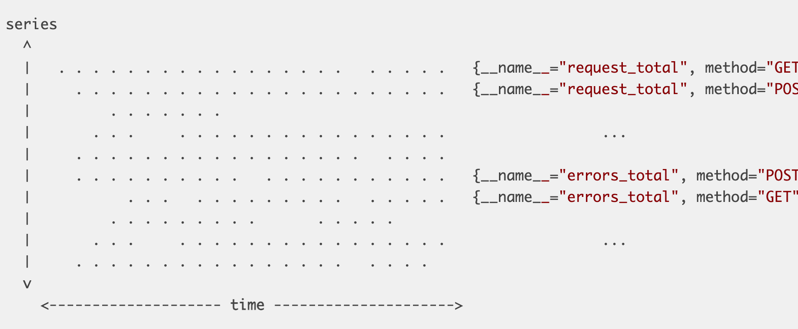

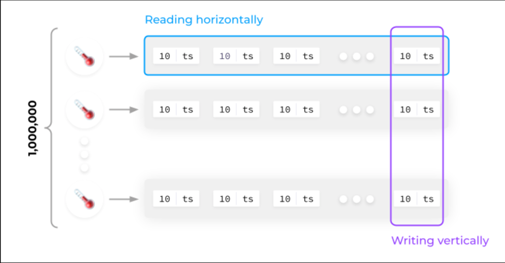

All data points can be laid out on a 2-dimensional plane, horizontal dimension represents the time and series spreads
across the vertical dimension.

* Write pattern:
  * Batch write: We want to batch write multiple data points at the same time to improve the performance. (We have
    multiple targets to scrape from at the same time)
  * Sequential data location on disk to optimize the query: To query data points of a target over a time window, it is
    hard to figure out where the individual points can be found, we have to read from a lot of random places on disk.
* Read pattern: Query is like reading a rectangular area from the two-dimensional plane.

#### Prometheus' V2 solution

* Create one file per time series that contains all of its samples in sequential order.
* Batch up 1KB chunk in memory first and then flush to file when it is full.

This approach provides two benefits: 1) Batch write, 2) Good compression.

**Problems from V2 solution**

* With several millions files, we may run out of `inodes` on our filesystem.
* There are several thousands of chunks per second are ready to be persisted. This still requires thousands of individual
  disk writes every second. If we try to alleviate by also batching up in-memory chunks, this increases the total memory
  footprint.
* Infeasible to keep all files open for reads and writes. But there will a significant query latencies if open thousands
  of files, find and read relevant data points into memory, and close them again.
* Deleting old data from the front of millions of files is a write intensive operation.
* Chunks that are currently accumulating are only held in memory, so if application crashes, data will be lost.

The concept of having chunks is something we want to keep, however having one file per time series is something we want
to find an alternative to.

### Series Churn

In the Prometheus context, we use the term series churn to describe that a set of time series becomes inactive, i.e.
receives no more data points, and a new set of active series appears instead. For a large system, it is possible that we
end up with 10 million time series, query performance is significantly impacted.

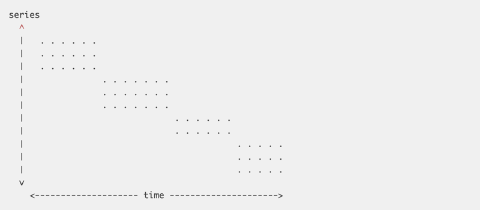

#### Prometheus' V2 solution

Prometheus V2 has an index based on LevelDB for all series that are currently stored. Query works efficiently with a given
label (e.g., `__name__="requests_total"`), but selecting all series with `instance="A" AND __name__="requests_total"` has
scalability problems.

### Resource consumption

By Prometheus' architecture the V2 storage slowly builds up chunks of sample data, which causes the memory consumption
to ramp up over time. As chunks get completed, they are written to disk and can be evicted from memory. Eventually,
Prometheus’s memory usage reaches a steady state. That is until the monitored environment changes — series churn
increases the usage of memory, CPU, and disk IO every time we scale an application or do a rolling update.

The approach of having a single file per time series also makes it way too easy for a single query to knock out the
Prometheus process. When querying data that is not cached in memory, the files for queried series are opened and the
chunks containing relevant data points are read into memory. If the amount of data exceeds the memory available,
Prometheus quits rather ungracefully by getting OOM-killed.
After the query is completed the loaded data can be released again but it is generally cached much longer to serve
subsequent queries on the same data faster.

## New Design

### In-memory layout

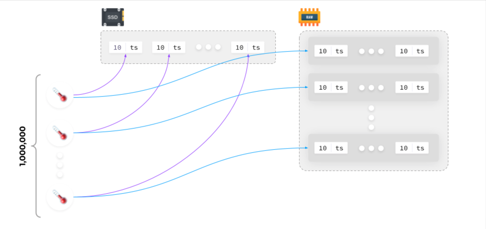

Writing all time series data into single file is straight forward, but we need to read horizontally which has scalability
and performance issue because all time series data are mixed (**Not sorted**).

We can write the collected data in RAM, group by time series, compile a block and then save it to SSD. This is similar to
Meta's Gorilla (in-memory TSDB).

Whenever the collected data is saved on disk, each time series data can be grouped together in a file (this optimizes
the read performance).

### On-disk layout

```text
./data
├── 01BKGV7JBM69T2G1BGBGM6KB12
│   └── meta.json
├── 01BKGTZQ1SYQJTR4PB43C8PD98
│   ├── chunks
│   │   └── 000001
│   ├── tombstones
│   ├── index
│   └── meta.json
├── 01BKGTZQ1HHWHV8FBJXW1Y3W0K
│   └── meta.json
├── 01BKGV7JC0RY8A6MACW02A2PJD
│   ├── chunks
│   │   └── 000001
│   ├── tombstones
│   ├── index
│   └── meta.json
├── chunks_head
│   └── 000001
└── wal
    ├── 000000002
    └── checkpoint.00000001
        └── 00000000
```

* `01BKGTZQ1SYQJTR4PB43C8PD98` is a block contains ingested samples of 2 hours time window.
  * Each block is not overlapping with another block in terms of time.
  * We are interested in keeping each block reasonably short (about two hours for a typical setup) to avoid accumulating
    too much data in memory.
* `chunks` contains all the time series samples for that window of time.
  * `000001` is a segment file with fixed size (512MB by default), contains all time series samples up to the fixed size.
* `index` indexes metric names and labels to time series in the chunks directory.
* `tombstones`: When series are deleted via the API, deletion records are stored in separate tombstone files (instead of
  deleting the data immediately from the chunk segments).
* `chunks_head` holds the current block for current samples if persisted. Incoming samples are kept in memory and is not
  fully persisted.
* `wal` is to prevent the in-memory data loss if server crashes or restarts.
  * Write-ahead log files are stored in the wal directory in 128MB segments.
  * These files contain raw data that has not yet been compacted.
  * Prometheus will retain a minimum of three write-ahead log files. High-traffic servers may retain more than three WAL
    files in order to keep at least two hours of raw data.

#### Benefits this design is adding

* Each block has time boundary (2 hours), it allows us to fan out queries to all blocks relevant to the queried time
  range, then we are able to merge the result. (**This solves the problems around series churn**)
* When completing a block, we can persist the data from our in-memory database by sequentially writing just a handful of
  larger files. We avoid any write-amplification and serve SSDs and HDDs equally well.
* We keep the good property of V2 that recent chunks, which are queried most, are always hot in memory.
* Deleting old data becomes extremely cheap and instantaneous. We merely have to delete a single directory. Remember, in
  the old storage we had to analyze and re-write up to hundreds of millions of files, which could take hours to converge.
  Now deletion can be done in background with compaction benefiting from the tombstone file.

### mmap

It is a POSIX-compliant Unix system call that maps files or devices into memory. It is a method of memory-mapped file
I/O. It implements demand paging because file contents are not immediately read from disk and initially use no physical
RAM at all. The actual reads from disk are performed after a specific location is accessed, in a lazy manner.

Prometheus leaves the memory management to OS, and can treat entire database as if they were in memory without occupying
any physical RAM. Only if we access certain byte ranges in our database files, the operating system lazily loads pages
from disk.

(**This solves the OOM problems when a query needs to access a large amount of database files**)

### Compaction

When querying multiple blocks, we have to merge their results into an overall result. This merge procedure obviously
comes with a cost and a week-long query should not have to merge 80+ partial results. To achieve both, we introduce
compaction. Compaction describes the process of taking one or more blocks of data and writing them into a, potentially
larger, block. There are two options in the following diagram.

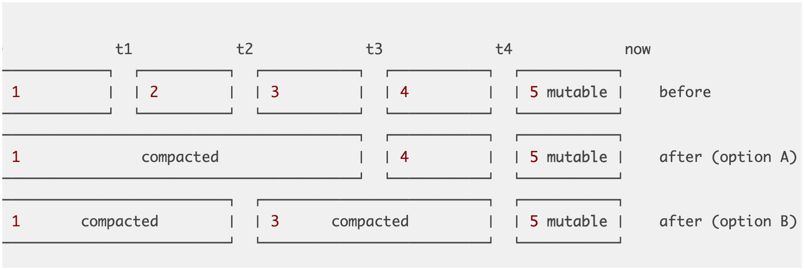

### Retention

How can we drop old data in our block based design? Quite simply, by just deleting the directory of a block that has no
data within our configured retention window. In the example below, block 1 can safely be deleted, whereas 2 has to stick
around until it falls fully behind the boundary.

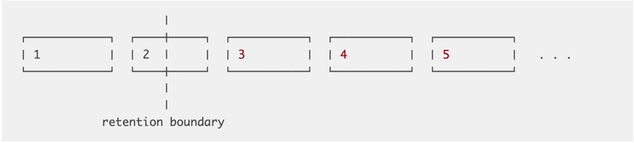

When we do compaction, we generate larger blocks, we should set the limit so block does not grow to span entire database.
this also limits the total disk overhead of blocks that are partially inside and partially outside of the retention
window, i.e. block 2 in the example above.

### Label set

We store the raw data into chunk files, but how do we know which data belongs to which sensor ? The answer is label sets.

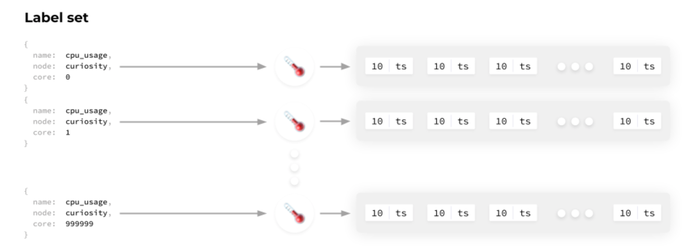

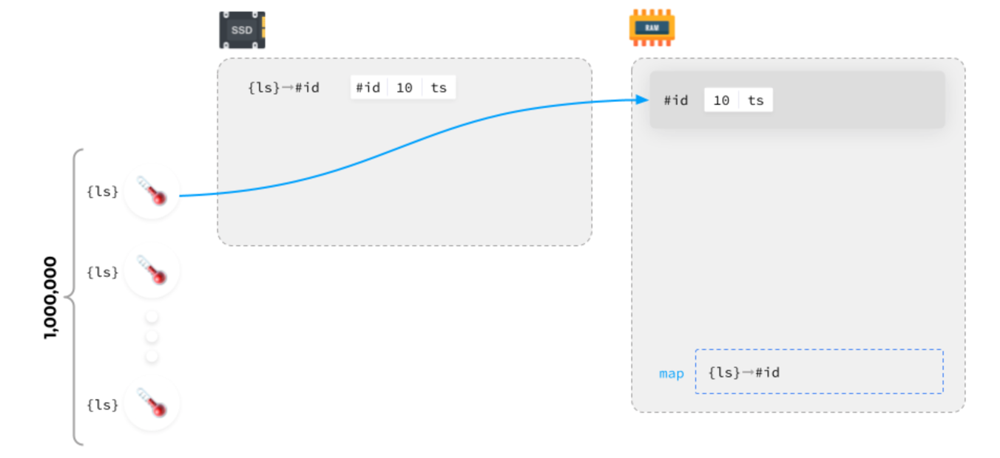

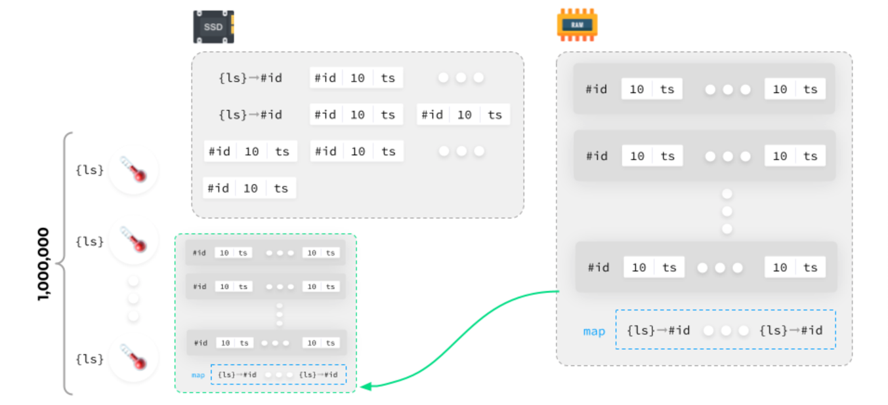

* Each label sets have an ID associated with it.
* Once the data arrives, we assign an ID and store it with raw data.

#### Workflow on query

A request arrives to display data for a specific label set:

* Get the label set ID.
* Find the matching IDs in blocks/chunks and fetch data. (This can be optimized with index)
* Display data.

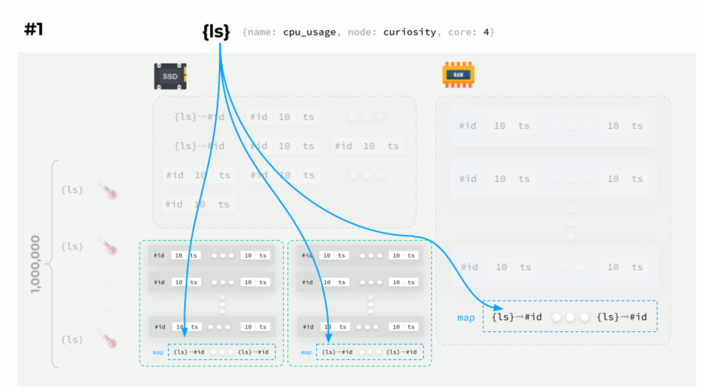
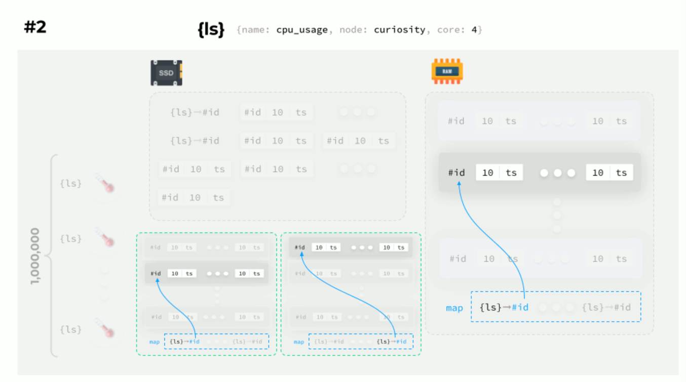
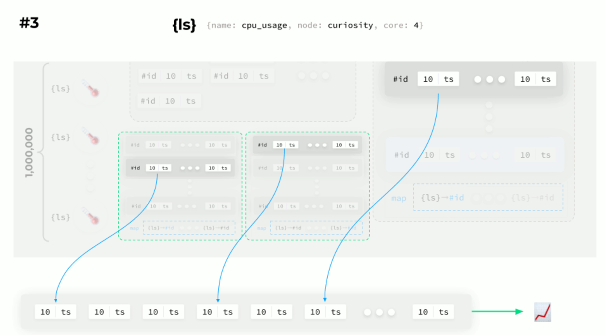

### Index

An inverted index provides a fast lookup of data items based on a subset of their contents. Simply put, I can look up
all series that have a label app=”nginx" without having to walk through every single series and check whether it
contains that label.

```text
Example: If the series with IDs 10, 29, and 9 contain the label app="nginx", the inverted index for the label “nginx” is
 the simple list [10, 29, 9], which can be used to quickly retrieve all series containing the label. Even if there were
  20 billion further series, it would not affect the speed of this lookup.
```

The inverted index also helps with the combined labels query, e.g., `__name__="requests_total" AND app="foo"`. To find
all series satisfying both label selectors, we take the inverted index list for each and intersect them.

## References

* <https://web.archive.org/web/20210803115658/https://fabxc.org/tsdb/>
* <https://blog.palark.com/prometheus-architecture-tsdb/>