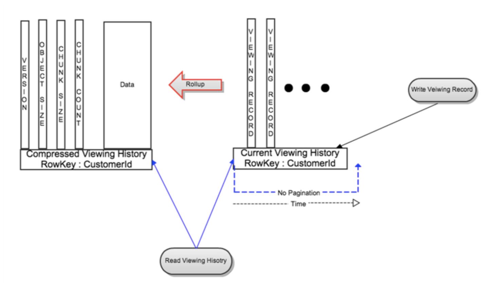
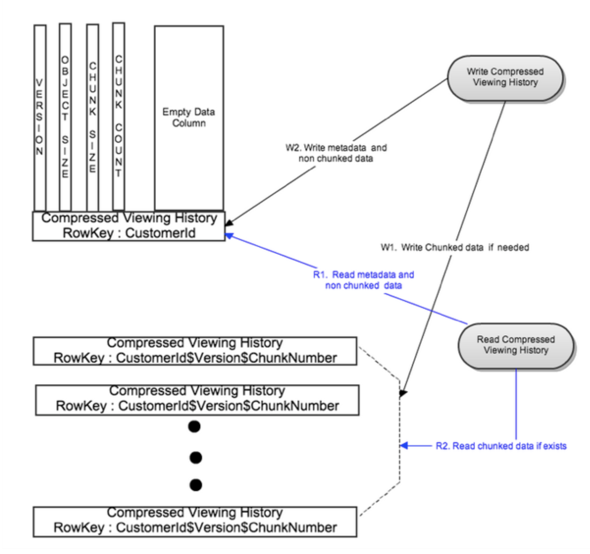
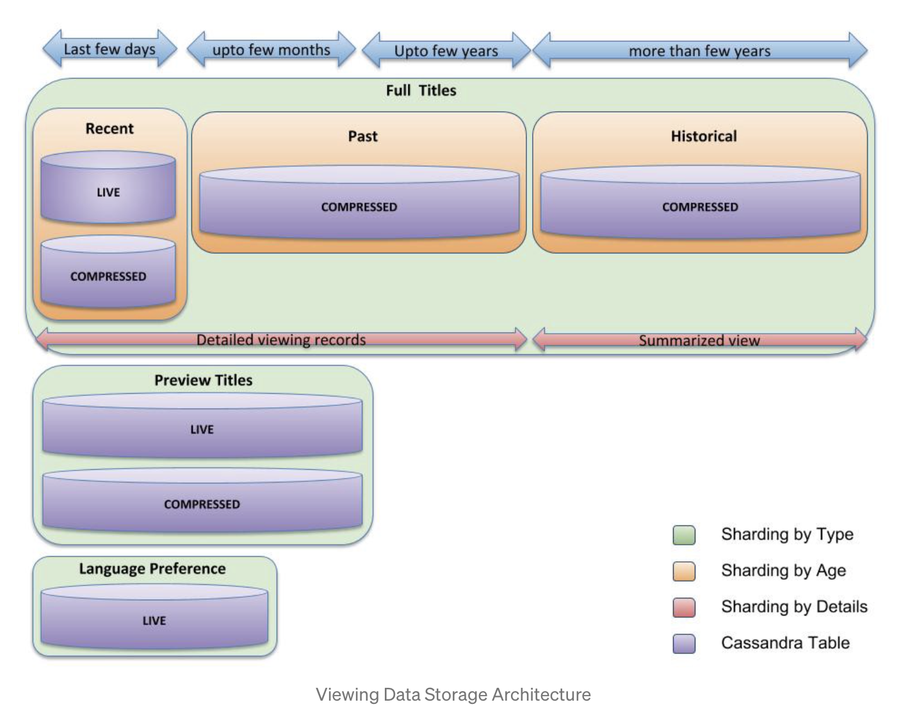
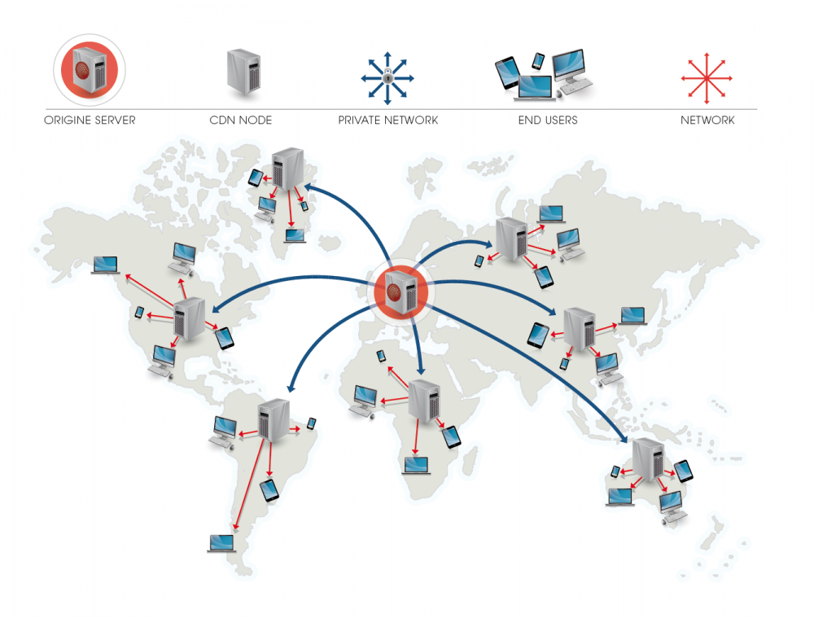

# Design Netflix or Youtube

## Requirements

### Functional requirements

- Stream videos to user
  - One video could be watched by multiple users simultaneously
- Allow users to watch video previews for x seconds
- Allow users to search video
- Video recommendations

### Non-functional requirements

- HA: If one of the CDN node down, user could still watch the video. If a backend server crashes, user could still login
  and search videos

## Assumptions

- DAU
- Number of users are allowed to watch the same video at the same time ?
- What is the average size of video ?

## Data models

### User related

```go
type Account struct {
	CustomerID string // unique identifier for the account 
	Email string
	Password string // hashed string which stores the user logging password 
	Name string
	PlanID string // indicates which plan the account is subscribed to 
	Locale string // indicates the language used for i18n 
	...
}

type PaymentMethod struct {
	FullName string
	BillingAddress string
	CardNumber string // unique identifier of a payment method
	CVS string
	CustomerID string // linked to the account
}

type Billing struct {
	CustomerID string // which account the billing applies to
	Date Date // when the bill is filed
	Amount float32 // the amount has been charged 
	CardNumber string // which card used of the payment
}
```

### Video related

```go
type Video struct {
	VideoID string // unique identifier of a video
	Title string
	Subtitle string
	Description string
	SeriesName string // only applies to series
	Episode int // only applies to series
	Likes int
	MediaURL string // the endpoint to access the media ?
	...
}

type Comment struct {
	CustomerID string // the account who puts the comment 
	VideoID string // to which video the comment is applied to
	Content string
}

type ViewHistorys struct {
	Email string // the unique id of account
	History [] struct {
		Video Video
		Data string
	}
}
```

## Storage 

Netflix uses MySQL cluster and Cassandra

### Member Viewing History

Netflix uses Cassandra to store the viewing history.

#### First solution

RowKey: customerID
Column: each column is the viewing history

---
- On write: create a new column for each view history
- On read: read entire row or slice(range query)

Problems:

- read does not scale with the growth of user viewing history

Improvements:

- use EVCache to cache the result
  - customerID as the key
  - compressed viewing history as the value
  
#### Second solution

Above improvements still have problems when user data is huge, either the Cassandra row data is huge or the large data
could not fit into a single EVCache entry.

So the idea of LiveVH and CompressedVH is raised.

- Live or Recent Viewing History (LiveVH): Small number of recent viewing records with frequent updates. The data is
  stored in uncompressed form as in the simple design detailed above.
- Compressed or Archival Viewing History (CompressedVH): Large number of older viewing records with rare updates.
  The data is compressed to reduce storage footprint. **Compressed viewing history is stored in a single column per row
  key**.
  
---
- On write: New view history is written to LiveVH
- On read:
  - Recent Viewing History: For most cases this results in reading from LiveVH only, which limits the data size
    resulting in much lower latencies. 
  - Full Viewing History: Implemented as parallel reads of LiveVH and CompressedVH. Due to data compression and
    CompressedVH having fewer columns, less data is read thereby significantly speeding up reads.
- On LiveVH rollup: When the LiveVH hits the limit, the older viewing history is rolling up into the compressedVH. New
  row(rowID: customerID) will be created if there was no such row exists, or viewing history will be merged into existing
  compressedVH row.
  


Problems:

- With the growth of the data, the compressedVH could has a very large row size

Improvements:

- Break the compressedVH into chunks and store them in different row, so that it could be processed in parallel
  - rowID: CustomerId$Version$ChunkNumber
  - On write: rolled up compressed data is split into multiple chunks based on a configurable chunk size. All chunks are
    written in parallel to different rows with row key:CustomerId$Version$ChunkNumber. Metadata is written to its own
    row with row key:CustomerId after successful write of the chunked data. This bounds the write latency to two writes for
    rollups of very large viewing data. In this case the metadata row has an empty data column to enable fast read of metadata.
  - On read: The metadata row is first read using CustomerId as the key. For the common case, the chunk count is 1 and the
    metadata row also has the most recent version of rolled up compressed viewing data. For the rare case, there are
    multiple chunks of compressed viewing data. Using the metadata information like version and chunk count, different
    row keys for the chunks are generated and all chunks are read in parallel. This bounds the read latency to two reads.



There are more improvements have been done, please refer to this [blog](https://netflixtechblog.com/scaling-time-series-data-storage-part-ii-d67939655586)
for more details.



### Comments

It might be a good idea to use NoSQL database to store comments as well since we have already been using wide column
database for viewing history. So it would be easier for dev team to develop and maintain the same tech stack. If using
wide column, then the `rowKey` could be the `videoID`, the `columnKey` could be `customerID`. 

#### First solution

RowKey: videoID
Column: timestamp + customerID

---
- On write: create a new column for the new comment
- On read: read entire row or slice(range query)

The same ideas with viewing history on the improvements.

### Videos

Netflix uses S3 to store the initially uploaded videos and then transcode them to be pushed to remote CDNs. Object storage
could be a good choice to store media files, and it also has REST API support.

## How admin upload video to Netflix or users upload video to Youtube

Usually a movie is shot in 8K and could be several hundreds GBs or maybe using TB to measure it. A Youtube video could
have several GBs as well. So there are few **challenges** here:

- Client/Server could not load the entire file into memory
- Network partition could happen any time, we do not want to re-upload everything once the network is back
- On server side, should we store the inbound data into a temp file first then move it to persistent storage ? Or we could
  write into persistent storage directly

The evolution of the architecture to support the Big File Upload functionality can be summarized as follows ( this is
ranging from early multi-tier web-applications to modern-day architecture).

- Read the file in memory and commit to a local or remote file-store. This works well for small files , but for larger
  files this might require large amounts of memory.
- Read the inbound file and write to a local temporary storage space. When upload operation is complete, the file can be
  saved to a persistent file storage.(asynchronous commit).This needs some support for asynchronous processing & will
  need a lot of ephemeral storage to handle incoming files.
- Read the inbound file and synchronously write to a persistent storage device/service (this is also referred to as the
  tunnel-mode). This will require a significant amount of compute capability on the server. Some implementations also
  create a dedicated backend infrastructure to support the file upload operation — this can get expensive.
- Provide temporary credentials to the client and let them directly upload the data to a persistent storage-service.
  The application can then stores a reference/pointer to the file stored on the storage-service. We have to implement
  some kind of identity federation, but this approach will free up the application’s backend infrastructure from
  inbound/upload data processing.
  
When uploading a large file, the client side will usually do the following(more details could be found
[here](https://zhuanlan.zhihu.com/p/68271019)):

- Split the large file into smaller slices, so that each slice could be uploaded in parallel
  - Add an incremental ID to each slice, this is to make sure the order
  - Add context metadata, this is to make sure the slice belongs to a particular file
  - When all slices are uploaded, send a signal to server. This is to notify the server to combine file if necessary
- In order to resume the upload, we need to store the info on which slices are uploaded
  - Store at local
  - Store at server side

For using S3, individual Amazon S3 objects can range in size from a minimum of 0 bytes to a maximum of 5 terabytes. A 4K
movie is 100 GB on average, so it is feasible using S3 object storage.([Reference](https://aws.amazon.com/s3/faqs/#:~:text=The%20total%20volume%20of%20data,single%20PUT%20is%205%20gigabytes.))

For large files, user could use multipart upload from S3([Reference](https://docs.aws.amazon.com/AmazonS3/latest/userguide/mpuoverview.html))

## How to upload large video files to thousands of CDN servers



- Have a control plane which could provide two kinds of information: what videos to be pushed and where the videos are
  - What videos to be pushed: This could be calculated based on popularity
  - Where the videos are: This could be a list of locations sorted by costs
- Service runs in CDN cluster could periodically call control plane to get the videos list (with their locations) (PULL)
- OR service in control plane proactively talk to CDN cluster with the videos list (with their locations) (PUSH)
- Within CDN cluster, there is a master server who is responsible for communicating with control plane
- The CDN master server get the videos list, calculate the diff to see if the videos are present within its own cluster
- The CND master server transfer the videos in the following order:
  - Peer fill: Available peers within the same cluster or the same subnet
  - Tier fill: Available peers outside the same cluster configuration, but in the same logical group
  - Cache fill: Direct download from S3
  
When transfer the video, the same idea as large file upload could be used. (split into chunks and transfer in parallel)

The following two blogs describes how Netflix fills their videos to CDN servers:

- [Netflix and fill](https://netflixtechblog.com/netflix-and-fill-c43a32b490c0)
- [Distributing content to Open Connect](https://netflixtechblog.com/distributing-content-to-open-connect-3e3e391d4dc9)

## How to stream/download large video files from CND servers

<https://docs.microsoft.com/en-us/azure/cdn/cdn-large-file-optimization>

## How to build personalized home page per user profile

## How to auto switch between different resolutions while streaming

<https://en.wikipedia.org/wiki/Adaptive_bitrate_streaming>

## How to remember last played time

<https://netflixtechblog.com/netflixs-viewing-data-how-we-know-where-you-are-in-house-of-cards-608dd61077da>
<https://netflixtechblog.com/to-be-continued-helping-you-find-shows-to-continue-watching-on-7c0d8ee4dab6>

## How user search the video

## How video is recommended

Spark, collaborative filtering and content based filtering

## References

- [Recommendation system for Netflix](https://beta.vu.nl/nl/Images/werkstuk-fernandez_tcm235-874624.pdf)
- [Youtube: Netflix system design](https://www.youtube.com/watch?v=psQzyFfsUGU&ab_channel=TechDummiesNarendraL)
- <https://about.netflix.com/en/news/how-netflix-works-with-isps-around-the-globe-to-deliver-a-great-viewing-experience>
- <https://netflixtechblog.com/scaling-time-series-data-storage-part-i-ec2b6d44ba39>
- <https://netflixtechblog.com/scaling-time-series-data-storage-part-ii-d67939655586>
- <https://netflixtechblog.com/to-be-continued-helping-you-find-shows-to-continue-watching-on-7c0d8ee4dab6>
- <https://netflixtechblog.com/netflixs-viewing-data-how-we-know-where-you-are-in-house-of-cards-608dd61077da>
- <https://en.wikipedia.org/wiki/Adaptive_bitrate_streaming>
- [Distributing content to Open Connect](https://netflixtechblog.com/distributing-content-to-open-connect-3e3e391d4dc9)
- [Netflix and Fill](https://netflixtechblog.com/netflix-and-fill-c43a32b490c0)