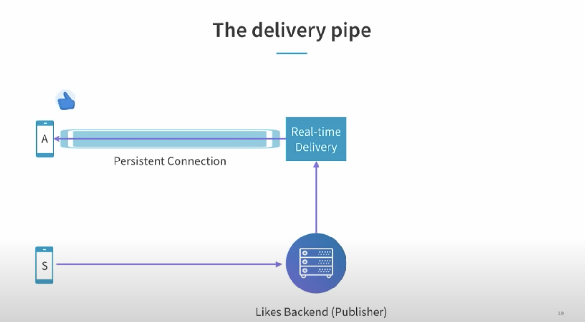
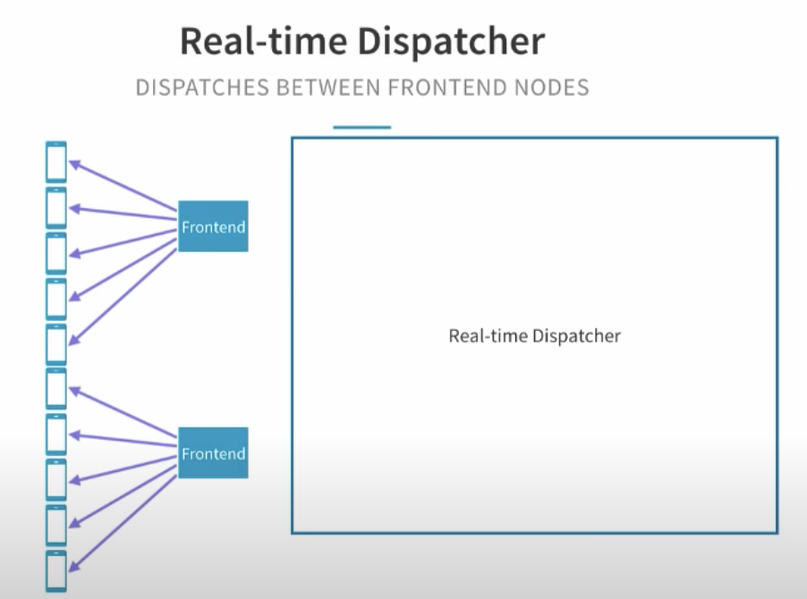
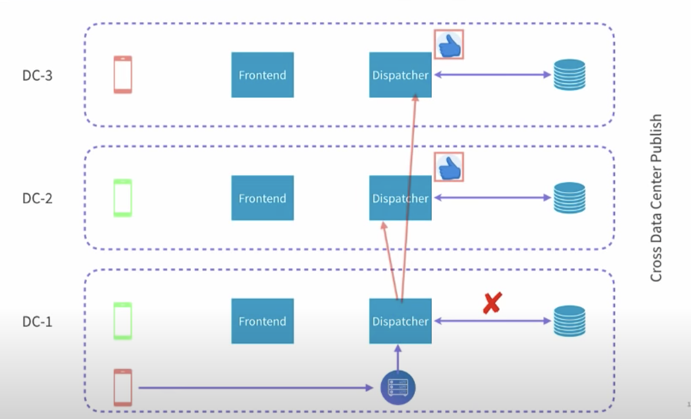

# Real time interactions on live video

This note is based on a InfoQ talk about [Streaming a Million Likes/Second: Real-Time Interactions on Live
Video](https://www.youtube.com/watch?v=yqc3PPmHvrA&ab_channel=InfoQ) from Linkedin.

## How to stream

The persistent connection is using `HTTP Long Poll` with Server Sent Events.

- Client sends `GET` request with `Accept: text/event-stream`
- Server respons `200 OK` with `Content-Type: text/event-stream`
- Connection is established without closing
- Server sends `data:{"like", object}` or `data:{"comment", object}` to client

## Challenges

### Connection management with tons of connections

Linkedin uses Akka and Play framework for connection management.

### Subscriptions

We could not blindly broadcast the `likes` to all clients, because different users are watching different live videos.

### 10K or more viewers

Add an abstraction between clients and backend, known as `frontend server`

### Dispatcher is the bottleneck

How to handle the 1000 likes persecond? We could have multiple dispatcher nodes, and allow a balanced number of clients
to be connected to dispatcher nodes. All `likes` could be sent to any dispatcher nodes and render to clients. But this
requires to pull out the `in-memory` mapping table out to its own key-value store.

### Multi data centers

#### Cross data center subscriptions

#### Publish likes to all data centers

## References

- <https://www.youtube.com/watch?v=yqc3PPmHvrA&ab_channel=InfoQ>
