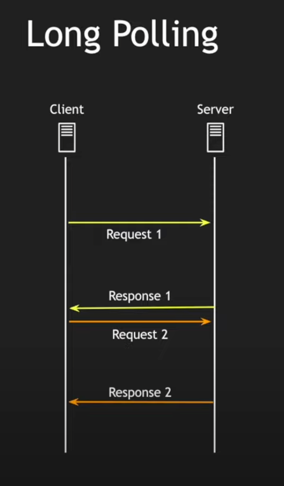
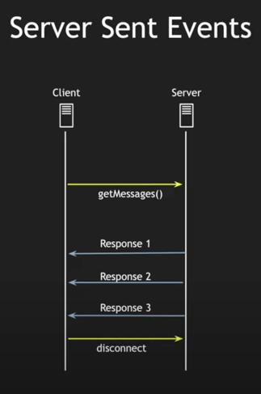
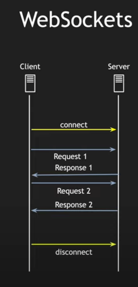

# Long Polling vs SSE vs WebSocket

## HTTP Long Polling

Mechanism: Client sends a request, server holds it open until data is available or a timeout occurs, then responds and
closes the connection. Client immediately sends another request, creating a continuous loop.

### Pros

* Simple, works over standard HTTP without special libraries.
* Works behind most firewalls and proxies.

### Cons

* Inefficient for high-frequency updates due to frequent polling and connection overhead.
* Server-side resource usage can be high due to many open connections.

## Server-Sent Events (SSE)

Mechanism: Unidirectional communication from server to client over a single, long-lived HTTP connection. Server pushes
events to the client as they occur.

### Pros

* More efficient than Long Polling for one-way updates.
* Reduced server-side resource usage.
* Simpler JavaScript API for client-side handling.

### Cons

* Still relies on HTTP, not as efficient as WebSockets for bidirectional communication.
* Limited browser support compared to WebSockets.

## WebSockets

Mechanism: Full-duplex, bidirectional communication over a persistent TCP connection. Enables real-time, two-way data
exchange between client and server.

### Pros

* Most efficient for real-time, bidirectional communication.
* Low latency, low overhead.
* Wide browser support.
* Can handle binary data and messages of any size.

### Cons

* Requires WebSocket-specific libraries and protocols.
* Might be blocked by some firewalls or proxies.