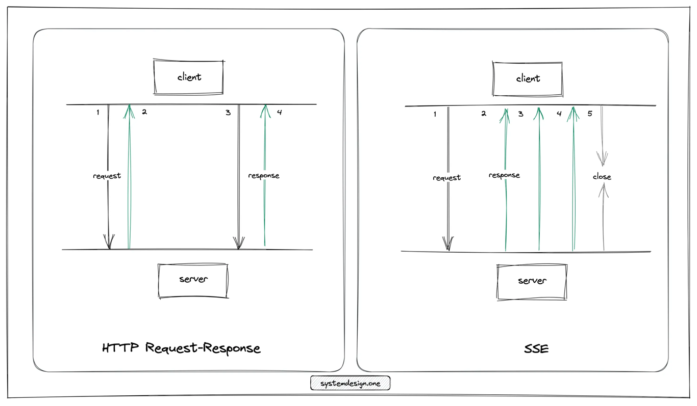
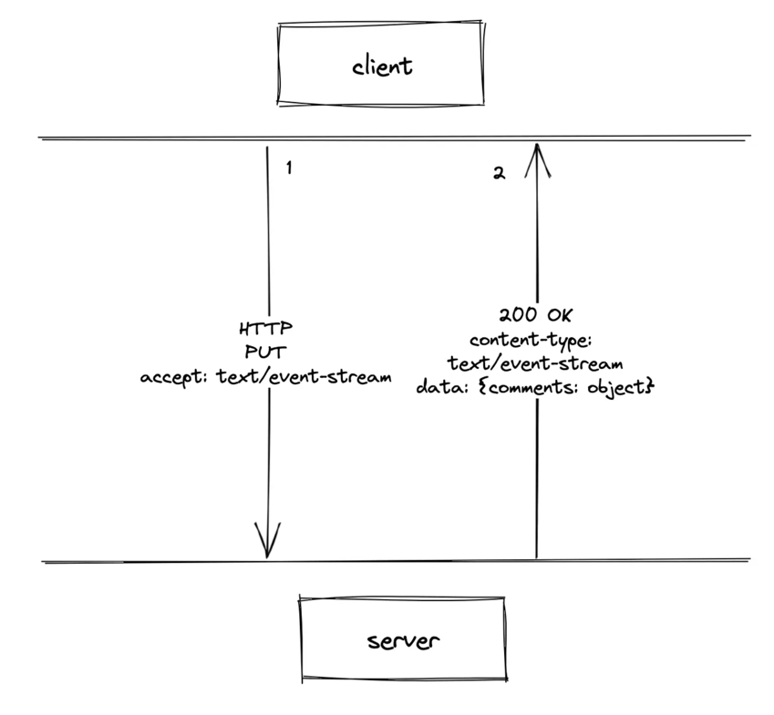
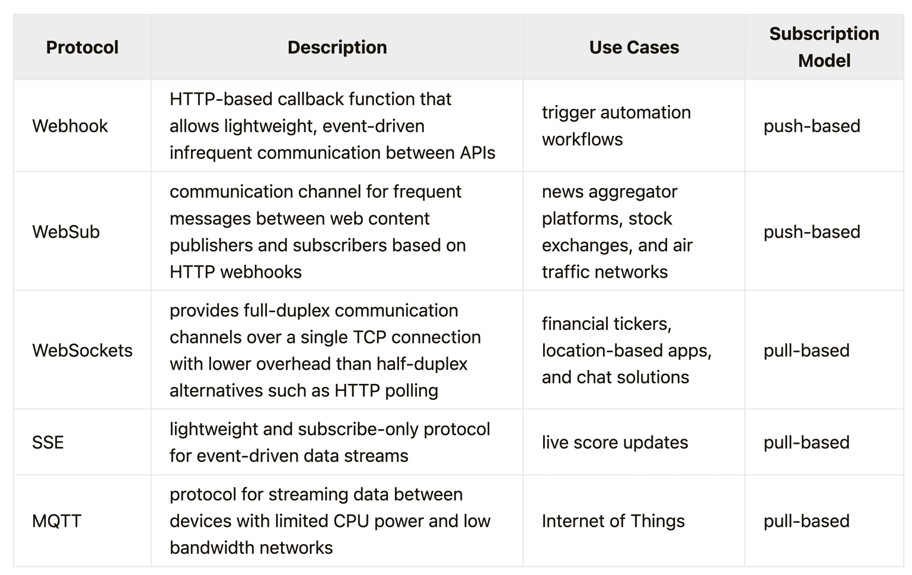
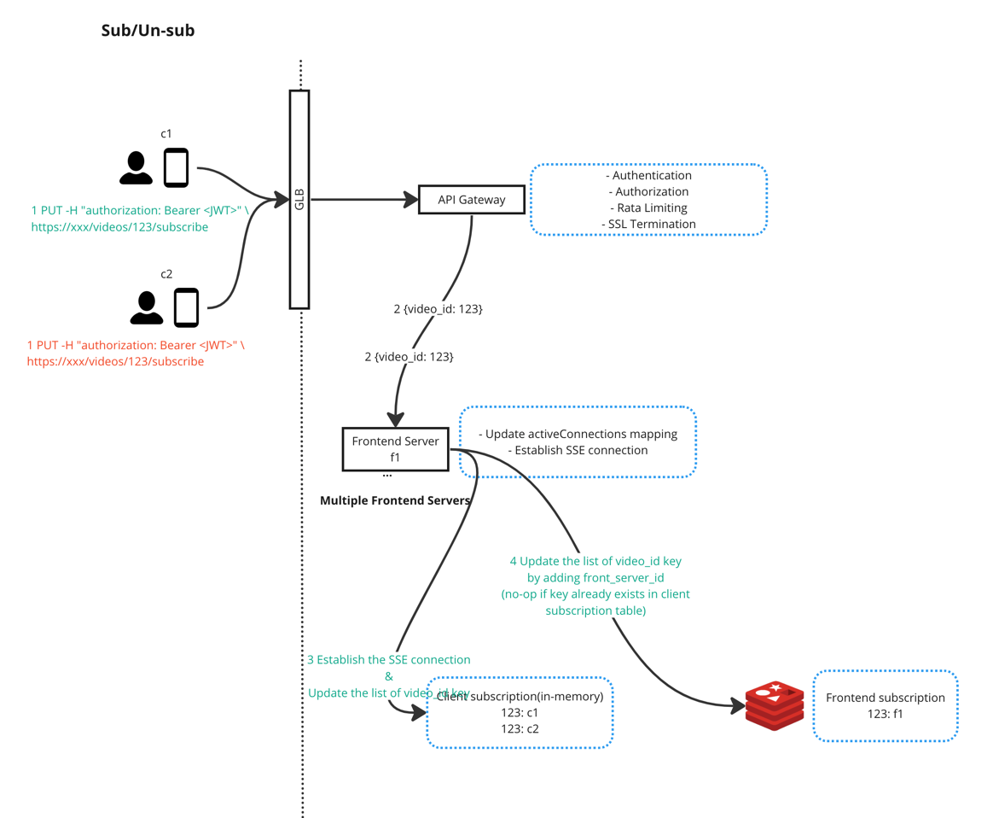
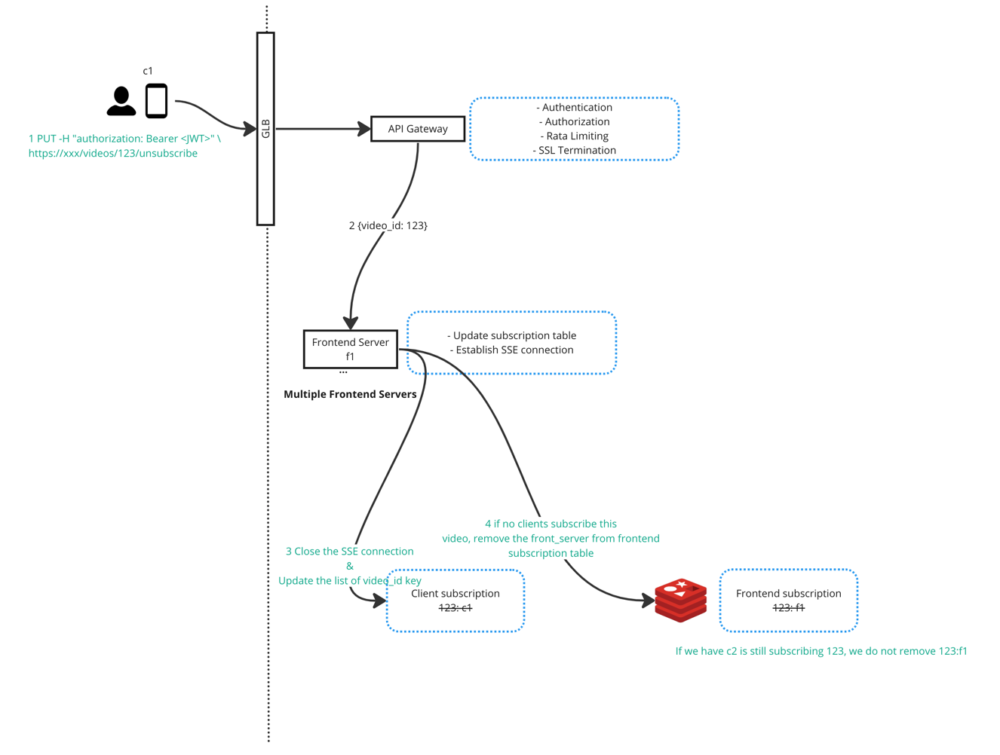
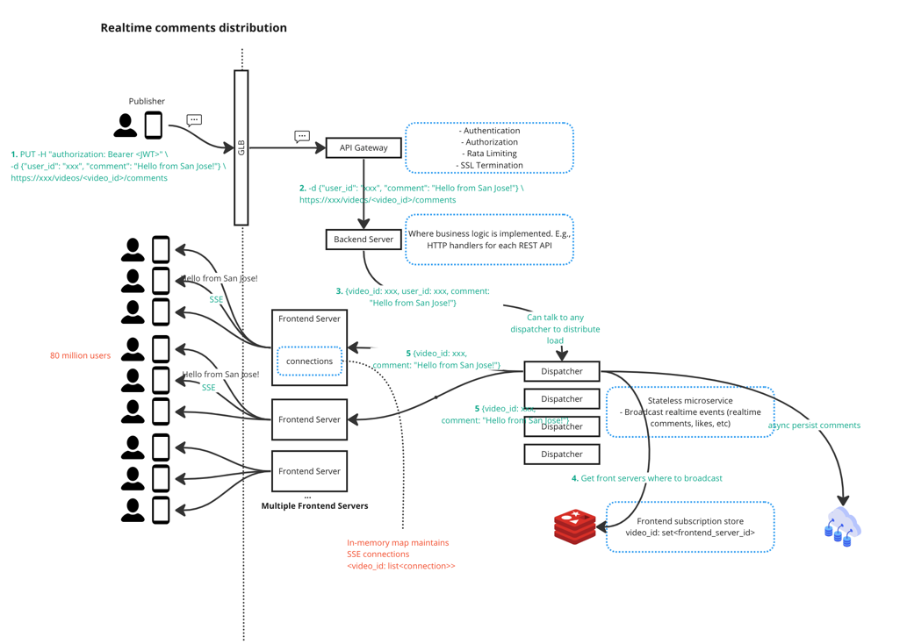
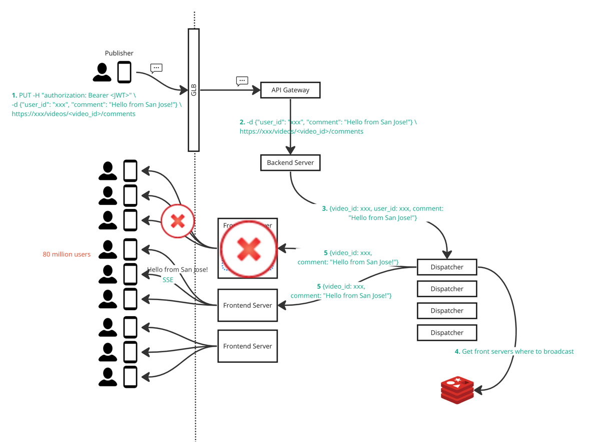
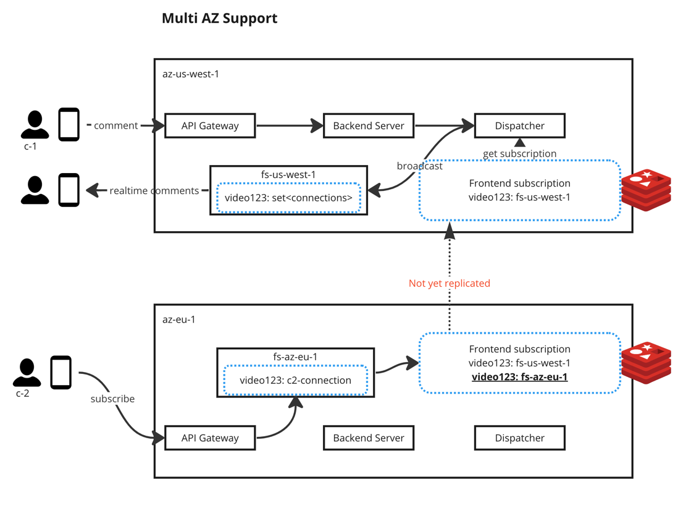
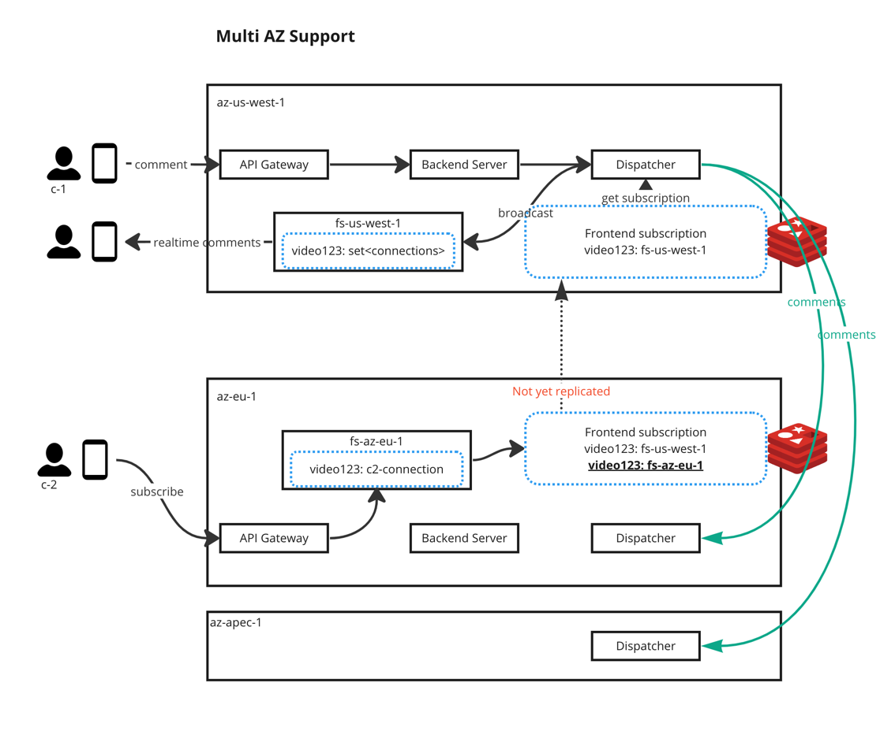

# Realtime comments on live video

## Requirements and User stories

### Functional requirements

* As a viewer, I want to post comments on a live video to interact with streamer.
* As a viewer/streamer, I want to see realtime comments from other viewers.
* As a viewer, I shuold be able to see a history of comments when I join a live video and scroll up on.
* The realtime comment service should handle clients across the globe.
* The realtime comment service should handle millions of concurrent clients.
* ?? Will live video be stored when it's ended ?

### Non functional requirements

* Low latency: We should be able to see the realtime comments as soon as it's available with low latency
* HA/Fault tolerance
* Scalability
* Eventual consistency

## Calculation

* Daily active users: 100 million
* Total daily live videos: 200 million
* Peak concurrent users watching the same live videos: 80 million
* Read:Write ratio of realtime comments: 100:1 (Read Heavy)

## Data model

```go
type User struct {
	UserID int64
	Name   string
	Email  string
	...
}
```

```go
type Video struct {
	VideoID int32
	UserID  int64 // the streamer
	Title   string
}
```

```go
type Comment struct {
	UserID    int64 // the viewer who publish a comment.
	VideoID   int32 // signed int32 can handle 2 billion unique IDs.
	CommentID int32
	Text      string // content of the comment.
	Timestamp Time
}
```

* If we don't store the live video when it ends, then int32 should be good enough because our assumption is to have 200
  million daily live videos. Signed `int32` can handle 2 billion unique IDs.

## APIs

### Subscribe to a video

An authenticated and authorized user needs to subscribe to a video in order to view/publish the realtime comments.
`Accept:text/event-stream` header is telling server that we want to use
[SSE](https://developer.mozilla.org/en-US/docs/Web/API/Server-sent_events) over HTTP. After a user
subscribes a video, the backend service will maintain a map so server knows where to broadcast the realtime comments.





```shell
curl -X PUT -H "Accept:text/event-stream" -H "authorization: Bearer <JWT>" \
https://xxx/videos/<video_id>/subscribe

status code: 200 OK
content-type: text/event-stream

# The content-type: text/event-stream HTTP response header indicates that the server established an open connection to
# the event stream to dispatch events to the client. The response event stream contains the live comments.
---
id: 1
event: comment
data: {"comment": "awesome", "user": "sleepybear"}
data: {"comment": "hey there", "user": "winterwolfe"}
```

### Unsubscribe from a video

```shell
curl -X DELETE -H "authorization: Bearer <JWT>" https://xxx/videos/<video_id>/unsubscribe/<connection_id>

status code: 200 OK
```

When a user unsubscribes a video, the backend service will remove the server side map record, so no more realtime
comments will be sent to that client.

### Publish a comment

```shell
curl -X PUT -H "authorization: Bearer <JWT>" -d {"user_id": "xxx", "comment": "Hello from San Jose!"} \
https://xxx/videos/<video_id>/comments

status code: 200 OK
```

### Comparisons of pull-based(client-initiated) vs push-based(server-initiated)

* Push-based: Server proactively initiates the communication.
* Pull-based: Client initiates the communication. (Once connection is established, server can broadcasts events data)

We choose **Pull-based** model, because of the following reasons:

* Viewer's connection is unpredictable.
* Server only sends realtime comments to subscribers who are online/connected. Subscription and online/offline is client
  side behavior which cannot be managed by server.
* Viewer is geographically distributed across the globe.

### Long Poling vs SSE vs Websocket

See [here](long-polling-vs-sse-vs-websocket.md) for more details.

### Comparison of each protocols



* Not picking Webhook is because: 1) Server push based 2) It's not designed for frequent communication, each time when
  server wants to broadcast the events, a new connection will be established again.
* Not picking WebSub is because: 1) Server push based 2) It's not designed for frequent communication (this is based on
  webhook)
* Why cannot we use WebSocket ? 1) Websocket is bi-directional, mostly used in gaming/collaborative application. We are
  read heavy in realtime comment service. 2) Websocket is a separate protocol from HTTP, SSE is built on top of HTTP.

## Architecture

### Data Store

#### Why do we need a data store

Take YouTube Live stream as the example, when streamer ends the live streaming the video will be persisted along with
all the comments/chat history. So if that is the case, we need the data store to at least persist streamed video and the
comments. **The scope of this design is to focus on storing comments**.

#### Requirements on data store

* Optimized read performance (Read heavy)
* A good support for horizontal scaling.
* Highly distributed to support global users.
* Fault tolerant. When a node is down or has network partition, there is no customer impact.

#### Capacity planning

* 200 million live video/day * 10 comments/video = 2 billion (comments/day)

```text
UserID    int64  // 8 bytes
VideoID   int32  // 4 bytes
CommentID int32  // 4 bytes
Text      string // 20480 bytes
Timestamp Time   // 8 bytes
```

* 2 (KB/comment) * 2 billion (comment/day) = 4 billion KB / day = 4 TB / day

#### Relational database

Let's use MySQL and PostgreSQL as an example.

* Fixed data schema which makes it hard to extend. Today we support text only comments, what if we want to extend to
  support emoj or pictures. Making changes to schema is expensive.
* Leader/Master based replication model. All writes need to be redirect to leader/master/primary node which slows down
  the performance. Given that we are read heavy, this replication model might be ok for now.
* Focus more on consistency, so it has to sacrifice on either Availability or Partition Tolerance. In our case, we do
  not have strong consistency requirement.

More readings:

* <https://cloud.google.com/architecture/architectures-high-availability-postgresql-clusters-compute-engine>
* <https://en.wikipedia.org/wiki/MySQL_Cluster>

**Conclusion**: Relational database might not be an optimal choice

#### NoSQL database

Let's take Cassandra as an example.

* Wide column. If we want to extend comment data model to support more than just text, it can be easily done by adding
  a new column.
* LSM tree based storage engine offers extremely high performance on writes. LSM tree based storage engine could be slow
  on read (we need to scan memtable first and then potentially multiple SSTables on disk). Bloom filter is used to
  improve the read performance.

**Conclusion**: NoSQL database is more flexible in terms of scalability. Consider using NoSQL to store comments.

Comments can be stored as individual rows within a table. Each of the following properties are mapped to each column:

```go
type Comment struct {
	UserID    int64 // the viewer who publish a comment.
	VideoID   int32 // signed int32 can handle 2 billion unique IDs.
	CommentID int32
	Text      string // content of the comment.
	Timestamp Time
}
```

```cassandraql
CREATE TABLE comments (
    video_id uuid,
    comment_time timestamp,  // Clustering key for creation time ordering
    comment_id uuid,        // Unique identifier for comments
    user_id uuid,
    comment_text text,
    PRIMARY KEY (video_id, comment_time) // video_id is the partition key; comment_time is the cluster key column
);
```

See [this blog](https://www.baeldung.com/cassandra-keys#3-clustering-key) to learn more on Cassandra clustering keys.

When we do query from Cassandra, we can do:

```cassandraql
select * from comments
where video_id = 'app1'
and comment_time > '2021-08-13T00:00:00';
```

#### Handle old comments

Based on our estimate, we have 4 TB / day used for storing comments. That is roughly 1.2 PB storage / year. We
definitely need to consider compress or remove old comments.

TODO: How to compress ? How does Netflix compress the view history ?

### Cache layer

### High Level Design & Workflows

#### Subscribe & Unsubscribe





```java
import org.springframework.http.MediaType;
import org.springframework.web.bind.annotation.GetMapping;
import org.springframework.web.bind.annotation.RequestMapping;
import org.springframework.web.bind.annotation.RestController;
import reactor.core.publisher.Flux;

import java.time.Duration;
import java.time.LocalTime;
import java.util.Map;
import java.util.concurrent.ConcurrentHashMap;

public class Connection {
    String userID;
    Flux<String> flux;
    public Connection(String userID, Flux<String> flux) {
        this.userID = userID;
        this.flux = flux;
    }
}

@RestController
public class SSEController {

    private final Map<String, List<Flux<String>>> videoSubscriptions = new ConcurrentHashMap<>();
    private final Map<String, Flux<String>> activeConnections = new ConcurrentHashMap<>();

    @GetMapping("/subscribe", produces = MediaType.TEXT_EVENT_STREAM_VALUE)
    public Flux<String> subscribe() {
        // Generate a unique identifier for the client
        String videoId = <some-code-to-get-video-id-from-request>;
        String userId = <get-userId=from=request>;

        // Create a Flux to send SSE events to the client
        Flux<String> flux = Flux.interval(Duration.ofSeconds(1))
                .map(sequence -> "data: Server time is " + LocalTime.now() + "\n\n")
                .doOnCancel(() -> {
                    // Cleanup resources when the client disconnects
                    System.out.println("Client disconnected: " + userId);
                    // Remove the disconnected client from the registry
                    activeConnections.get(userId).close();
                });

        // Add the new connection to the registry
        videoSubscriptions.get(videoId).add(flux);
        activeConnections.put(userId, flux);

        return flux;
    }

    // Example method to broadcast a message to all active connections
    public void broadcastMessage(String message) {
        // Iterate through the active connections and send the message
        videoSubscriptions.forEach((videoId, connections) -> {
            for (Flux<String> f : connections) {
                // Add the broadcast logic here
                // clean up the close connection
            }
        });
    }
}
```

#### Realtime comments distribution



```java
import org.springframework.beans.factory.annotation.Autowired;
import org.springframework.web.bind.annotation.PostMapping;
import org.springframework.web.bind.annotation.RequestBody;
import org.springframework.web.bind.annotation.RequestMapping;
import org.springframework.web.bind.annotation.RestController;

@RestController
@RequestMapping("/comments")
public class CommentsController {

    private final SSEController sseController;

    @Autowired
    public EventController(SSEController sseController) {
        this.sseController = sseController;
    }

    @PostMapping
    public void handleEvent(@RequestBody String eventData) {
        // Process the received event, perform any necessary logic

        // Broadcast a message to all connected clients
        sseController.broadcastMessage("New Event: " + eventData);
    }
}

```

## Failure handling

### Frontend server failure



SSE connection is initiated by client, no matter what causes the disconnection server cannot reestablish the connection.

When a frontend server node is down, we lose all the connections between clients to that frontend server. Dispatcher
will continue sending messages/events/comments to that frontend server node (but cannot reach).

* Client's heartbeat signal cannot reach the frontend server node, an indicator/notification can be sent to client.
  Client can "refresh" to reestablish the SSE connection.
* API Gateway detects the front server node down, it will not redirect any request to that node.
* Dispatcher detects the front server node down (because it cannot reach it), dispatcher will update its own
  subscription record.

### Dispatcher failure

Dispatcher can be stateless, we pulled out the `<video_id>:set<frontend_node>`out to Redis. That Redis is shared among
all dispatchers. Backend server can retry another dispatcher. The only drawback is latency.

### TODO What will happen if API Gateway fails

### TODO What will happen if GLB fails

## Scaling

### Multi AZ support



#### Challenges

* c-2 subscribes to `video-123` from AZ `az-eu-1`. Subscription table has been updated in local AZ.
* c-1 sends comments on `video-123` from AZ `az-us-west-1`. The subscription table under `as-us-west-1` does not know
  c-2's subscription (but eventually it will know).
* c-2 will not get realtime comments from another AZ. (Latency)

#### Solution - 1

* Allows the across-az latency
* Dispatcher will eventually broadcast comments to all subscribed frontend servers

#### Solution - 2

Whenever a local dispatcher receives an event, it also sends the event to other dispatchers in other AZs.
(**This is what Linkedin uses**) The downside is that `az-apec-1` has no subscriptions on `video-123`, it will always
receive the events, this increases the load of dispatcher.



## References

* <https://systemdesign.one/live-comment-system-design/#live-comment-system-databasedesign>