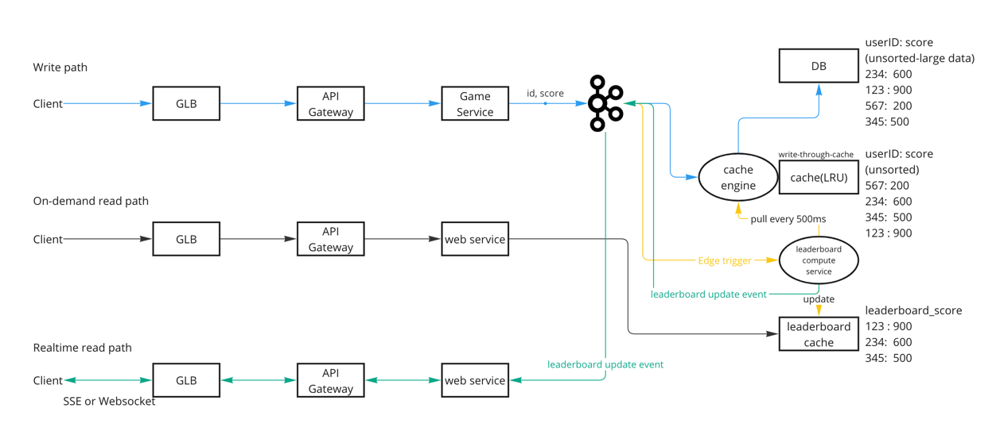
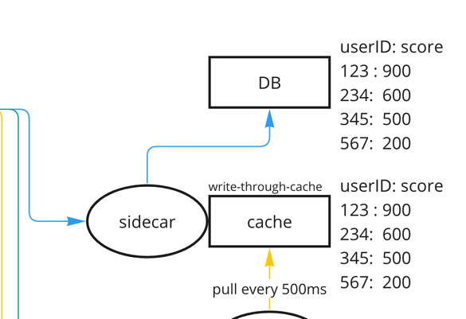
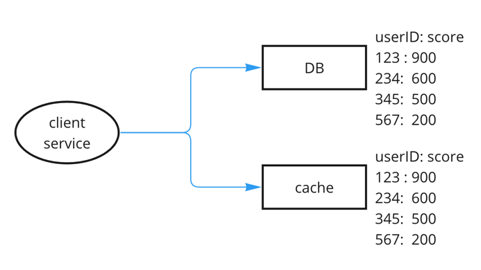
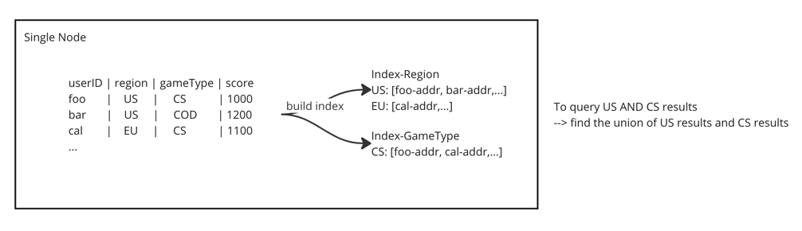
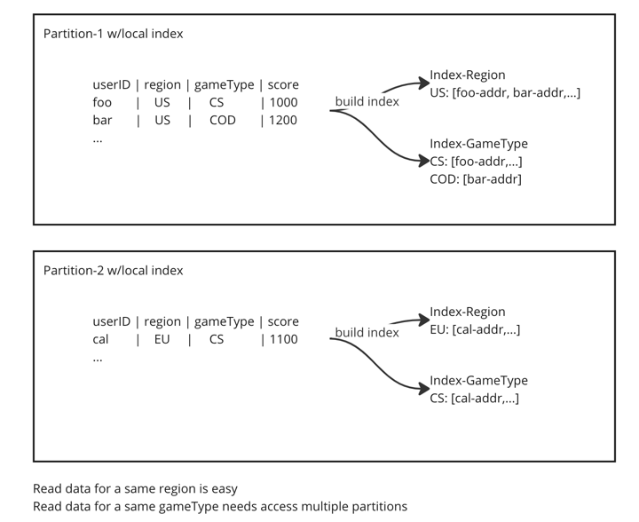
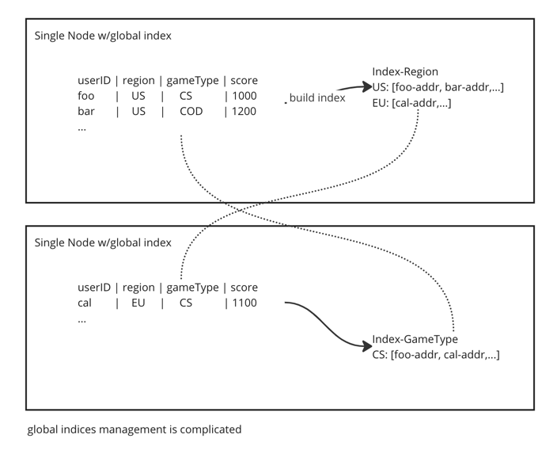

# Realtime gaming leaderboard

## Requirements and User stories

### Functional requirements

- As a user, I should be able to see my own rank after playing a game.
- As a user, I should be able to see the realtime (near to realtime) leaderboard.

### Non functional requirements

- Be able to see the leaderboard change in realtime or near realtime.
- Highly available and fault tolerant
- Eventual consistency

## Calculation

- DAU: 5 x 10^6
- Games per day per user: 10
- Write per second = 5 x 10^6 x 10 / ~10^5 = 500 wps
- Read per second <= 500 rps
- Total space for Users = 10 ^ 9(total users) x 128 bytes = 128 GB

## Data model

```go
type User struct { // ---> 116 bytes  = ~ 128 bytes
	id string  // 128bits -> 32 bytes
	name string // 15 char x 4 bytes/char = 60 bytes
	region string // 4 char x 4 bytes/char = 16 bytes
	score double // 64bits -> 8 bytes
}

type Leaderboard struct { // ---> K = 10 --> 480 bytes
	topK {userId: score}[] // K x 40 bytes
  category string // 16 bytes
	time timestamp // 64bits
}
```

## APIs

```text
POST /v1/score
updateScore(userId, score) --> statusCode

GET /v1/rank
getRank(userId) --> {userId: xxx, score: xxx, rank: x}

Get /v1/leaderboard
getLeaderboard(category) -->
{
  {userId: xxx, score: xxx, rank: x},
  {userId: xxx, score: xxx, rank: x},
  {userId: xxx, score: xxx, rank: x},
  {userId: xxx, score: xxx, rank: x},
  metadata: {
    catagory: xxx
    timestamp: xxx
  }
}
```

## Architecture



### Message broker

- Original thought was to have to buffer between game service and storage layer. But seems the cache layer in front of DB
  can also be treated as buffer.
- Then I found message broker can help handle events to realize the realtime leaderboard. (See green line in
  architecture diagram)
- The yellow line shows another benefits of having the message broker. It can be used to trigger the leaderboard compute
  service to update the pre-calculated leaderboard.

### Write-through cache



The main reason of having the write-through cache is to handle data consistency (read your own write). Imaging we have a
look aside cache(see diagram in below). The client service is responsible for data writing logic and its consistency.
Two problems here: 1) client service should not be responsible for implementing caching logic, e.g., invalidation. 2)
Split path will cause data inconsistency issue when DB succeeds but cache fails. Reading from cache causes stale data.



### Leaderboard compute service

- With the growth, `userId:score` cache could be partitioned, so having consumer to query from multiple partitions and
  compute the final result is not idea.
- Leaderboard compute service can have level-trigger and edge-trigger mechanism to pre-calculate the leaderboard_score
  result. So that it can have the near realtime leaderboard data.
- On edge trigger, leaderboard compute service compares the timestamp of the event and the last update timestamp of the
  leaderboard_score cache. If the delta > threshold, then triggers leaderboard update event for realtime leaderboard
  update.

### Leaderboard by filter



We can build index on different column to speed up the query, and leverage cache to offload the datastore access.

When we have our data partitioned, we can build local indices or global indices.





## Failure handling

## Scaling

## References

* <https://medium.com/@mayilb77/design-a-real-time-leaderboard-system-for-millions-of-users-08b96b4b64ce>
* <https://serhatgiydiren.com/system-design-interview-top-k-problem-heavy-hitters/#Data_Retrieval>
* <https://systemdesign.one/leaderboard-system-design/>