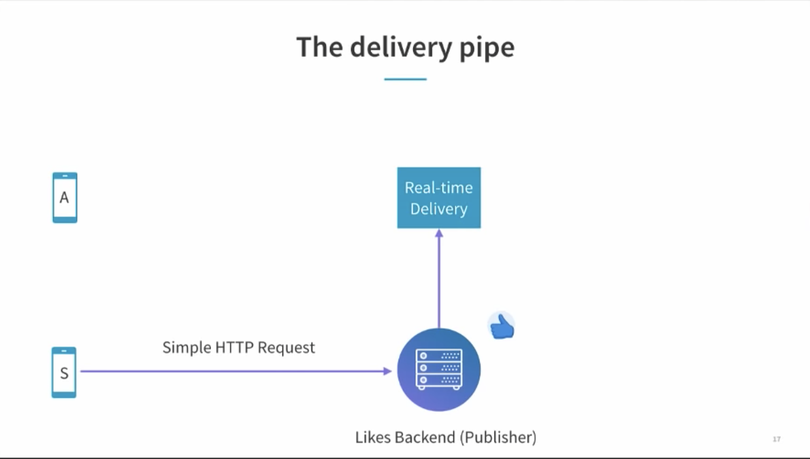
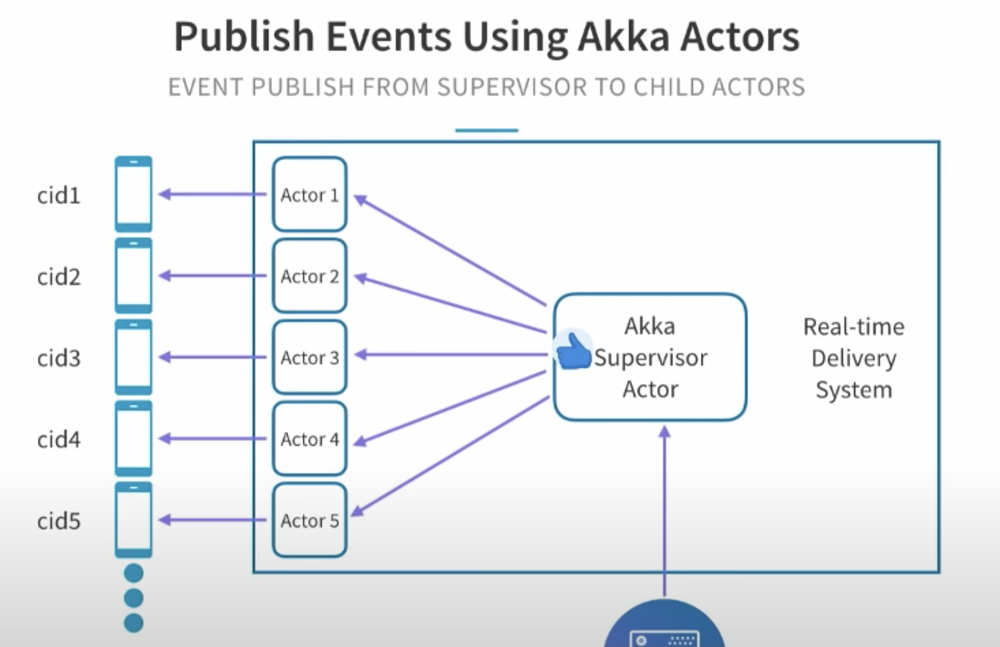
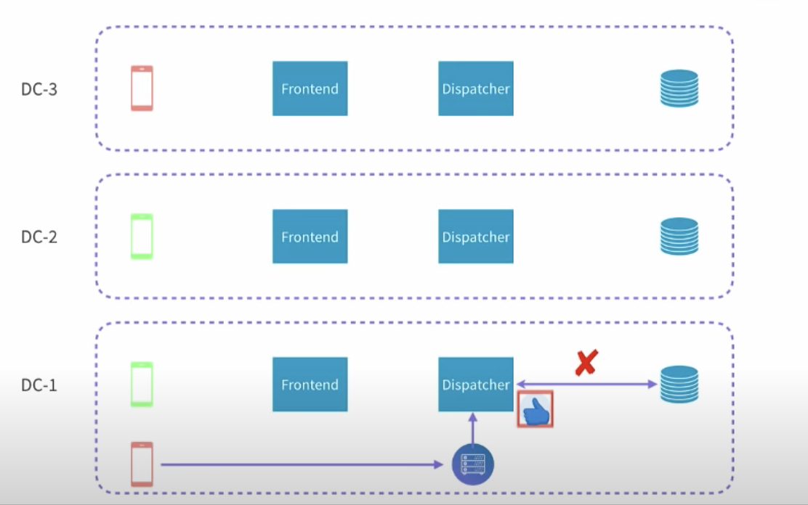

# Real time interactions on live video

This note is based on a InfoQ talk about [Streaming a Million Likes/Second: Real-Time Interactions on Live
Video](https://www.youtube.com/watch?v=yqc3PPmHvrA&ab_channel=InfoQ) from Linkedin.

## Traditional way to stream likes

The persistent connection is using `HTTP Long Poll` with "Server Sent Events".

- Client sends `GET` request with `Accept: text/event-stream`
- Server responses `200 OK` with `Content-Type: text/event-stream`
- Connection is established without closing
- Server sends `data:{"like", object}` or `data:{"comment", object}` to client

```javascript
// Client lib
var evtSource = new EventSource("https://www.linkedin.com/realtime/connect");
evtSource.onmessage = function(e) {
  var likeObj = JSON.parse(e.data);
}
```





## Challenges

### Tons of connections


Linkedin uses Akka and Play framework for connection management.

- Each Akka actor listens on the like events and manages one connection.
- Each Akka manages a mailbox(event queue) which holds the events to be published.





### Subscriptions

We could not blindly broadcast the `likes` to all clients, because different users are watching different live videos.

- Maintain an in-memory subscription table.
- A client likes `Live Video 2`, server could get all the connection IDs which are subscribed to `Live Video 2`.
- Server just sends `like` events to a subset of connections.


### Scale to 10K or more viewers

- Add an abstraction between clients and backend dispatcher, known as `frontend server`. Each frontend server handles a
  portion of connections.
- Frontend server subscribes to `Live Video 2`.
- Dispatcher maintains an in-memory subscription table maps `Live Video 2` to `frontend-server-x`.
- Frontend server maintains an in-memory subscription table maps `Live Video 2` to `connection-1`.


### Dispatcher is the bottleneck

How to handle the 1000 likes per second?

- We could have multiple dispatcher nodes, and allow a balanced number of clients
  to be connected to dispatcher nodes.
- All `likes` could be sent to any dispatcher nodes and render to clients.
- This requires to pull out the `in-memory` mapping table out to global key-value store.


### Multi data centers

We don't have subscribers for red-video from DC-1 and DC-2, but there are only subscribers from DC-3.



#### Cross data center subscriptions

- Frontend nodes subscribe to all dispatchers in all DCs.
- DC-1's subscribe table is similar to this:

```text
live-video-red: dc-3-front-1
live-video-green: dc-2-front-1
live-video-green: dc-1-front-1
...
```

- `likes` of live-video-1 send to dispatcher in DC-1 and will be dispatched to `dc-3-front-1`

Few points to keep in mind:

- Cross datacenter sub/un-sub might not update all subscribe tables at the same time (Data inconsistent)
  - Some frontend nodes will not receive the `likes`.
  - Some frontend nodes will still receive the `likes` even it un-sub the video.

#### Publish likes to all data centers


- `likes` are sent to dispatcher in DC-1.
- Dispatcher in DC-1 will send the `likes` to all other dispatchers in all DCs.

Few points to keep in mind:

- Might not have data inconsistency issue in terms of sub/un-sub.
- Have high volume of traffic sent to all DCs no matter there are subscription or not.
  - In the case of DC-2, it will always receive `likes` of live-video-1(the red one).

## References

- <https://www.youtube.com/watch?v=yqc3PPmHvrA&ab_channel=InfoQ>
