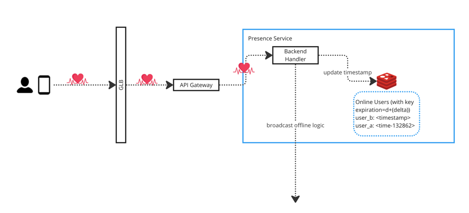

# Realtime presence platform

## Requirements and User stories

* As a user, I would like to set my status as online/offline from a device.
* As a user, I would like to see my friends' online/offline status in realtime.

### Functional requirements

* User can set the status to be online/offline.
* A platform watches user's online/offline status and broadcast to related/subscribed other users in realtime.
* Display the last-active timestamp of an offline user.

### Non functional requirements

* The platform should be scalable to handle 700 million users.
* The online/offline status should be displayed in realtime.
* HA
* Fault tolerant

## Assumptions & Calculation

* 700 million total users
* 100 million concurrent online users
* Average 10 status change / per user / per day
* Read:Write 10:1

10 * 100 million = 1 Billion status change / day = **12 K writes / second** `-->` **120 K reads / second**

## Data model

```go
type Presence struct {
  UserID    int64 // 8 bytes
	Presence  String  // true | false 1 Byte
	Timestamp Timestamp // 8 bytes in Redis
}
```

## APIs

```shell
# Change user's staus to online
curl -X PUT -H "Accept:text/event-stream" -H "authorization: Bearer <JWT>" \
-d {user_id: "xxx", presence: "online"} https://xxx/users/presence

# Change user's status to offline
curl -X PUT -H "authorization: Bearer <JWT>" \
-d {user_id: "xxx", presence: "offline"} https://xxx/users/presence

# Get users' status
curl -X GET -H "authorization: Bearer <JWT>" \
-d {user_id: "xxx", users_status: {"user_b", "user_c"}} https://xxx/users/presence
```

**We might not need to send user_id, because JWT contains user information**

## Architecture


### Data Store

We need to persist the user's last active timestamp, so a data store is required. For edge trigger (user sign on/off),
we have to update the timestamp. For level trigger (heartbeat), we will also have to update the timestamp. Since we have
100 million concurrent online users, the data store must be able to handle high volume writes.

#### Relational database is not a good choice

* Fixed schema: 1) Putting `presenceStatus` with user profile table, however user profile table is not supposed to be
  frequently updated. 2) Putting `presenceStatus` into separate table, however displaying user profile and presence
  status needs to query two tables.
* Strong consistency sacrifices performance: Each write is ACID-compliant, waiting for write to be successful will slow
  down the performance.
* Scalability concerns: ACID properties makes scaling challenge. 1) Strong consistency makes horizontal scale hard,
  because it will sacrifices performance. 2) Sharding and distributing data across multiple nodes while maintaining
  consistency can be challenging. 3) Building indexes slows down the write performance. 4) Data denormalization is
  challenging.

#### NoSQL Database

100,000,000 concurrent online user * 17 bytes ~= 1.7GB capacity needed to store the online presence status. We do not
have to persist all users presence status, even so the total data size would be ~11GB.

We broadcast the status change in realtime using the realtime platform, so we do not have strong consistency requirement
at database level. (Eventual consistency should be fine).

This is a read intensive application, so we should replicate data and allows reading from each replica.

From above, we know:

* In-memory database is possible.
* We want replicate data to support high volume reads. (Either leader based or leaderless is fine)

We have multiple potential databases:

* Cassandra (leaderless, LSM tree based, wide-column store)
* DynamoDB (leaderless, B tree based, key-value store)
* Redis (leader-follower, In-memory hashtable, key-value store)

### Realtime Platform

Realtime platform is a sub-pub based realtime message/events delivery platform. This [note](../realtime-comments-on-live-video/readme.md)
covers all the details around it.

### Presence Service

* Backend/HTTP Handler:
  * Handles the incoming request from client. E.g., User status change requests.
  * Invokes Realtime platform API to broadcast status change events.
  * Invokes Realtime platform API to subscribe interested users.
* Presence store: (Can be Redis)
  * Persists `user_id: <last_active_timestamp>`
  * We can use the built-in key expiration feature or async process to delete the old keys that we are not interested
    in. E.g., We are only interested in displaying the last active timestamp of a user no more than 7 days from now. So,
    we can delete keys older than 7 days.

### Heartbeat module (with network fluctuation handling)

#### Client sends heartbeat



The biggest problem of this approach is the network overhead. 1)Each heartbeat will establish an new HTTP connection.2)
Hard to tune the system to avoid network spike.(All users send the heartbeat at the same time).

For some chat application, if we already have persistent WebSocket connection, we can also ask client to send heartbeat
by using that WebSocket connection.

So the overall idea is to reduce network overhead.

#### Implement Heartbeat service to send heartbeat


Our realtime platform has already maintained the SSE connection for realtime message/events delivery, we can leverage
that to obtain the online status of a user.

* Heartbeat Service periodically check the user_a's connection status, and send heartbeat to heartbeat handler every d
  second.
* If heartbeat handler receives the heartbeat:
  * user_a's key does not exist or `diff(<last_active_timestamp>, heartbeat_timestamp)` > d + (delta) second. `-->`
    user_a is back online. We need to 1) update last active timestamp, 2) broadcast the status change.
  * For other cases, just update last active timestamp & reset the timer. (Handle jittery connection, no need to
    broadcast events)
* If heartbeat handler does NOT receive the heartbeat within d + (2*delta) time:
  * (One user has a timer associated)
  * Timer expires which indicates that user is offline.
  * Invoke realtime platform to broadcast the offline event.

#### Avoid spikes in heartbeat

* Use Exponential Backoff: Implement exponential backoff when retrying failed heartbeats. Instead of immediately
  retrying upon a failure, wait for an increasing amount of time before the next attempt. This helps prevent the system
  from bombarding the server with rapid, repeated requests when there are temporary issues.

* Randomized Jitter: Introduce randomization or jitter in the timing of heartbeat signals. This means adding a small
  random delay before sending each heartbeat. Randomized jitter helps distribute the load more evenly, reducing the
  chances of synchronized spikes.

* Rate Limiting: Implement rate limiting on the client side to control the frequency of heartbeat signals. This ensures
  that the client doesn't send an excessive number of heartbeats within a short time frame. Set reasonable limits based
  on the characteristics of your system.

* Adaptive Heartbeat Intervals: Adjust the heartbeat intervals dynamically based on the system's current conditions. For
  example, you could increase the interval during periods of low activity and decrease it during periods of high
  activity. This adaptive approach helps balance the load.

* Use Queues: Queue heartbeat messages and process them in a controlled manner. This approach helps smooth out spikes by
  processing heartbeats in a more regulated and sequential manner. It also provides an opportunity to prioritize
  critical heartbeats over non-critical ones.

* Avoid Synchronized Heartbeats: Ensure that multiple clients do not synchronize their heartbeat signals, especially if
  they are interacting with a centralized server. If many clients send heartbeats simultaneously, it can lead to spikes
  in the server load.

## Failure handling

### Backend HTTP Server/Handler failure

Backend HTTP Server/Handler is stateless, and can have multiple replicas. (Deployment in K8S)

### Database node failure

* Follower node failure is fine, we can have a new node to replace it. The new follower will eventually catch up the
  data. See [adding new followers](../../5-replication/readme.md#adding-new-followers) for details.
* Leader node failure: New leader will be promoted. See [how Raft does leader election](../../../general-knowledge-base/distributed-consensus/raft-distributed-consensus.md).

### Heartbeat failure

#### Heartbeat service failure

Heartbeat service is stateless. Like K8S Deployment with replica=1, a new service will be provisioned to replace the
terminated one. However, provisioning a new service takes time, heartbeat handler receives no heartbeat, so it will
treat users offline. (We do not want to send the false status change to all other users).

* Potential solution #1: Increase the variable `d`, to make it > average service restart time.
* Potential solution #2: Active-Passive mode. When active service is down, the passive one takes over.

#### Heartbeat handler failure

Unfortunately the timer is in-memory, if we lose the handler instance we also lose the timer. While waiting for the new
handler to be provisioned, we will encounter some delays on offline status broadcasting. (Because timer is reset)

// TODO: Can we not using timer in Heartbeat handler ? Setting the key expiration in Redis or leverage distributed
scheduler ?

## Scaling

* All components are horizontally scalable.

## References

* <https://systemdesign.one/real-time-presence-platform-system-design/>
* <https://engineering.linkedin.com/blog/2018/01/now-you-see-me--now-you-dont--linkedins-real-time-presence-platf>