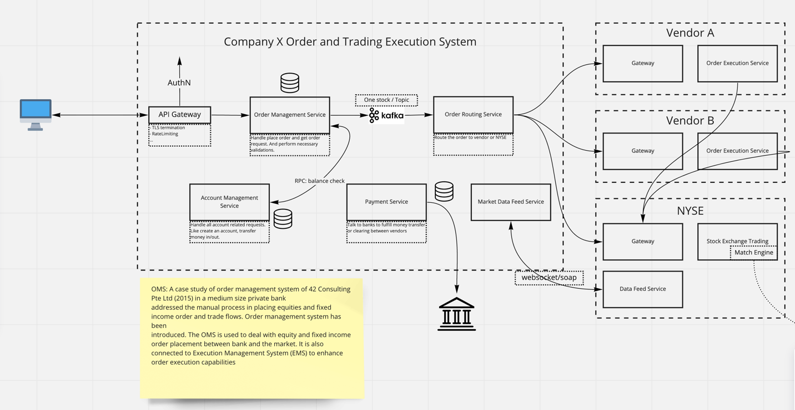
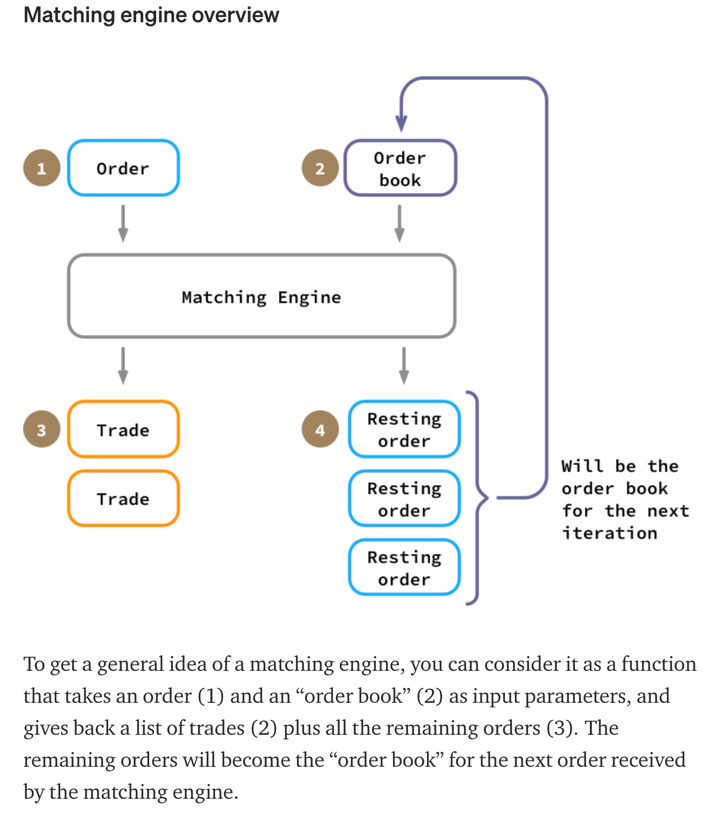
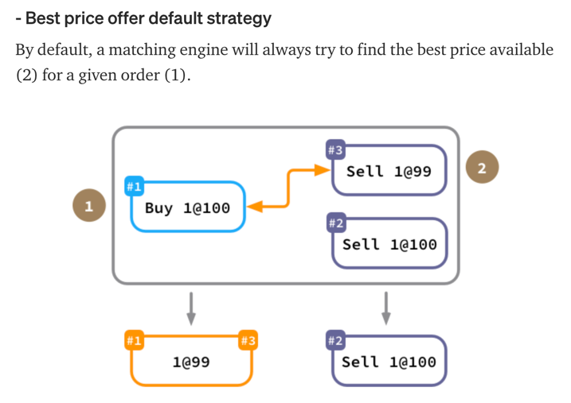
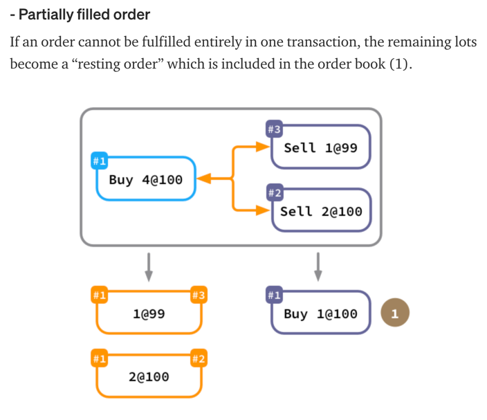
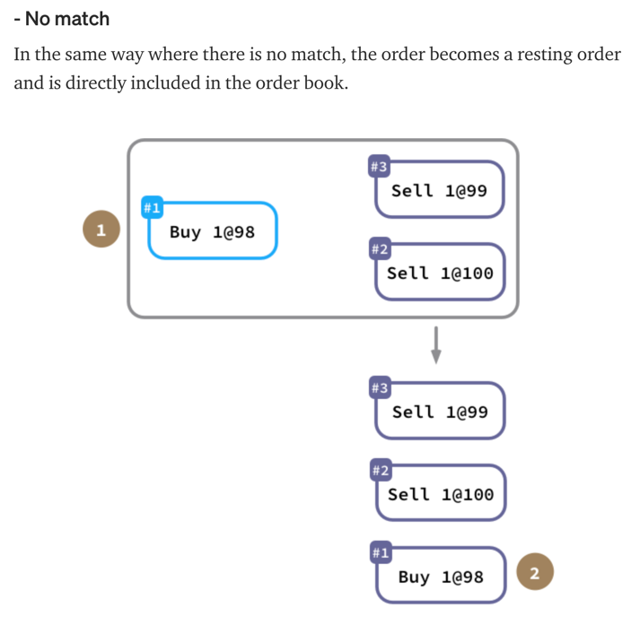
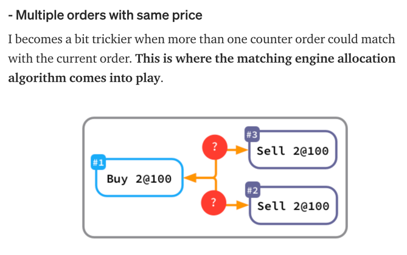
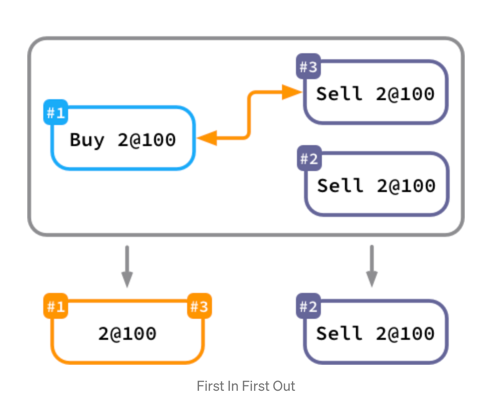
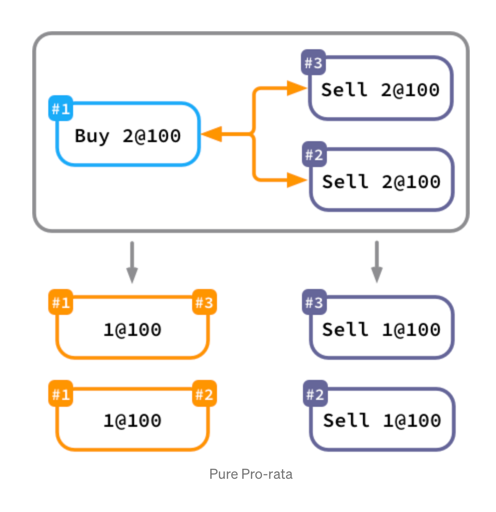
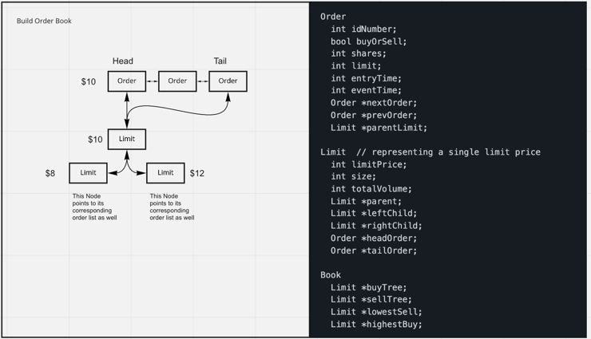

# Stock Exchange

## Requirements and User stories

### Functional requirements

- As a user, I would like to get the real time stock information, like price, open, close and volume.
- As a user, I would like to be able to place an order at a specific price.
  - Market order: Place an order at the latest market price.
  - Limit order: Place an order at the specific price.
  - Stop loss order: Place an order at the specific price, only match under a particular condition.
  - Fill-Or-Kill order: Place an order at the specific price, only match once.
- As a user, I would like to be able to update or cancel a pending order.
- As a user, I would like to see my order history.
- As a user, I would like to get notified once my order gets executed.

### Non functional requirements

- The system needs to be highly consistent. If my phone app shows the order has been executed, it should not show pending
  on web browser.
- The system needs to be functioning if some nodes have encountered network partition or failure.
- High write rates and low latency for millions of users.

## Calculation

- Five million qps.
- Tens PB of data per day.
- Over sixteen PB data in data lake.

[Reference](https://www.sec.gov/Archives/edgar/data/1783879/000162828021013318/robinhoods-1.htm)

## Data model

```go
type Account struct {
	AccountID string
	Balance float32 // what is the available balance
	// contains account related information, like payment methods, external bank account info, etc.
}
```

```go
type Order struct {
	AccountID string  // record who placed the order
	OrderID   string  // auto-generated id to record the order
	PlaceTime string
	Symbol    string  // APPL
	Type      string  // buy or sell
	Price     float32
	Quantity  int
	Expires   string  // if the order is not executed, when it expires
	Status    string  // record the order status: acknowledged, filled, rejected, canceled
	...
}
```

```go
type OrderHistory struct {
	AccountID string
	Orders []Order
}
```

```go
// This could be used to show the holdings of an account
type Position struct {
	AccountID string
	Symbol string
	Quantity int
	CostBasisPerShare float32
}
```

## APIs

### Client side RESTful API

- Place order: `PUT api/v1/order/place`
- Update order: `POST api/v1/order/update`
- Cancel order: `POST api/v1/order/cancel`
- Query stock price: `GET api/v1/stock/<symbol>`

## Architecture



### Match engine

More details on match engine could be found from this [blog](https://medium.com/lgogroup/a-matching-engine-for-our-values-part-1-795a29b400fa)
and this [blog](http://falconair.github.io/2015/01/05/financial-exchange.html).



- Offers(Sells) are sorted with the lowest price at the beginning(Seller order book).
- Bids(Buys) are sorted with the highest price at the beginning(Buyer order book).

This kind of sorting mechanism is to make sure there are high possibilities order could match.

- Based on different strategy, match engine ties to match orders.









- FIFO

  

- Pro-rata

  

### How to build an order book

- Add an order
- Cancel an order
- Execute an order

#### Heap(PriorityQueue)

- Add an order: O(logN), N is the number of orders.
- Cancel an order: O(logN), N is the number of orders.
- Execute an order: O(logN), pop the peak element and execute.

#### DDL and Binary Search Tree



Above diagram is based on this [article](https://github.com/Kautenja/limit-order-book/blob/master/notes/lob.md#how-to-build-a-fast-limit-order-book).

- All orders with the same price are organized by a DDL. New orders will be added to tail.
- Build a BST based on Limit prices, and each Limit node has references to the head order and tail order.
- Order Book object has the reference to Limit object, so the match algorithm could access to the orders.
- Add an order: O(logM) M is the number of Limit prices(it is way less than N, number of orders).
- Cancel an order: O(1).
- Execute an order: O(1).

### Message Bus vs RPC for delivering order between services

- Why we want to use message bus product like Kafka.
  - Built-in data persistent solution.
  - Built-in data replication solution.
  - Built-in delivery guarantee.

- Why we DO NOT want to use message bus product like Kafka.
  - Dependencies on third-party software.
  - Extra resource consumption to deploy and maintain message queue system.

```text
https://doc.akka.io/docs/akka-grpc/current/whygrpc.html#grpc-vs-message-bus

gRPC vs Message Bus
- While built on an efficient non-blocking implementation, gRPC is still ‘synchronous’ in the sense that it requires both
‘sides’ of the communication to be available at the same time. When using a (persistent) message bus, only the producer
and the bus must be up, the consumer does not need to be available, leading to a higher degree of decoupling.
- While gRPC supports bidirectional streaming for each request, when using a message bus the streams are decoupled.
```

More articles to read:

- <https://medium.com/@natemurthy/rest-rpc-and-brokered-messaging-b775aeb0db3>
- <https://particular.net/blog/rpc-vs-messaging-which-is-faster>

### How to guarantee latency

- Keep an active websocket session between client and server side for real time data exchange.
- This [article](https://www.confluent.io/blog/kafka-fastest-messaging-system/) compares Kafka with other message bus product
  in terms of **latency**, **throughput**, etc. The conclusion is: Kafka is the best choice.

### How order status gets updated on execution

- Using websocket API between Nasdaq and broker, and use server-push to send the order updates to broker.
- Using message bus solution, broker is the consumer.

## Failure handling

### Match engine(in-memory data) failure

TBA

### Service failure

- Multiple replicas

## Scaling

- Partition + LB

## References

- [What is match engine and how it works](https://medium.com/lgogroup/a-matching-engine-for-our-values-part-1-795a29b400fa)
- [Simulating a financial exchange in Scala](http://falconair.github.io/2015/01/05/financial-exchange.html)
- [Youtube Talk](https://www.youtube.com/watch?v=dUMWMZmMsVE&ab_channel=TechDummiesNarendraL)
- [Building a Trading System - General Considerations](https://github.com/Kautenja/limit-order-book/blob/master/notes/lob.md)
- <https://tianpan.co/notes/161-designing-stock-exchange>
- <https://www.linkedin.com/pulse/how-do-i-design-high-frequency-trading-systems-its-part-silahian/>
- <https://www.linkedin.com/pulse/how-do-i-design-high-frequency-trading-systems-its-part-silahian-1/>
- <https://www.redhat.com/files/summit/2015/14552_global-trading-platform-architecture-for-a-wall-street-investment-bank.pdf>
- <https://github.com/Nasdaq/hackathons/blob/master/README.md>
- <https://medium.com/geekculture/deep-reinforcement-learning-for-stock-trading-with-kafka-and-rllib-d738b9634675>
