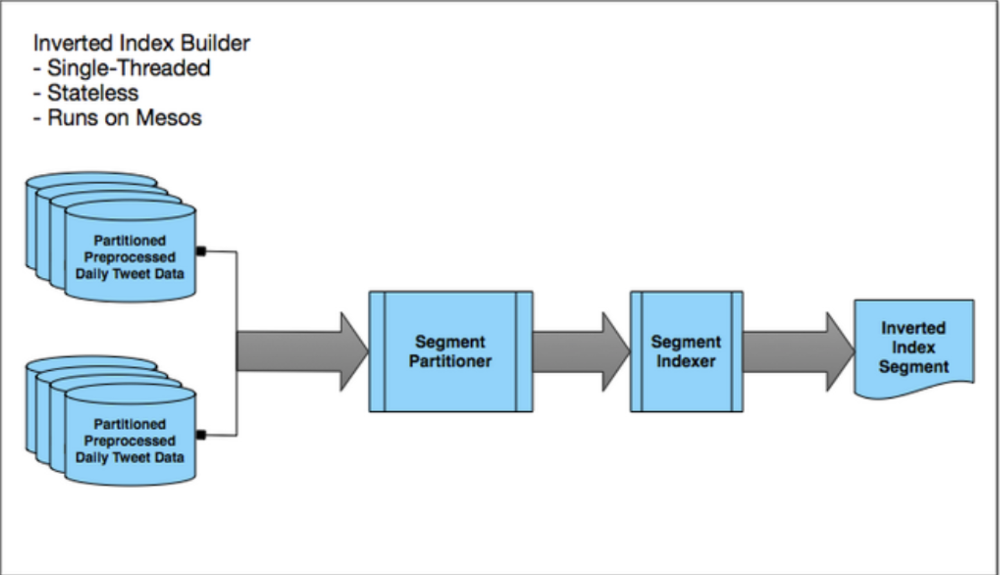

# Design text based search service

## Requirements

Design a system that supports the search feature based on arbitrary text input. Like twitter search by keywords or
Youtube/Netflix search by video name, etc.

### Functional requests

- The object is searchable as soon as possible after user creates it.
- The search needs to support arbitrary text based user input.
- The search needs to perform nearly real-time.

### Non-functional requests

- Search my own post, but allow delays searching others' post.
- High availability.
- Cluster needs to support scaling gracefully with less re-partitioning.

### Questions to ask

- Does this search service need to support other business logic, e.g. generating the home timeline?

## Assumptions

- The length of the searchable term has 8 words
- Each word has 10 characters on average
- How much data we have to index ?
  - 500 videos are uploaded / minute
- This is a read heavy system which needs to handle high volume of concurrent reads
  - Might need rate limiting

`8 * 10 * 4 Byte * 500 * 60 minute * 24 hours = 230 MBs / Day`

`230 MBs * 365 Days * 10 Years = 840 GBs in total for 10 years`

This means we have to create the index for 840 GBs data in total. This definitely could not be held in a single machine in
the memory. We want to design a distributed service.

## Design overview

### High level architecture


### How does content get indexed

#### Tokenizing

##### Real-time tokenizing


- Once a new tweet or video metadata comes, it will be immediately sent to the `tokenizer` service for processing.
- There could be several MQs connecting the input and the `tokenizer` worker threads.
- Multiple `tokenizer` worker threads could pop the event and generate the forward index.

```text

documentID : list of terms
--------------------------
0          | [(i, 0), (like,2), (apple,7)]
1          | [(liverpool,0),(wins,2)]
```

- The forward index results will be sent to `indexer` service to generate the inverted index and store on shards.

##### Offline tokenizing


- Engagement aggregator: Counts the number of engagements for each Tweet in a given day. These engagement counts are
  used later as an input in scoring each Tweet.
- Aggregation: Joins multiple data sources together based on Tweet ID.
- Ingestion: Performs different types of preprocessing — language identification, tokenization, text feature extraction,
  URL resolution and more.
- Scorer: Computes a score based on features extracted during Ingestion. For the smaller historical indices, this score
  determined which Tweets were selected into the index.
- Partitioner: Divides the data into smaller chunks through our hashing algorithm. The final output is stored into HDFS.

#### Inverted index building

- Update the mapping from term to termID
  ```text
  term       : termID
  --------------------------
  i          | 0
  like       | 1
  apple      | 2
  ...
  ```
- Building the inverted index
  ```
  termID     : list of postings (docID, position)
  --------------------------
  0          | [(0, 0)]
  1          | [(0, 2)]
  ...
  ```
##### Real-time inverted indexing


**Why using parallel array instead of list?** Because array elements have consecutive memory addresses. List is a random
memory address allocation. So array has better performance in terms of traversing.

##### Offline inverted indexing



#### Earlybirds shards

We need to distribute the index to all Earlybird servers in order to balance the load from both index building step and
query serving step. We could actually perform the index building (above step) on the Earlybird server itself, which means
we have to partition and distribute the load upfront. On the stage of tokenizing, the `key` is `documentID` and the `value`
is a list of terms. We could simply partition by the `documentID`, because each document usually has relatively random
terms, so that each server would be assigned with relatively random terms.

#### Earlybird roots(Blender)

Merge the search results from different Earlybird machines and enrich the result. This is the same idea of Blender.

### How does text based query work

There are two phases:

- Basic query
- Filter and Ranking

Posting list has limited size in memory to hold all relevance/ranking related info, so we could have a plugin mechanism
which could take the `documentID` as the input and return the `score` we could use to sort. However, this external service
query increases the latency. It is really a tradeoff between storage and performance (we either store the score with
posting list or decouple it to external service for scalability). Or we could have the ranking service to be affinitive
to the query service to reduce the network calls.

### How does index server handle high concurrent read/write

- Split reads and writes by using segments
  - Define a fixed number of segments.
  - Each segment holds a fixed number of documents.
  - Fill up one segment first before moving to next segment.
  - Only the current segment is actively being modified, other segments are read-only.
- Posting pools and `currReadyTailP` to avoid concurrent reads/writes within the same segment

### How does document updates work

**Note:** This is my personal thinking

- `docID-1, [i, like]` was the old record. The following inverted index will be generated.
  - `i:docID-1`
  - `like:docID-1`
- `docID-1: [i, hate]` will be sent to indexing service. The following inverted index will be generated.
  - `i:docID-1`
  - `hate:docID-1`
  - `like:docID-1*`

We have a flag in each posting to indicate if the posting entry should be deleted during the segments merge or if it should
be skipped during query. This is the similar idea to DB index segments merge.

### How does index server handle failures(High availability)

To have replicas across different index servers for HA, the replicas could be copied asynchronously.
The inverted index in memory will be lost in worst case scenario. However, the offline inverted indexing will fix it.

### What are the bottlenecks and how to improve

#### Reduce the size of posting list

- Using local documentID instead of global documentID (size reduced)
- Compress the posting list (size reduced)
  - Delta Compression and Bit Packing (size reduced)
  - Store count instead of positional info in posting list (size reduced)
  - Positional info is stored in another parallel array for further compression

<https://blog.twitter.com/engineering/en_us/topics/infrastructure/2016/omnisearch-index-formats.html>

#### Reduce the indexing latency and enhancements on original design

There are two major factors could drag down the performance

- When indexing is done, but some slow data processing is still in progress. Like the URL shortening service could slower
  than the indexing service. When customer does a search, what should we do?
- Sorting by scores, relevance could be slow

<https://blog.twitter.com/engineering/en_us/topics/infrastructure/2020/reducing-search-indexing-latency-to-one-second.html>

#### Sending indexing requests in batch instead of  multi http requests

<https://www.elastic.co/blog/found-keeping-elasticsearch-in-sync>

## Notes of ElasticSearch

TBA

## Notes of Lucene index

TBA

## References

- <https://buildingvts.com/elasticsearch-architectural-overview-a35d3910e515>
- <https://www.elastic.co/blog/found-indexing-for-beginners-part1/>
- <https://www.elastic.co/blog/found-indexing-for-beginners-part2/>
- <https://www.elastic.co/blog/found-indexing-for-beginners-part3/>
- <https://www.elastic.co/blog/performance-considerations-elasticsearch-indexing>
- <https://www.elastic.co/blog/found-dive-into-elasticsearch-storage>
- <https://youtu.be/CeGtqouT8eA?t=1455>
- <http://blog.gaurav.im/2016/12/28/systems-design-twitter-search/>
- <https://blog.twitter.com/engineering/en_us/a/2011/the-engineering-behind-twitter-s-new-search-experience.html>
- [Paper: Early bird - Twitter realtime search](resoureces/earlybird.pdf)
- <https://blog.twitter.com/engineering/en_us/a/2011/the-engineering-behind-twitter-s-new-search-experience.html>
- <https://blog.twitter.com/engineering/en_us/a/2014/building-a-complete-tweet-index.html>
- <https://blog.twitter.com/engineering/en_us/topics/infrastructure/2016/omnisearch-index-formats.html>
- <https://blog.twitter.com/engineering/en_us/topics/infrastructure/2020/reducing-search-indexing-latency-to-one-second.html>
- <https://blog.twitter.com/engineering/en_us/topics/infrastructure/2016/search-relevance-infrastructure-at-twitter.html>
- <https://blog.twitter.com/engineering/en_us/a/2014/building-a-complete-tweet-index.html>
- <http://blog.gaurav.im/2016/12/28/systems-design-twitter-search/>
- <https://www.slideshare.net/ramezf/twitter-search-architecture>
